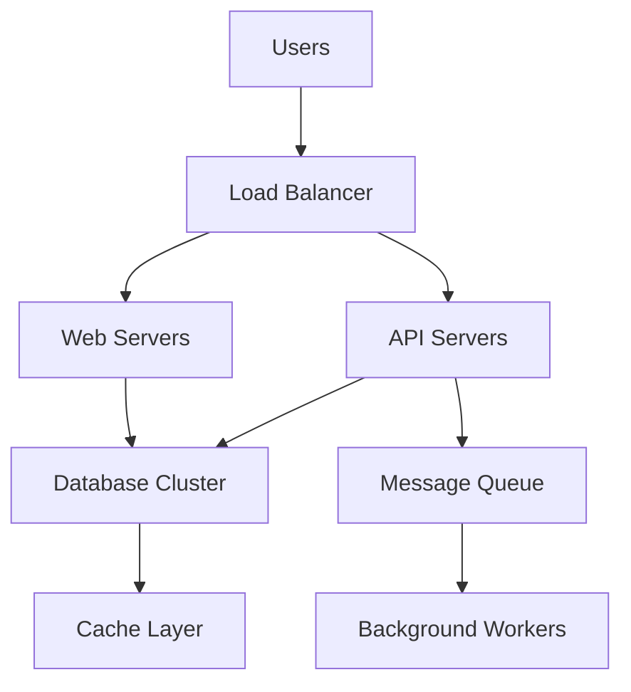

# Chapter 1: Introduction to System Design

## What is System Design?

System design is the process of defining the architecture, components, modules, interfaces, and data for a system to satisfy specified requirements. In simple terms, it's about figuring out how to build a software system that can handle real-world needs like millions of users, high performance, and reliability.

Think of system design as creating a blueprint for a software system before you start building it. Just like architects create blueprints before constructing a building, system designers create architectural plans before developers start coding.

## Why System Design Matters

System design is crucial for several reasons:

1. **Scale**: Building systems that can grow from 1,000 users to 1 million users
2. **Reliability**: Ensuring systems continue working even when parts fail
3. **Performance**: Making sure users get fast responses
4. **Cost**: Building efficient systems that don't waste resources
5. **Maintainability**: Creating systems that are easy to change and update

## Common Problems System Design Solves

Let's look at some real-world examples:

### Example 1: Social Media Platform
A platform like Twitter needs to handle:
- Millions of tweets posted every second
- Billions of users viewing their feeds
- Trending topics that require immediate propagation
- Real-time notifications

Without proper system design, a single viral tweet could bring down the entire platform.

### Example 2: E-commerce Website
Amazon needs to handle:
- Product searches across hundreds of millions of items
- Shopping cart functionality during Black Friday
- Inventory management across multiple warehouses
- Payment processing with security

### Example 3: Ride-sharing App
Uber needs to:
- Match riders with drivers in real-time
- Handle location updates from millions of devices
- Process payments securely
- Maintain availability during peak times

## Trade-offs in System Design

System design is fundamentally about making trade-offs. You can't have everything:

- **Consistency vs. Availability**: Do you prioritize always having the most up-to-date data, or always being able to serve requests?
- **Performance vs. Cost**: How fast do your users need the response to be, and what's the budget?
- **Complexity vs. Simplicity**: How much complexity are you willing to add for a marginal improvement?

## Requirements and Constraints

When approaching any system design problem, you need to think about:

### Functional Requirements
- What the system should do
- Features and capabilities
- User interactions

### Non-functional Requirements
- Performance: How fast should responses be?
- Scalability: How many users/requests should it handle?
- Availability: How often can the system be down?
- Security: What data needs protection?
- Reliability: How often should the system fail?

### Constraints
- Budget limitations
- Time constraints
- Technical limitations
- Regulatory requirements
- Existing infrastructure

## How to Think About System Design

1. **Start Simple**: Begin with a basic solution and then enhance it
2. **Understand Requirements**: Clarify functional and non-functional requirements early
3. **Think About Scale**: Consider how the system will grow over time
4. **Consider Failure**: Plan for how the system behaves when parts fail
5. **Iterate**: Refine your design as you think through different aspects

## Basic Architecture Patterns

A simple system might look like this:

As systems grow, they evolve to handle more complexity:

## Conclusion

System design is the art of balancing competing needs—performance, reliability, cost, and complexity—to create systems that meet business requirements. It's about asking the right questions, understanding trade-offs, and choosing the right tools and patterns for the job.

The key is to build a strong foundation by understanding the requirements, constraints, and trade-offs involved. This foundation allows you to make informed decisions about architecture and technology choices.