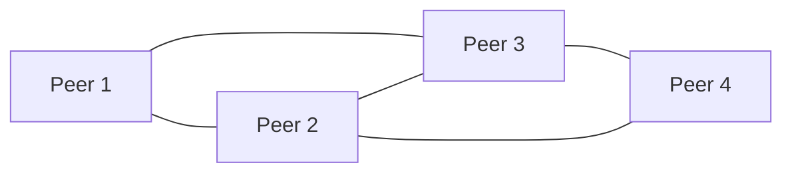
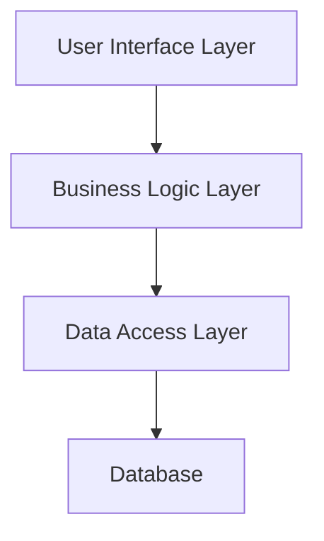
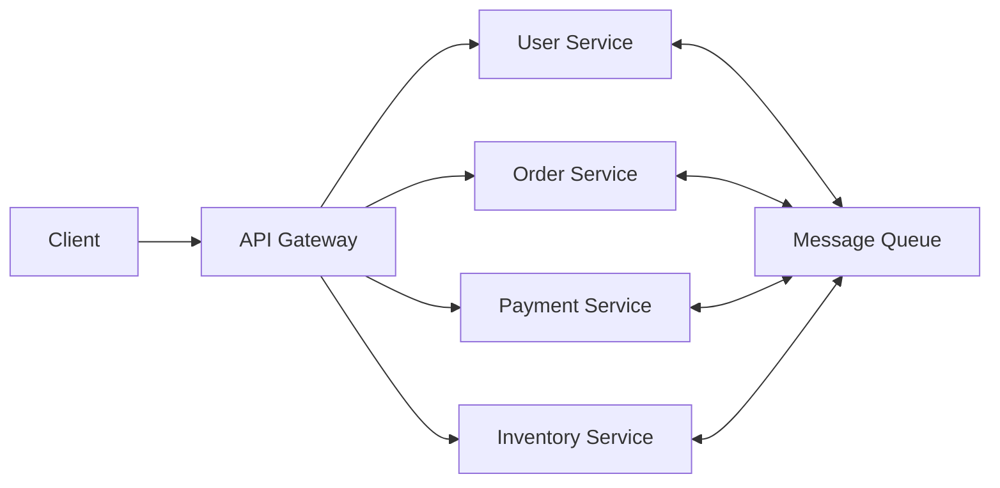
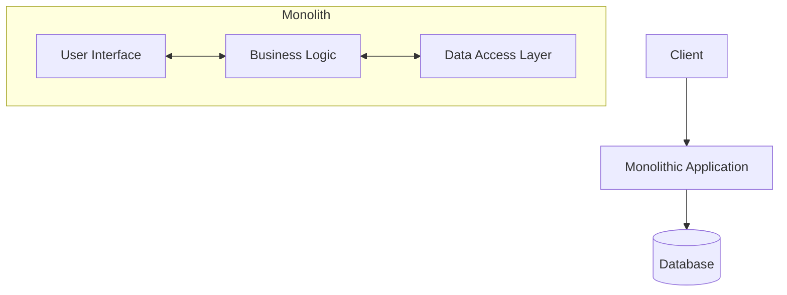
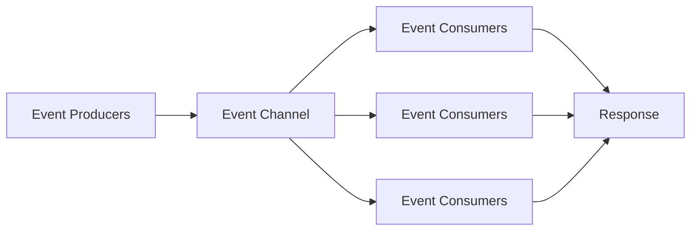

# Chapter 3: High-Level Architecture Patterns

## Overview

Architecture patterns are fundamental structures that determine how different components of a system interact with each other. Choosing the right architecture pattern is crucial for meeting your system's requirements and setting a foundation for future growth.

## Client-Server Pattern

**Definition**: The client-server pattern divides work between service providers (servers) and service requesters (clients). Clients send requests to servers, which process these requests and return responses.

**Simple Explanation**: Think of a restaurant where customers (clients) order food by sending requests to the kitchen (server), which prepares the food and sends it back.

**Real-world Example**: 
- Web browsers requesting web pages from web servers
- Mobile apps fetching data from backend APIs
- Email clients retrieving messages from email servers

**When to Use**: 
- When you have a clear separation between data consumers and data providers
- For systems with stateless operations
- When users need to access centralized resources

**Pros**:
- Clear separation of concerns
- Easy to implement and understand
- Scalable on the server side
- Supports multiple types of clients

**Cons**:
- Single point of failure on the server side
- Network dependency
- Server can become a bottleneck

## Peer-to-Peer (P2P) Pattern

**Definition**: In the P2P pattern, each node (peer) in the network can act as both a client and a server, sharing resources directly with other peers.

**Simple Explanation**: Think of people sharing files directly with each other instead of downloading from a central server. Each person can both request files and share files.

**Real-world Example**:
- BitTorrent file sharing
- Blockchain networks (Bitcoin, Ethereum)
- Video streaming services like LiveVideo
- Some VoIP applications

**When to Use**:
- When you want to avoid central points of failure
- For distributed file sharing
- When peers have similar capabilities and can contribute resources
- For systems requiring high availability

**Pros**:
- No central point of failure
- High availability and fault tolerance
- Resource sharing among peers
- Scalable by adding more peers

**Cons**:
- Complex to implement and manage
- Security challenges (not all peers are trustworthy)
- Network topology complexity
- Difficult to monitor and maintain

## Layered Architecture Pattern

**Definition**: The layered architecture pattern organizes components into horizontal layers, each with specific responsibilities. Each layer serves the layer above it and is served by the layer below it.

**Simple Explanation**: Think of a cake with different layers, where each layer has a specific purpose and the top layers depend on the bottom layers.

**Real-world Example**:
- Traditional web applications (Presentation, Business Logic, Data Access)
- Operating systems with kernel, system services, and application layers
- Enterprise applications following n-tier architecture

**When to Use**:
- For complex enterprise applications
- When you need separation of concerns
- For projects with multiple development teams working on different layers
- When you want to maintain clear dependencies

**Pros**:
- Separation of concerns
- Easy to develop, test, and maintain
- Clear dependencies between layers
- Supports team development

**Cons**:
- Can lead to performance issues due to multiple layer traversals
- May create unnecessary complexity for simple applications
- Can become rigid and difficult to change
- Risk of layer "leakage" where boundaries are not maintained

## Microservices Pattern

**Definition**: The microservices pattern structures an application as a collection of small, loosely coupled, highly cohesive services that follow the Single Responsibility Principle and communicate through well-defined APIs.

**Simple Explanation**: Instead of building one large application, you build many small applications that work together, each handling one specific business capability.

**Real-world Example**:
- Netflix (hundreds of microservices managing different aspects)
- Amazon (originally a monolith, now thousands of microservices)
- Uber (authentication, payments, trip management, etc. as separate services)

**When to Use**:
- For large, complex applications
- When teams need to develop and deploy independently
- When different parts of the system have different scaling requirements
- For organizations with multiple teams

**Pros**:
- Independent deployment and scaling
- Technology diversity (different services can use different tech stacks)
- Fault isolation (failure in one service doesn't necessarily affect others)
- Team autonomy and parallel development

**Cons**:
- Network latency and communication overhead
- Increased operational complexity
- Data consistency challenges
- Distributed system complexity
- Testing becomes more challenging

## Monolithic Architecture Pattern

**Definition**: A monolithic architecture is a single, unified application where all components are interconnected and interdependent, typically deployed as a single unit.

**Simple Explanation**: Imagine a building where all the rooms are built as one inseparable structure - you can't remove the kitchen without affecting the rest of the building.

**Real-world Example**:
- Traditional enterprise applications (ERP, CRM systems)
- Early versions of many successful companies (Amazon, Netflix)
- Simple web applications (blog platforms, e-commerce sites)

**When to Use**:
- For small to medium-sized applications
- When the development team is small
- For simple applications with clear requirements
- When time-to-market is critical

**Pros**:
- Simple development and deployment
- Easy testing and debugging
- Straightforward scaling for small applications
- Less operational complexity

**Cons**:
- Difficult to scale different parts independently
- Technology stack is fixed for the entire application
- Risk of large-scale failures
- Deployment complexity as the application grows
- Team coordination challenges for larger teams

## Event-Driven Architecture Pattern

**Definition**: The event-driven architecture pattern is based on producing, detecting, consuming, and reacting to events. Components communicate through events, enabling loose coupling and asynchronous processing.

**Simple Explanation**: Think of a newsroom where reporters (event producers) send news updates, and different departments (event consumers) react to relevant news without directly communicating with each other.

**Real-world Example**:
- Stock trading systems (price changes trigger automatic trades)
- E-commerce order processing (new order event triggers inventory, payment, shipping)
- Real-time analytics systems
- IoT sensor data processing

**When to Use**:
- For real-time processing systems
- When you need loose coupling between components
- For asynchronous processing requirements
- When dealing with high-volume data streams

**Pros**:
- High scalability and flexibility
- Loose coupling between components
- Asynchronous processing capability
- Good for real-time analytics
- Supports high-volume, high-velocity data

**Cons**:
- Complex to design and debug
- Event ordering challenges
- Possible event loss if not properly handled
- Additional infrastructure complexity (message queues, event stores)

## Choosing the Right Pattern

The choice of architecture pattern depends on several factors:

1. **Size and Complexity**: Simple applications often benefit from monolithic architecture initially
2. **Team Size and Structure**: More teams may benefit from microservices
3. **Scaling Requirements**: Different components with different scaling needs favor microservices
4. **Performance Needs**: Client-server for low-latency requirements; event-driven for high-volume processing
5. **Organizational Culture**: Teams that prefer autonomy might prefer microservices
6. **Time Constraints**: Monoliths are often faster to develop initially

## Conclusion

Understanding these architecture patterns allows you to make informed decisions about how to structure your system. Often, the best solution involves combining elements from multiple patterns rather than strictly following one. The key is to understand the trade-offs of each pattern and choose what best fits your specific requirements, constraints, and context.

Remember that architecture patterns are not set in stone - they can evolve over time as your system grows and requirements change. What starts as a monolith might eventually become a microservices architecture as it scales.