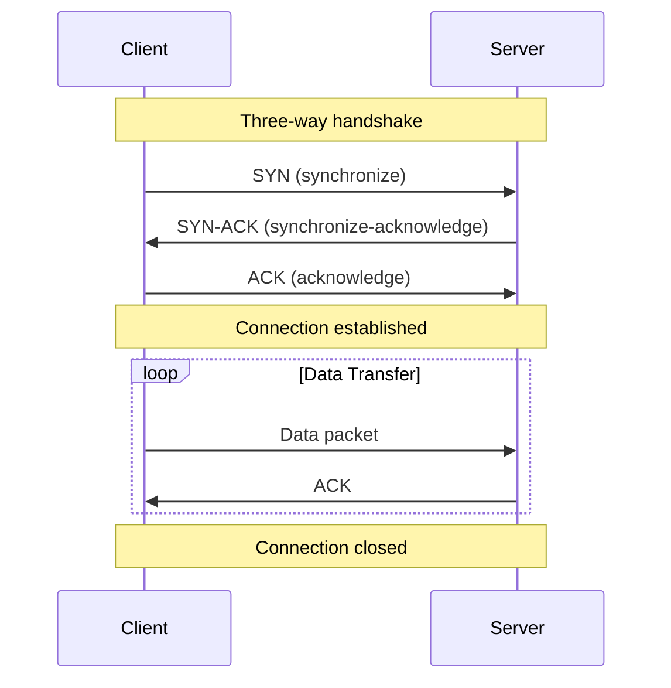
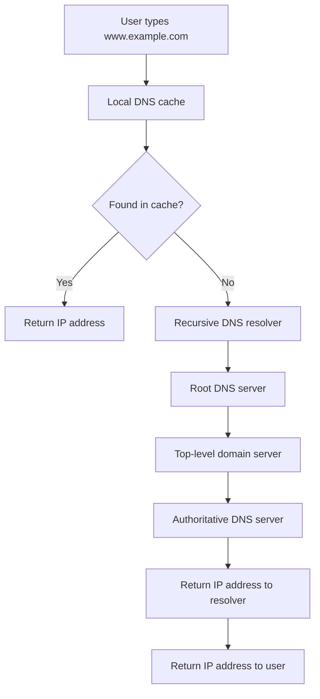
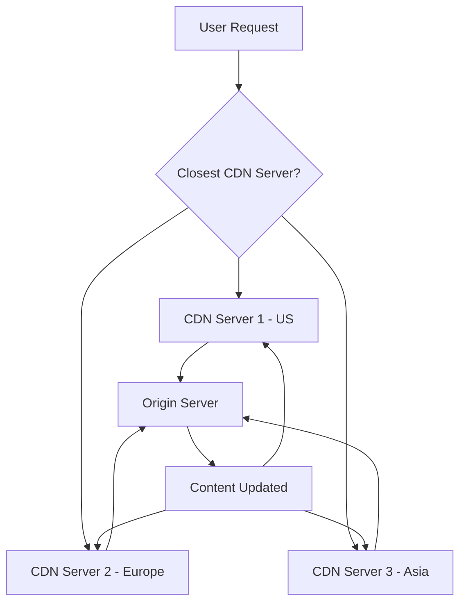

# Chapter 4: Networking & Protocol Basics

## Overview

Networking fundamentals are essential to system design because they determine how components communicate, how fast they can exchange information, and how reliable that communication is. Understanding network protocols helps you make better architectural decisions and avoid common bottlenecks.

## TCP/IP Protocol Suite

**Definition**: The TCP/IP (Transmission Control Protocol/Internet Protocol) suite is the foundation of internet communication, consisting of a set of protocols that define how data travels across networks.

**Simple Explanation**: Think of TCP/IP as the postal system for the internet. Just like how mail gets addressed, packaged, and delivered through various postal facilities, data gets packaged and addressed to travel across the internet.

**Layers of TCP/IP Model**:
1. **Application Layer**: Where applications create user data
2. **Transport Layer**: Manages end-to-end communication (TCP/UDP)
3. **Internet Layer**: Handles addressing and routing (IP)
4. **Link Layer**: Manages communication between adjacent network nodes

**TCP (Transmission Control Protocol)**:
- **Connection-oriented**: Establishes a connection before data transfer
- **Reliable**: Guarantees delivery of data in the correct order
- **Slower**: Has more overhead due to error checking and retransmission
- **Use cases**: Web browsing, email, file transfer



**Real-world Example**: When you visit a website, your browser uses TCP to establish a connection with the web server, ensuring that all webpage elements (HTML, CSS, JavaScript) arrive intact and in the correct order.

## UDP (User Datagram Protocol)

**Definition**: UDP is a connectionless protocol that sends data without establishing a connection or guaranteeing delivery.

**Simple Explanation**: UDP is like sending a postcard - you send it without confirmation that it will arrive, but it's fast and efficient.

**Characteristics**:
- **Connectionless**: No setup required before sending data
- **Unreliable**: No guarantee that packets will arrive or be in order
- **Faster**: Less overhead than TCP
- **Use cases**: Video streaming, online gaming, VoIP, DNS queries

**Real-world Example**: When watching a live video stream, UDP is often used because it's better to have a slightly lower quality stream than to wait for missing packets to be retransmitted, which would cause buffering.

## HTTP/HTTPS Protocols

**HTTP (HyperText Transfer Protocol)**:
- **Definition**: The protocol used for transferring web pages and other content on the internet
- **Simple Explanation**: The language that web browsers and servers speak to each other

**HTTP Characteristics**:
- **Stateless**: Each request is independent
- **Request-Response**: Client sends request, server sends response
- **Text-based**: Uses human-readable text for requests and responses

**HTTP Request Structure**:
```
GET /index.html HTTP/1.1
Host: www.example.com
User-Agent: Mozilla/5.0
Accept: text/html
```

**Common HTTP Methods**:
- **GET**: Retrieve data
- **POST**: Create new resources
- **PUT**: Update existing resources
- **DELETE**: Remove resources
- **PATCH**: Partial updates

**HTTPS (HTTP Secure)**:
- **Definition**: HTTP over an encrypted connection (TLS/SSL)
- **Purpose**: Provides confidentiality, integrity, and authenticity
- **Simple Explanation**: HTTP with a lock icon - your data is encrypted during transmission

**Real-world Example**: When you log into your bank account, HTTPS encrypts your credentials so that hackers can't intercept them as they travel across the internet.

## TLS (Transport Layer Security)

**Definition**: TLS is a cryptographic protocol that provides secure communication over a network.

**Simple Explanation**: TLS is like sending a letter in a locked box with a key that only the recipient has. Even if someone intercepts the letter, they can't read it without the key.

**TLS Handshake Process**:
1. Client sends "hello" with supported encryption methods
2. Server responds with chosen method and certificate
3. Client verifies certificate and generates session keys
4. Both parties establish encrypted communication

**Real-world Example**: Every time you see "https://" and a lock icon in your browser, TLS is working to encrypt your communication with the website.

## DNS (Domain Name System)

**Definition**: DNS translates human-readable domain names (like www.example.com) into machine-readable IP addresses (like 93.184.216.34).

**Simple Explanation**: DNS is like a phone book for the internet - it helps you find the address of websites using their names instead of numbers.

**DNS Resolution Process**:


**DNS Record Types**:
- **A Record**: Maps domain name to IPv4 address
- **AAAA Record**: Maps domain name to IPv6 address
- **CNAME Record**: Creates an alias for another domain
- **MX Record**: Specifies mail server for domain

**Real-world Example**: When you type "google.com" in your browser, DNS translates this to Google's actual IP address so your computer knows where to send the request.

## CDN (Content Delivery Network)

**Definition**: A CDN is a distributed network of servers that delivers content to users based on their geographic location, the origin of the content, and the content server's availability.

**Simple Explanation**: Instead of everyone getting content from one central server (which might be far away), CDNs place copies of content on servers around the world so users get content from the closest server.

**How CDN Works**:


**Benefits of CDN**:
- **Reduced Latency**: Content served from nearby servers
- **Increased Reliability**: Multiple servers reduce single points of failure
- **Reduced Bandwidth Costs**: Less load on origin servers
- **Improved Security**: DDoS protection and other security features

**Real-world Example**: When you watch a Netflix movie, the video content comes from a CDN server near you rather than Netflix's central servers, providing faster streaming.

## How Network Behavior Affects System Design

### Latency Considerations
- **Round Trip Time (RTT)**: The time it takes for a signal to travel from sender to receiver and back
- **Geographic Distribution**: Consider where your users are located when placing servers
- **Network Hops**: Each router/switch adds to latency

### Bandwidth Considerations
- **Available Bandwidth**: The maximum data rate of a network connection
- **Throughput**: The actual rate of successful data delivery
- **Congestion**: When network capacity is exceeded

### Reliability Considerations
- **Packet Loss**: Network connections are not 100% reliable
- **Connection Failures**: Networks can fail temporarily
- **Service Availability**: Plan for network outages in your design

### Security Considerations
- **Man-in-the-Middle Attacks**: Data can be intercepted during transit
- **Data Privacy**: Sensitive information needs protection
- **Authentication**: Verify identity across network connections

## Network Protocols in System Design Decisions

When designing systems, consider these network factors:
1. **Choose appropriate protocols**: TCP for guaranteed delivery, UDP for speed
2. **Minimize network calls**: Batch requests when possible
3. **Implement retry logic**: Handle temporary network failures
4. **Consider data compression**: Reduce bandwidth usage
5. **Plan for network partitions**: Ensure system works when parts are disconnected

## Conclusion

Understanding networking fundamentals is crucial for system design because network performance directly impacts your system's performance, reliability, and user experience. Network protocols form the foundation of how your system components communicate and interact.

The decisions you make about network protocols and topologies can significantly affect your system's performance, scalability, and security. Whether you're choosing between TCP and UDP, implementing encryption with TLS, or using CDNs for content delivery, these networking decisions have long-term implications for your system's success.