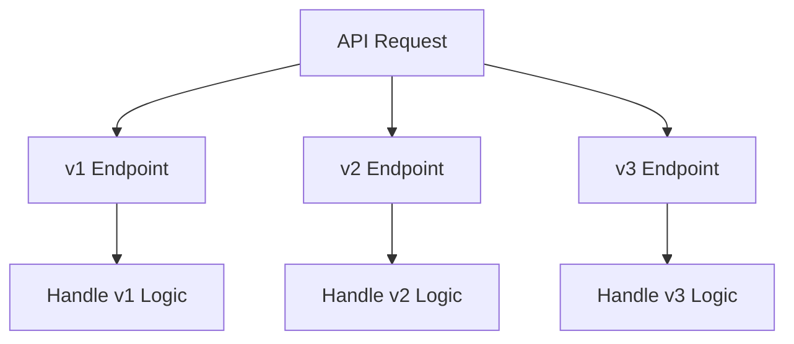

# Chapter 5: APIs and Interface Design

## Overview

APIs (Application Programming Interfaces) are the contracts that define how different software components communicate with each other. Good API design is crucial for system integration, scalability, and maintainability. Well-designed APIs make systems easier to use, extend, and maintain.

## What is an API?

**Definition**: An API is a set of rules, protocols, and tools that allows different software applications to communicate with each other. It defines the methods and data formats that applications can use to request and exchange information.

**Simple Explanation**: Think of an API as a waiter in a restaurant who takes your order (request) to the kitchen (server) and brings back your food (response).

## REST APIs

**Definition**: REST (Representational State Transfer) is an architectural style for designing networked applications, typically using HTTP protocols.

**Key Principles of REST**:
1. **Stateless**: Each request contains all information needed to process it
2. **Client-Server**: Separation of concerns between client and server
3. **Cacheable**: Responses can be cached for improved performance
4. **Uniform Interface**: Consistent way of interacting with resources
5. **Layered System**: Clients don't know if they're connected to the end server or an intermediary

**REST Resource Naming**:
- Use nouns, not verbs: `/users` not `/getUsers`
- Use plural nouns: `/users` not `/user`
- Use hierarchical structure: `/users/{id}/orders`
- Use lowercase with hyphens if needed: `/user-profiles`

**HTTP Methods for REST**:
- **GET**: Retrieve a resource (`/users/123`)
- **POST**: Create a resource (`/users`)
- **PUT**: Update a resource (`/users/123`)
- **PATCH**: Partial update (`/users/123`)
- **DELETE**: Remove a resource (`/users/123`)

**Real-world Example**: Twitter's API allows developers to retrieve tweets, post new tweets, and manage accounts using standard HTTP methods and REST conventions.

**Sample REST API Response**:
```json
{
  "id": 123,
  "name": "John Doe",
  "email": "john.doe@example.com",
  "created_at": "2023-01-15T10:30:00Z"
}
```

## GraphQL APIs

**Definition**: GraphQL is a query language for APIs and a runtime for executing those queries with existing data. It allows clients to request exactly the data they need.

**Simple Explanation**: Instead of getting a fixed set of data like with REST, GraphQL lets you ask for exactly what you want, like ordering from a menu where you can request specific items rather than getting a pre-made combo.

**Key Features of GraphQL**:
- **Single Endpoint**: All operations go through one endpoint
- **Flexible Queries**: Clients specify exactly what data they need
- **Strongly Typed Schema**: Clear contract between client and server
- **Introspection**: APIs can describe themselves

**GraphQL Query Example**:
```graphql
query {
  user(id: "123") {
    name
    email
    posts {
      title
      publishedDate
    }
  }
}
```

**Real-world Example**: GitHub's API v4 is built entirely on GraphQL, allowing developers to fetch exactly the information they need for their applications.

## gRPC APIs

**Definition**: gRPC is a high-performance, open-source universal RPC (Remote Procedure Call) framework that can run in any environment.

**Simple Explanation**: gRPC is like making a direct function call to code running on another server, with the benefits of using protocol buffers for efficient data serialization.

**Key Features of gRPC**:
- **Protocol Buffers**: Efficient binary serialization
- **Multiple Service Types**: Unary, server streaming, client streaming, bidirectional streaming
- **Language Agnostic**: Supports multiple programming languages
- **Built-in Features**: Authentication, load balancing, health checking, monitoring

**Service Definition Example**:
```protobuf
service UserService {
  rpc GetUser (GetUserRequest) returns (GetUserResponse);
  rpc GetUserStream (GetUserRequest) returns (stream GetUserResponse);
}

message GetUserRequest {
  int32 user_id = 1;
}
```

**Real-world Example**: Google uses gRPC extensively across its infrastructure for inter-service communication due to its efficiency and performance.

## API Design Best Practices

### Designing Clear APIs

**Consistent Naming Conventions**:
- Use consistent naming across all endpoints
- Follow standard conventions (camelCase, snake_case, etc.)
- Use descriptive names that clearly indicate purpose

**Versioning APIs**:
- **URL Versioning**: `/api/v1/users`
- **Header Versioning**: `Accept: application/vnd.myapi.v1+json`
- **Query Parameter Versioning**: `/api/users?version=1`



**Real-world Example**: Stripe uses URL versioning (e.g., `/v1/charges`) to maintain backward compatibility while introducing new features.

### Pagination

**Why Pagination Matters**:
- Prevents server overload from large result sets
- Improves response times
- Reduces bandwidth usage

**Pagination Techniques**:
- **Offset-based**: `GET /users?page=2&limit=10`
- **Cursor-based**: `GET /users?cursor=abc123`
- **Time-based**: `GET /events?since=2023-01-01`

**Offset-based Example**:
```
GET /products?page=2&size=20
Response:
{
  "data": [...],
  "pagination": {
    "page": 2,
    "size": 20,
    "total": 1500,
    "pages": 75
  }
}
```

### Rate Limiting

**Definition**: Rate limiting controls how many requests a client can make to an API within a specific time period.

**Simple Explanation**: Like having a bouncer at a club who only lets in a certain number of people per hour to prevent overcrowding.

**Rate Limiting Strategies**:
- **Token Bucket**: Client has a bucket of tokens that replenish over time
- **Leaky Bucket**: Requests processed at fixed rate
- **Fixed Window**: Count requests in fixed time windows

**Rate Limiting Headers**:
```
X-RateLimit-Limit: 1000          # Max requests allowed
X-RateLimit-Remaining: 998       # Remaining requests
X-RateLimit-Reset: 1609459200    # Time when limit resets
```

**Real-world Example**: Twitter API implements rate limiting to prevent abuse and ensure fair usage across developers.

### Idempotency

**Definition**: An operation is idempotent if making it multiple times has the same effect as making it once.

**Simple Explanation**: Pressing an elevator button multiple times has the same effect as pressing it once - the elevator still comes to your floor.

**HTTP Methods and Idempotency**:
- **Idempotent**: GET, PUT, DELETE, HEAD, OPTIONS
- **Not Idempotent**: POST, PATCH

**Implementing Idempotency**:
```http
POST /payments
Idempotency-Key: abc-123-def-456
```

**Real-world Example**: Payment APIs often use idempotency keys to prevent duplicate charges when a request is retried.

## Error Handling

**HTTP Status Codes**:
- **2xx**: Success (200 OK, 201 Created, 204 No Content)
- **4xx**: Client errors (400 Bad Request, 401 Unauthorized, 404 Not Found)
- **5xx**: Server errors (500 Internal Server Error, 503 Service Unavailable)

**Best Practices for Error Responses**:
```json
{
  "error": {
    "code": "VALIDATION_ERROR",
    "message": "Email address is invalid",
    "details": [
      {
        "field": "email",
        "issue": "Invalid email format"
      }
    ]
  }
}
```

### API Contracts

**Definition**: An API contract defines the expected interface between clients and servers, including endpoints, request/response formats, and error handling.

**Benefits of API Contracts**:
- Clear documentation for developers
- Enable parallel development
- Support automated testing
- Facilitate API evolution

**API Description Formats**:
- **OpenAPI (Swagger)**: For REST APIs
- **GraphQL Schema Definition Language**: For GraphQL APIs
- **Protocol Buffers**: For gRPC APIs

**OpenAPI Example**:
```yaml
openapi: 3.0.0
info:
  title: User API
  version: 1.0.0
paths:
  /users/{id}:
    get:
      parameters:
        - name: id
          in: path
          required: true
          schema:
            type: integer
      responses:
        '200':
          description: A user object
          content:
            application/json:
              schema:
                $ref: '#/components/schemas/User'
```

## Security Considerations

**Authentication**:
- **API Keys**: Simple identification for services
- **OAuth 2.0**: Delegated authorization
- **JWT Tokens**: Stateful authentication with expiration

**Authorization**:
- Role-based access control (RBAC)
- Scope-based permissions
- Resource-level permissions

**Input Validation**:
- Validate all incoming data
- Sanitize user inputs
- Implement proper content filtering

**Transport Security**:
- Always use HTTPS/TLS
- Implement HSTS headers
- Regularly update certificates

## API Performance Optimization

**Caching Strategies**:
- Client-side caching with HTTP headers
- CDN caching for static content
- Server-side caching for expensive operations

**Response Compression**:
- Enable gzip compression
- Optimize JSON responses
- Use appropriate data formats

**Efficient Data Fetching**:
- Minimize over-fetching with GraphQL
- Use appropriate pagination
- Implement ETags for conditional requests

## Conclusion

Good API design is fundamental to creating maintainable, scalable systems. Well-designed APIs serve as the backbone of modern distributed systems, enabling different services to communicate effectively.

Key takeaways for API design:
1. Choose the right API type (REST, GraphQL, gRPC) based on your specific needs
2. Maintain clear, consistent interfaces that are easy to understand
3. Implement proper error handling and versioning strategies
4. Consider security from the start
5. Optimize for performance and developer experience

Remember that APIs are contracts between different parts of your system (or between your system and external systems). Design them thoughtfully, document them well, and maintain backward compatibility when possible. The quality of your API design directly impacts the maintainability and success of your system.