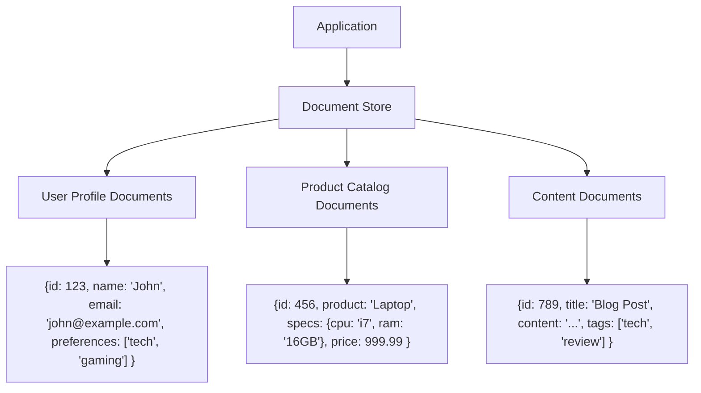
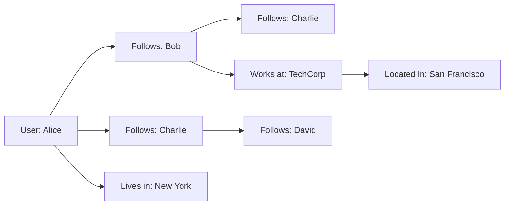

# Chapter 6: Data Modeling and Storage Choices

## Introduction

Data modeling and storage choices form the backbone of any system design. The storage solution you choose directly impacts your application's performance, scalability, and maintainability. Understanding the trade-offs between different storage options is crucial for building systems that meet your requirements efficiently.

## Relational vs. NoSQL Databases

### Relational Databases (SQL)

Relational databases store data in tables with predefined schemas. Each table has a fixed structure with columns and rows, and relationships between tables are defined through foreign keys.

**Key Characteristics:**
- ACID (Atomicity, Consistency, Isolation, Durability) properties
- Structured Query Language (SQL) for data manipulation
- Strong consistency and data integrity
- Schema-on-write (schema is defined before data is written)

**When to use:**
- When data has well-defined relationships
- When strong consistency is critical
- When complex queries and transactions are needed
- When reporting and analytics require complex joins

**Example:** A banking application where account balances must be consistent across multiple operations.

### NoSQL Databases

NoSQL databases offer flexible schemas and are designed for specific data models. They come in various types: document, key-value, columnar, and graph databases.

**Key Characteristics:**
- Schema-on-read (structure is defined when reading)
- Horizontal scaling capabilities
- Different consistency models (eventual, strong, etc.)
- Optimized for specific access patterns

**Types of NoSQL:**
- **Document Stores:** MongoDB, Couchbase
- **Key-Value Stores:** Redis, DynamoDB  
- **Columnar Stores:** Cassandra, HBase
- **Graph Databases:** Neo4j, Amazon Neptune

### Real-World Examples

#### Relational Example: E-commerce Order Management
```sql
-- Orders table
CREATE TABLE Orders (
    id INT PRIMARY KEY,
    customer_id INT,
    order_date DATE,
    total_amount DECIMAL(10,2),
    FOREIGN KEY (customer_id) REFERENCES Customers(id)
);

-- Order Items table
CREATE TABLE OrderItems (
    id INT PRIMARY KEY,
    order_id INT,
    product_id INT,
    quantity INT,
    price DECIMAL(10,2),
    FOREIGN KEY (order_id) REFERENCES Orders(id)
);
```

#### Document Store Example: Content Management System
```json
{
  "article_id": "abc123",
  "title": "System Design Fundamentals",
  "author": {
    "name": "Pras",
    "email": "pras@example.com"
  },
  "tags": ["system", "design", "fundamentals"],
  "content": "Long-form content...",
  "created_at": "2025-01-15T10:00:00Z",
  "published": true
}
```

## Storage Types and Their Characteristics

### Document Stores

Document stores treat each record as a document with a flexible schema. They're ideal for content management, catalogs, and user profiles.

**Mermaid Diagram: Document Store Structure**


**Pros:**
- Flexible schema
- Hierarchical data storage
- Rich query capabilities
- Good for content management

**Cons:**
- Complex transactions can be difficult
- May have consistency limitations
- Can be less efficient for simple key-value lookups

### Key-Value Stores

Key-value stores are the simplest NoSQL databases, storing data as a collection of key-value pairs.

**Pros:**
- Extremely fast reads/writes
- Simple to scale
- Flexible values (strings, JSON, binary)
- Good for caching and sessions

**Cons:**
- Limited query capabilities
- No relationships between data
- No consistency guarantees in most implementations

**Example:** Redis is commonly used for session storage:
```
SessionKey: "session:123"
SessionValue: {"user_id": 456, "preferences": {"theme": "dark"}, "last_login": "2025-01-15T10:00:00Z"}
```

### Columnar Stores

Columnar stores organize data by columns rather than rows, making them efficient for analytical queries.

**Pros:**
- Excellent for analytical queries
- High compression ratios
- Fast aggregation operations
- Good for time-series data

**Cons:**
- Slower for transactional workloads
- More complex to model for applications
- Less intuitive for traditional application development

### Graph Databases

Graph databases store data in nodes and relationships, making them ideal for connected data.

**Mermaid Diagram: Graph Database Example**


**Use Cases:**
- Social networks
- Recommendation systems
- Fraud detection
- Network and IT operations

## Normalization vs. Denormalization

### Normalization

Normalization is the process of organizing data to reduce redundancy and improve data integrity. It typically involves breaking down large tables into smaller related tables and defining relationships between them.

**Example of Normalization:**

Before normalization:
```
Customer: {id: 1, name: "John", email: "john@example.com", address: "123 Main St", product_name: "Laptop", product_price: 999.99}
Customer: {id: 2, name: "Jane", email: "jane@example.com", address: "456 Oak Ave", product_name: "Phone", product_price: 699.99}
```

After normalization:
```
Customers: {id: 1, name: "John", email: "john@example.com", address: "123 Main St"}
Products: {id: 1, name: "Laptop", price: 999.99}
Orders: {id: 1, customer_id: 1, product_id: 1}
```

### Denormalization

Denormalization is the process of combining normalized tables back into a single table to optimize for read performance. This often involves duplicating data to avoid expensive joins.

**When to Denormalize:**
- High-read applications
- When query performance is critical
- When data consistency requirements allow it
- For reporting and analytical systems

**Example of Denormalization:**
```
OrderSummary: {
    order_id: 123,
    customer_name: "John Doe", 
    customer_email: "john@example.com",
    customer_address: "123 Main St",
    product_name: "Laptop",
    product_price: 999.99,
    order_date: "2025-01-15"
}
```

## Schemas and Indexing

### Schema Design Considerations

**For Relational Databases:**
- Define primary keys for each table
- Establish proper foreign key relationships
- Choose appropriate data types for efficiency
- Plan for future growth and evolution

**For Document Databases:**
- Design flexible but consistent document structures
- Consider query patterns when structuring documents
- Plan for schema evolution strategies

### Indexing Strategies

Indexes are crucial for query performance. They act as pointers to data, allowing the database to find records quickly without scanning every row.

**Types of Indexes:**
- **Primary Index:** Based on the primary key
- **Secondary Index:** Based on other columns
- **Composite Index:** Based on multiple columns
- **Unique Index:** Ensures uniqueness of values
- **Full-text Index:** For text-based searches

**Index Trade-offs:**
- **Pros:** Faster query performance, better user experience
- **Cons:** Slower write operations, additional storage requirements, more complex maintenance

**Example:**
```sql
-- Creating indexes in a relational database
CREATE INDEX idx_customer_email ON customers(email);
CREATE INDEX idx_orders_date_customer ON orders(order_date, customer_id);
```

## Choosing the Right Storage Solution

### Factors to Consider

1. **Data Structure:**
   - Is your data highly structured or flexible?
   - Do you need rich relationships between entities?

2. **Access Patterns:**
   - How will you query the data?
   - Do you need complex transactions?
   - What are your consistency requirements?

3. **Scale Requirements:**
   - How much data do you expect to store?
   - What are your read/write ratios?
   - Do you need global distribution?

4. **Consistency Needs:**
   - Do you need immediate consistency?
   - Can eventual consistency work for your use case?

### Decision Framework

- **Choose Relational** when you need ACID transactions, complex queries, and well-defined relationships
- **Choose Document Store** when you need flexible schemas and hierarchical data
- **Choose Key-Value Store** for caching, sessions, and simple lookup patterns
- **Choose Columnar Store** for analytical workloads and time-series data
- **Choose Graph Database** for highly connected data and relationship-heavy queries

## Summary

Data modeling and storage choices significantly impact your system's performance, scalability, and maintainability. Consider your data structure, access patterns, scale requirements, and consistency needs when making storage decisions. Remember that many successful systems use a combination of different storage technologies to meet diverse requirements.