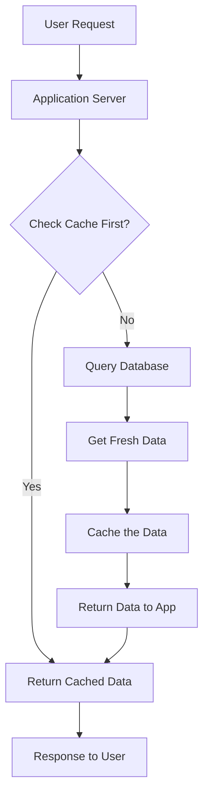
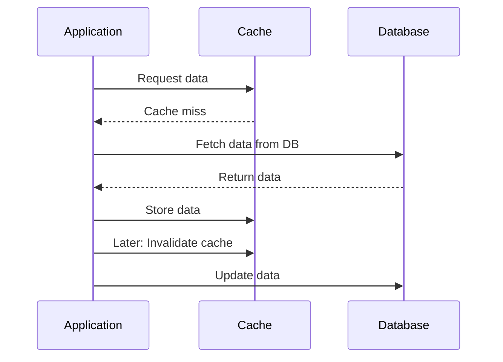
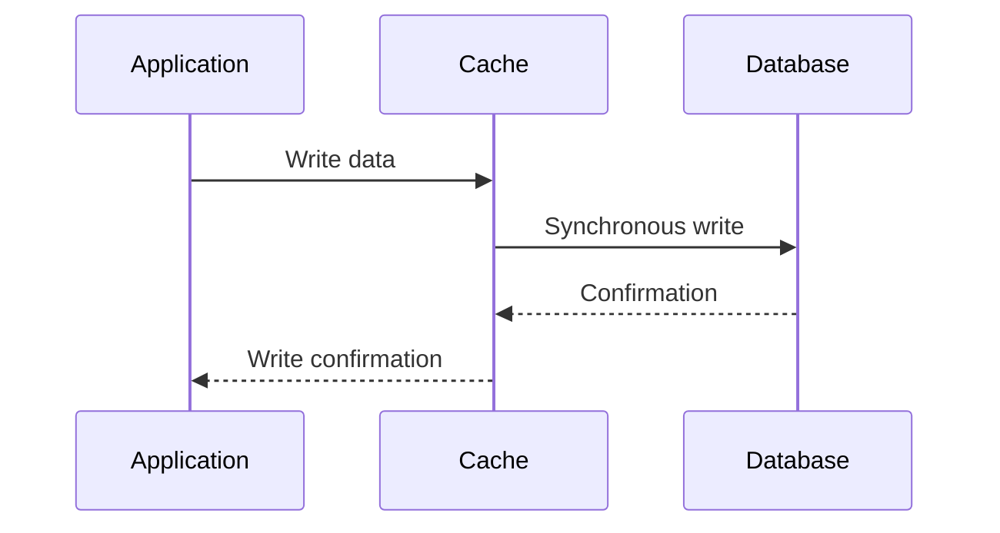

# Chapter 8: Caching Strategies

## Introduction

Caching is one of the most effective techniques for improving system performance and user experience. By storing frequently accessed data in faster storage, caching reduces response times and decreases load on backend systems. Understanding different caching strategies is crucial for building high-performance systems.

## Types of Cache Layers

### Client-Side Caching

Client-side caching stores data on the user's device, reducing the need for network requests.

**Browser Caching:**
- Static assets (CSS, JS, images) cached in browser
- Uses HTTP headers like `Cache-Control` and `ETag`
- Reduces bandwidth usage and load times

**Local Storage/Session Storage:**
- JavaScript-based storage in browsers
- Local Storage: persists across sessions
- Session Storage: cleared when tab/window closes

**Mobile App Caching:**
- Storing data locally on mobile devices
- SQLite, Realm, or key-value stores
- Works offline capabilities

### CDN (Content Delivery Network) Caching

CDNs cache static content at edge locations worldwide, reducing latency for users.

**How CDNs Work:**
- Request goes to nearest edge server
- If content not cached, fetch from origin
- Serve from edge on subsequent requests

**Real-World Example: Netflix CDN**
- Content cached globally based on popularity
- Different quality levels cached separately
- Dynamic loading based on connection quality

### Edge Caching

Edge caching stores content at network edge locations between users and origin servers.

**Benefits:**
- Reduced latency
- Lower origin server load
- Better user experience

### Application-Level Caching

Application-level caching sits between the application and database, storing frequently accessed data in memory.

**Common Tools:**
- Redis: in-memory data structure store
- Memcached: distributed memory caching system
- Hazelcast: in-memory data grid

**Mermaid Diagram: Application-Level Caching**


### Database Caching

Database caching stores frequently accessed database results or query plans in memory.

**Types:**
- Query result cache: stores results of common queries
- Row cache: stores frequently accessed rows
- Plan cache: stores execution plans for queries

## Cache Invalidation Patterns

Cache invalidation determines when cached data should be removed or updated.

### Cache-Aside Pattern (Lazy Loading)

**Process:**
1. Application checks cache for data
2. If not in cache, fetch from database
3. Store in cache for next request
4. When data changes, update database and invalidate cache

**Mermaid Diagram: Cache-Aside Pattern**


**Pros:**
- Only frequently accessed data is cached
- Cache only contains requested data

**Cons:**
- Cache stampede possible
- Cache miss penalty exists

### Write-Through Pattern

**Process:**
1. Write to cache
2. Cache writes to database synchronously
3. Both cache and database are updated together

**Mermaid Diagram: Write-Through Pattern**


**Pros:**
- Cache and database consistency
- Read operations always hit cache

**Cons:**
- Higher write latency
- Write failures affect cache and DB together

### Write-Behind Pattern (Write-Back)

**Process:**
1. Write to cache
2. Write to database asynchronously
3. Better write performance

**Pros:**
- Fast writes
- Batched database updates

**Cons:**
- Potential data loss if cache fails before DB write
- Cache/database inconsistency

## Cache Eviction Policies

When memory is full, cache eviction policies determine which items to remove.

### LRU (Least Recently Used)

Removes the least recently accessed items first.

**Implementation:**
- Maintain a doubly linked list
- Recently accessed items move to head
- When removing, remove from tail

**Example:**
```python
# Simulated LRU eviction
cache = OrderedDict()
if len(cache) >= MAX_SIZE:
    # Remove oldest (least recently used)
    cache.popitem(last=False)
```

### LFU (Least Frequently Used)

Removes items with the lowest access frequency.

**Advantages:**
- Better for workloads with skewed access patterns
- Keeps high-value items longer

**Disadvantages:**
- More complex to implement
- Requires tracking access frequencies

### FIFO (First In, First Out)

Removes the oldest items regardless of access pattern.

**Advantages:**
- Simple implementation
- Predictable behavior

**Disadvantages:**
- May remove important items accessed early
- Not adaptive to access patterns

### Random Eviction

Randomly selects items to remove.

**Advantages:**
- Very fast
- Simple implementation

**Disadvantages:**
- Less effective than other strategies
- May remove frequently accessed items

## Cache Architecture Patterns

### Multi-Level Caching

Uses multiple cache layers for different purposes.

**Example Architecture:**
1. L1 Cache: CPU cache (smallest, fastest)
2. L2 Cache: Application cache (Redis/Memcached)
3. L3 Cache: CDN cache (edge locations)

**Benefits:**
- Optimized for different access patterns
- Reduces load on each level

### Cache-Aside with Cache-As-SoR Pattern

Combines caching with source-of-truth pattern for high availability.

**Process:**
1. Cache acts as primary data store
2. Database as backup for data integrity
3. Cache and database synchronized

## Common Cache Problems and Solutions

### Cache Stampede (Cache Miss Storm)

When popular cached items expire simultaneously, causing many requests to hit the database at once.

**Solutions:**
- Stagger cache expiration times
- Use distributed locks to prevent multiple regeneration
- Implement background refresh

### Cache Warming

Pre-populate cache with likely-to-be-requested data before user access.

**Approaches:**
- Analyze access logs to identify common patterns
- Preload cache during off-peak hours
- Implement predictive loading based on trends

### Cache Coherency

Ensuring all cache instances have consistent data in distributed systems.

**Strategies:**
- Centralized cache (Redis cluster)
- Cache invalidation notifications
- Event-driven cache updates

## Real-World Examples

### Twitter Timeline Caching

Twitter caches user timelines to reduce database load:
- Each user has a cached timeline of recent tweets
- Cache updated via fan-out-on-write or fan-out-on-load
- Different strategies for celebrities vs. regular users

### Facebook News Feed Caching

Facebook uses complex caching strategies:
- Pre-computed feeds for users
- Multiple layers of caching
- Machine learning to predict content relevance

### E-commerce Product Catalog

E-commerce platforms cache product information:
- Static product data cached for long periods
- Dynamic pricing and inventory updated more frequently
- Personalized recommendations cached per user

## Cache Performance Metrics

Monitor these metrics to optimize caching strategies:

- **Hit Ratio:** Percentage of requests served from cache
- **Miss Ratio:** Percentage of requests requiring backend fetch
- **Eviction Rate:** How often items are removed from cache
- **Response Time:** Time to serve cached vs. uncached requests
- **Memory Usage:** Cache memory consumption

## Summary

Effective caching requires understanding your application's access patterns and choosing the right combination of strategies. Consider multi-layer caching, appropriate invalidation patterns, and proper eviction policies. Monitor cache performance regularly and adjust strategies based on changing access patterns. Remember that caching adds complexity, so implement only where the performance benefit justifies the additional complexity.