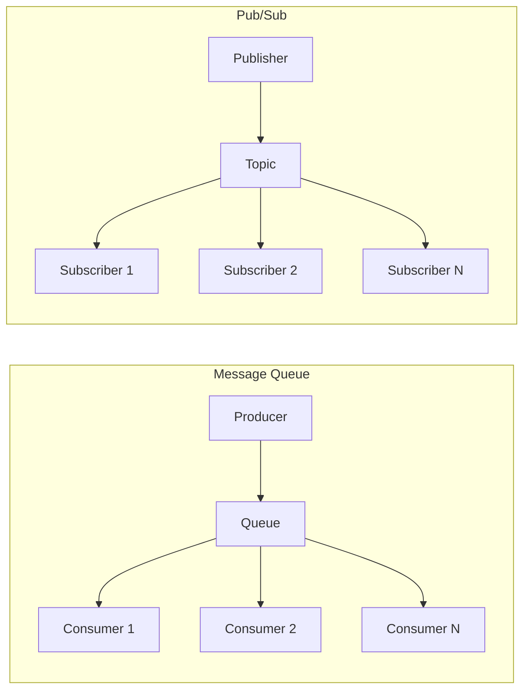
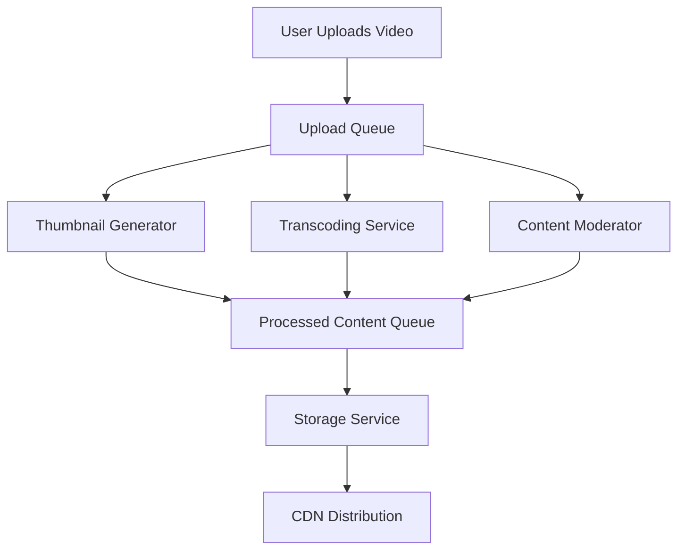

# Chapter 9: Message Queues & Asynchronous Systems

## Introduction

Message queues are essential for building scalable, resilient systems. They enable asynchronous processing, decouple components, and help manage load variations. Understanding how to implement and use message queues is critical for creating robust distributed systems.

## Queues vs. Pub/Sub Models

### Message Queues

Message queues use a point-to-point model where messages are sent to a specific queue and processed by one consumer.

**Characteristics:**
- One message processed by one consumer
- Load balancing through multiple consumers
- Messages persist until consumed
- Sequential processing possible

**Real-World Example: Order Processing Queue**
- E-commerce order placed → placed on order queue
- Multiple order processors consume from queue
- Each order processed by exactly one processor
- Ensures no duplicate processing

### Publish-Subscribe (Pub/Sub)

Pub/Sub uses a broadcast model where messages are sent to topics and multiple subscribers can receive them.

**Characteristics:**
- One message can be processed by multiple subscribers
- Loose coupling between publishers and subscribers
- Fan-out pattern implementation
- Different subscribers can process messages differently

**Real-World Example: Notification System**
- User activity published to "user-actions" topic
- Email service subscribes to send email notifications
- SMS service subscribes to send text notifications
- Analytics service subscribes to track metrics

**Mermaid Diagram: Queue vs Pub/Sub Comparison**


## Ordering and Delivery Guarantees

### Message Ordering

Maintaining message order is critical for many business processes but challenging in distributed systems.

**FIFO Queues:**
- Guaranteed in-order delivery
- Single consumer or partitioned queues
- Lower throughput due to ordering constraints

**Non-FIFO Queues:**
- Higher throughput
- Possible out-of-order processing
- Requires application-level ordering logic

**Partitioned Ordering:**
- Maintain order within partitions
- Different partitions processed in parallel
- Order maintained for related events

### Delivery Semantics

**At-Most-Once Delivery:**
- Message delivered zero or one time
- Risk of message loss
- Higher performance

**At-Least-Once Delivery:**
- Message delivered one or more times
- Guaranteed delivery
- Risk of duplicate processing

**Exactly-Once Delivery:**
- Message delivered exactly one time
- Most challenging to implement
- Requires deduplication logic

**Real-World Example: Payment Processing**
```python
# At-least-once with idempotency
def process_payment(payment_id, amount):
    # Check if already processed
    if is_payment_processed(payment_id):
        return "Already processed"
    
    # Process payment
    execute_payment(payment_id, amount)
    mark_payment_processed(payment_id)
    return "Processed successfully"
```

## Retry Mechanisms and Dead-Letter Queues

### Retry Strategies

When message processing fails, retry mechanisms determine how to handle the failure.

**Exponential Backoff:**
- Retry with exponentially increasing delays
- Prevents overwhelming systems during failures
- Common pattern: 1s, 2s, 4s, 8s, etc.

**Linear Retry:**
- Fixed delay between retries
- Simple to implement
- May not be optimal for temporary failures

**Max Retries:**
- Limit number of retry attempts
- Prevent infinite retry loops
- Move to dead-letter queue after max retries

### Dead-Letter Queues (DLQ)

DLQs store messages that repeatedly fail processing for later analysis and handling.

**Use Cases:**
- Malformed messages that can't be processed
- Messages causing repeated system errors
- Poison messages affecting other messages

**Implementation:**
- Configure message queues to move failed messages
- Separate team/process handles dead-letter messages
- Analysis and reprocessing of DLQ messages

## Backpressure Handling

Backpressure occurs when message producers outpace consumers, potentially overwhelming the system.

### Approaches to Backpressure

**Throttling Producers:**
- Slow down message production
- Temporary rejection of new messages
- Backpressure signals to upstream systems

**Buffering:**
- Temporary storage during high load
- Memory or disk-based buffers
- Risk of resource exhaustion

**Dropping Messages:**
- Acceptable for non-critical data
- Last resort option
- Clear communication to message producers

### Circuit Breaker Pattern

Prevents system overload by temporarily stopping requests to failing systems.

**States:**
- **Closed:** Normal operation
- **Open:** Failed service, requests blocked
- **Half-Open:** Test if service recovered

## Message Queue Implementations

### Apache Kafka

**Features:**
- High-throughput distributed streaming platform
- Persistent message storage
- Built-in partitioning and replication
- Real-time stream processing

**Architecture:**
- Topics divided into partitions
- Multiple brokers in cluster
- Consumers in consumer groups

### RabbitMQ

**Features:**
- Flexible routing with exchanges
- Multiple protocols (AMQP, MQTT, STOMP)
- Message acknowledgments
- Advanced queue types

**Exchange Types:**
- Direct: Routing key based
- Fanout: Broadcast to all queues
- Topic: Pattern-based routing
- Headers: Header-based routing

### Amazon SQS

**Features:**
- Fully managed message queuing service
- Standard and FIFO queues
- Dead-letter queue integration
- Serverless integration

### Azure Service Bus

**Features:**
- Queues and topics/subscriptions
- Session state support
- Duplicate detection
- Automatic retry policies

## Asynchronous Processing Patterns

### Fire and Forget

- Message sent without waiting for response
- Suitable for non-critical notifications
- High performance but no guarantee of processing

### Request-Reply

- Message sent expecting a response
- Implemented via temporary queues or correlation IDs
- Synchronous-like behavior over asynchronous transport

### Scatter-Gather

- One request sent to multiple services
- Responses collected and combined
- Useful for parallel processing

### Event Sourcing

- Store events rather than current state
- State derived from event replay
- Audit trail and temporal queries

## Real-World Examples

### E-commerce Order Processing

**System Components:**
- Order Service: Creates orders
- Inventory Service: Checks/updates inventory
- Payment Service: Processes payments
- Shipping Service: Handles shipping
- Notification Service: Sends confirmations

**Message Flow:**
1. Order placed → message to order queue
2. Inventory service validates availability
3. Payment service processes payment
4. Shipping service prepares shipment
5. Notification service sends confirmations
6. Analytics service tracks metrics

### Content Processing Pipeline

**Video Processing Pipeline:**
- User uploads video → message to upload queue
- Thumbnail generation service processes
- Transcoding service converts formats
- Content moderation service checks content
- Storage service saves processed content
- CDN distribution service uploads to CDN

**Mermaid Diagram: Content Processing Pipeline**


## Performance Considerations

### Message Size Optimization

- Large messages increase network overhead
- Consider compression for large payloads
- Optimize message structure for efficiency
- Batch multiple small messages when possible

### Consumer Scaling

- Add consumers to increase throughput
- Monitor consumer lag regularly
- Use auto-scaling for variable loads
- Consider partitioning for parallel processing

### Monitoring and Observability

**Key Metrics:**
- Queue depth and growth rate
- Consumer lag and processing time
- Error rates and retry counts
- Throughput (messages/second)

**Tools:**
- Application performance monitoring (APM)
- Distributed tracing for message flows
- Log aggregation for debugging
- Alerting for critical metrics

## Summary

Message queues and asynchronous systems are fundamental for building scalable, resilient applications. Choose the right messaging pattern (queue vs pub/sub) based on your requirements. Consider ordering guarantees, delivery semantics, and retry mechanisms carefully. Implement proper monitoring and backpressure handling to maintain system health. Remember that asynchronous processing adds complexity but provides significant benefits for system scalability and resilience.