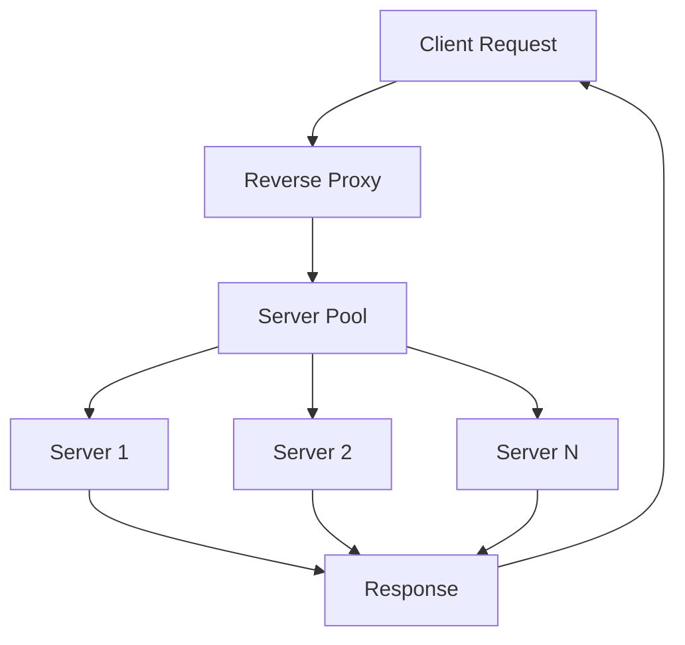
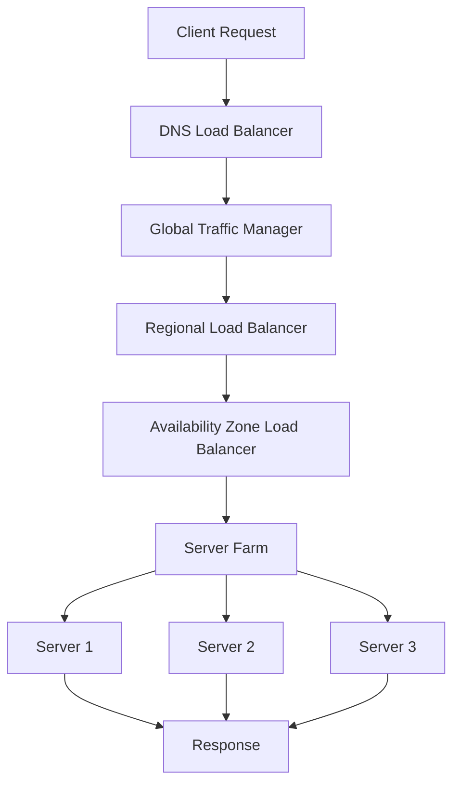

# Chapter 10: Load Balancing & Traffic Management

## Introduction

Load balancing is a critical component in any scalable system architecture. It distributes incoming network traffic across multiple servers to ensure no single server becomes overwhelmed, improving application availability and user experience. Effective traffic management involves not only distributing requests but also optimizing for performance, handling failures, and managing various traffic patterns.

## Reverse Proxies

A reverse proxy sits in front of backend servers and forwards client requests to appropriate servers. It acts as an intermediary that handles requests from clients destined for servers.

### Functions of Reverse Proxies

**Traffic Distribution:**
- Distribute incoming requests to backend servers
- Hide server details from clients
- Provide a single point of entry to application

**Security:**
- Hide internal server structure
- SSL termination at proxy level
- DDoS protection and rate limiting

**Caching:**
- Serve frequently requested content
- Reduce load on backend servers
- Improve response times

### Popular Reverse Proxy Solutions

**Nginx:**
- High-performance HTTP server and reverse proxy
- Efficient for static content delivery
- Extensive configuration options

**Apache HTTP Server:**
- Mature and feature-rich
- Modular architecture
- Strong community support

**HAProxy:**
- High-performance TCP/HTTP load balancer
- Excellent for load balancing
- Advanced routing capabilities

**Mermaid Diagram: Reverse Proxy Architecture**


## Load Balancer Types: L4 vs L7

### Layer 4 (L4) Load Balancing

L4 load balancers operate at the transport layer (TCP/UDP) and route traffic based on network and transport layer information.

**Characteristics:**
- Fast, low-latency routing
- Works with any protocol (TCP/UDP)
- Routes based on IP address and port
- Does not inspect application content

**Use Cases:**
- Database load balancing
- Gaming applications
- Applications with encryption (SSL passthrough)

### Layer 7 (L7) Load Balancing

L7 load balancers operate at the application layer and can make routing decisions based on content in the application layer.

**Characteristics:**
- Content-aware routing
- Can route based on URL, headers, cookies
- Supports advanced features like compression and SSL offloading
- Higher processing overhead

**Use Cases:**
- Web applications with different URL paths
- API gateways
- Content-based routing

**Comparison Table:**

| Feature | L4 Load Balancer | L7 Load Balancer |
|---------|------------------|------------------|
| Speed | Fast | Slower |
| Intelligence | Basic | Advanced |
| Protocol Support | Any TCP/UDP | Application-specific |
| Features | Limited | Rich |

## Load Balancing Algorithms

### Round Robin

Distributes requests sequentially across servers in a circular manner.

**Pros:**
- Simple implementation
- Equal distribution when servers are similar
- Good for basic scenarios

**Cons:**
- Doesn't consider server capacity or current load
- May not be optimal if servers have different capabilities

### Weighted Round Robin

Similar to round robin but assigns different weights to servers based on their capacity.

**Implementation:**
- Assign weights based on server capacity
- Higher weight servers receive more requests
- Useful when servers have different specifications

### Least Connections

Routes requests to servers with the fewest active connections.

**Pros:**
- Better distribution when requests have varying processing times
- Accounts for current server load
- Good for long-running connections

**Cons:**
- May not account for CPU/memory utilization
- Slightly more complex implementation

### IP Hash

Uses a hash of the client IP address to determine which server to use.

**Pros:**
- Consistent server selection for same client
- Maintains session affinity
- Good for sticky sessions

**Cons:**
- Uneven distribution possible
- Not suitable when server pool changes

### Least Response Time

Routes to servers with the lowest average response time and fewest active connections.

**Pros:**
- Considers server performance
- Adapts to server conditions
- Self-balancing

**Cons:**
- More complex to implement
- May cause uneven distribution during warmup

### Consistent Hashing

Minimizes reorganization when servers are added or removed.

**Use Cases:**
- Distributed caches
- Database sharding
- Content delivery networks

## Sticky Sessions

Sticky sessions ensure that a client's requests are consistently routed to the same backend server.

### When to Use Sticky Sessions

**Stateful Applications:**
- Applications storing session data in memory
- Real-time applications with persistent connections
- Applications requiring consistent server selection

### Implementation Approaches

**Cookie-Based:**
- Load balancer inserts cookie with server identification
- Client sends cookie with subsequent requests
- Server identified from cookie value

**Source IP Hash:**
- Hash of client IP determines server
- Consistent routing for same IP address
- Less effective with NAT/CDNs

### Drawbacks of Sticky Sessions

- Reduced fault tolerance
- Potential load imbalances
- Difficult to scale dynamically
- Session loss when server fails

## Health Checks

Health checks monitor the status of backend servers to ensure traffic is only sent to healthy servers.

### Types of Health Checks

**Active Health Checks:**
- Load balancer periodically sends test requests
- Checks server response and status codes
- More reliable but adds overhead

**Passive Health Checks:**
- Monitors actual traffic for failures
- Marks servers as unhealthy after consecutive failures
- Less overhead but slower detection

### Health Check Parameters

**Interval:**
- How often health checks occur
- Balance between detection speed and overhead

**Timeout:**
- How long to wait for response
- Should be less than server response time threshold

**Thresholds:**
- Number of failures before marking unhealthy
- Number of successes to mark healthy again

### Health Check Endpoints

**Simple HTTP Check:**
```
GET /health
Response: 200 OK if healthy
```

**Detailed Health Check:**
```
GET /health/detail
Response: JSON with status of all dependencies
{
  "status": "healthy",
  "database": "ok",
  "cache": "ok",
  "external_api": "degraded"
}
```

## Connection Draining

Connection draining (also called graceful shutdown) allows a server that is about to be taken out of rotation to finish processing existing requests before being removed.

### Implementation

**Process:**
1. Remove server from rotation (stop sending new requests)
2. Allow existing connections to complete
3. Wait for timeout or completion
4. Terminate server

**Benefits:**
- Prevents request failures during server maintenance
- Ensures smooth deployments
- Maintains user experience during scaling operations

## Traffic Shaping and Rate Limiting

### Traffic Shaping

Traffic shaping controls the rate at which traffic is sent or received.

**Use Cases:**
- Preventing server overload
- Ensuring fair resource allocation
- Managing service level agreements

### Rate Limiting

Rate limiting restricts the number of requests a client can make in a given time period.

**Algorithms:**

**Token Bucket:**
- Tokens added at fixed rate
- Each request consumes a token
- Allows for burst requests up to bucket capacity

**Leaky Bucket:**
- Requests placed in bucket with fixed output rate
- Smooths out traffic bursts
- More predictable output rate

**Fixed Window Counter:**
- Count requests within fixed time window
- Simple but can have uneven distribution at window boundaries

**Sliding Window Log:**
- Maintain log of request timestamps
- More accurate but more resource-intensive

### Implementation Examples

**API Rate Limiting:**
```python
# Token bucket implementation
class TokenBucket:
    def __init__(self, capacity, refill_rate):
        self.capacity = capacity
        self.tokens = capacity
        self.refill_rate = refill_rate
        self.last_refill = time.time()
    
    def consume(self, tokens=1):
        now = time.time()
        # Add tokens based on time elapsed
        tokens_to_add = (now - self.last_refill) * self.refill_rate
        self.tokens = min(self.capacity, self.tokens + tokens_to_add)
        self.last_refill = now
        
        if self.tokens >= tokens:
            self.tokens -= tokens
            return True
        return False
```

## Geographic Load Balancing

Geographic load balancing routes requests to servers based on the geographic location of clients.

**Benefits:**
- Reduced latency
- Improved user experience
- Regulatory compliance (data sovereignty)
- Disaster recovery

**Implementation:**
- DNS-based routing
- Anycast IP addresses
- CDN load balancing
- Cloud provider global load balancers

## Advanced Load Balancing Features

### Session Persistence

Maintains user sessions across multiple requests to ensure consistent user experience.

### Content Switching

Routes requests based on content type, URL, or other application-layer data.

### SSL/TLS Termination

Handles SSL/TLS encryption/decryption at the load balancer level.

### Application Firewall Integration

Provides security features like DDoS protection and malicious request filtering.

## Real-World Examples

### Netflix Traffic Management

Netflix uses multiple layers of load balancing:
- DNS-level geolocation
- Application-level load balancing
- Custom algorithms for content distribution
- Circuit breakers to prevent cascading failures

### Amazon AWS Elastic Load Balancing

AWS provides multiple load balancer types:
- Application Load Balancer (Layer 7)
- Network Load Balancer (Layer 4)
- Gateway Load Balancer
- Each optimized for different use cases

**Mermaid Diagram: Multi-Layer Load Balancing**


## Monitoring and Metrics

### Key Load Balancing Metrics

**Throughput:**
- Requests per second
- Connections per second
- Data throughput

**Latency:**
- Response time
- Connection time
- Processing time

**Availability:**
- Server uptime
- Successful request percentage
- Error rates

**Health:**
- Server health status
- Connection pool utilization
- Resource utilization

### Alerting

Set up alerts for:
- High error rates
- Increased latencies
- Server failures
- Capacity thresholds

## Summary

Effective load balancing and traffic management are fundamental to creating scalable, resilient systems. Choose the right load balancing algorithm based on your specific requirements and traffic patterns. Implement comprehensive health checks and monitoring to maintain system reliability. Consider geographic distribution and traffic shaping for optimal user experience. Remember that load balancing solutions should be part of a holistic approach that includes application design, resource scaling, and failure handling strategies.