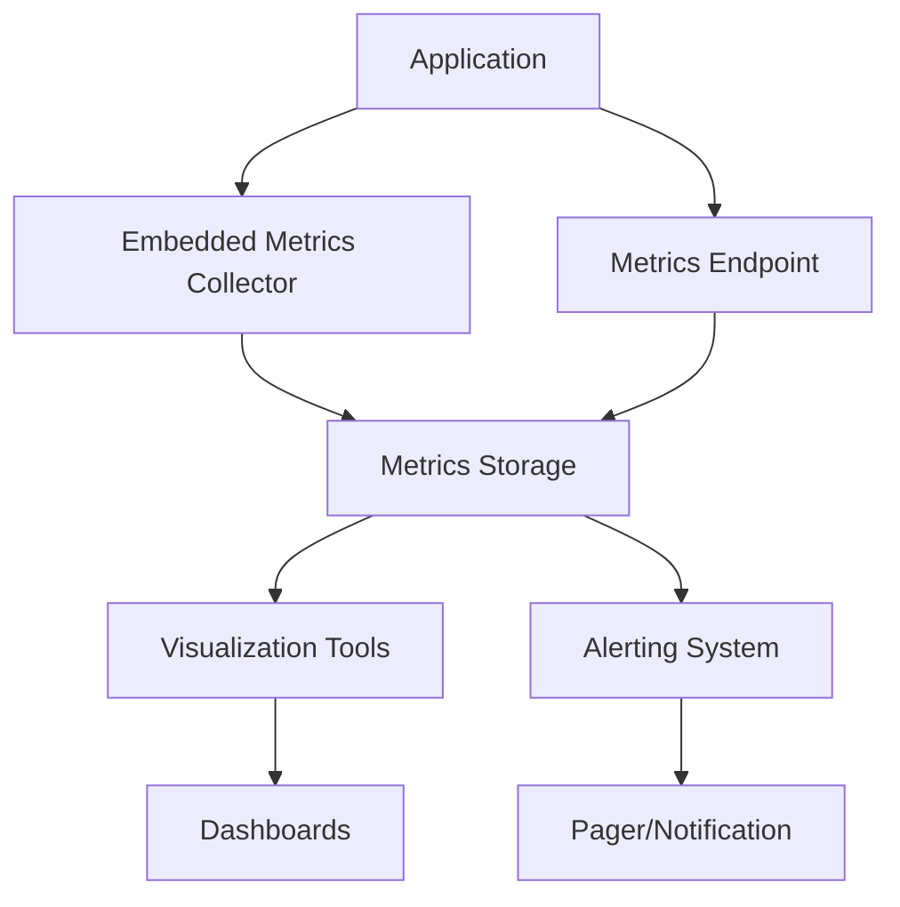
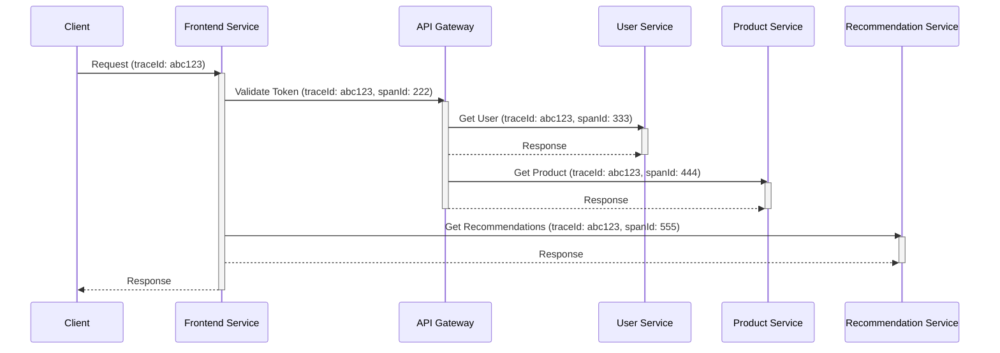

# Chapter 11: Observability: Logging, Metrics, Tracing

## Introduction

Observability is the ability to understand the internal state of a system by examining its external outputs. It's crucial for maintaining healthy systems, debugging issues, and understanding system behavior. The three pillars of observability are logging, metrics, and tracing, each providing different insights into system performance and behavior.

## Structured Logging

### What is Structured Logging?

Structured logging is the practice of logging data in a format that can be easily parsed and processed by machines, typically in JSON or other structured formats, rather than plain text.

**Benefits of Structured Logging:**
- Machine-readable output
- Consistent format across applications
- Easier querying and analysis
- Better correlation with other data sources

### Structure and Content

**Key Components of Structured Logs:**
- Timestamp
- Log level (debug, info, warn, error)
- Service name
- Request identifier
- User identifier
- Contextual fields specific to the operation

**Example of Structured Log:**
```json
{
  "timestamp": "2025-01-15T10:30:00.123Z",
  "level": "INFO",
  "service": "user-service",
  "traceId": "abc123xyz",
  "userId": "user123",
  "operation": "login",
  "durationMs": 150,
  "status": "success",
  "ipAddress": "192.168.1.100"
}
```

### Log Levels and Categories

**Standard Log Levels:**
- **DEBUG:** Detailed diagnostic information
- **INFO:** General operational information
- **WARN:** Potential issues that don't affect operation
- **ERROR:** Errors that don't prevent system operation
- **FATAL:** Critical errors that cause system failure

**Contextual Logging:**
- Business event logs (user actions, transactions)
- System operation logs (startup, shutdown, maintenance)
- Security logs (authentication, authorization, changes)

**Real-World Example: E-commerce Platform Logging**
```
# User checkout process
{"timestamp": "2025-01-15T10:30:01.000Z", "level": "INFO", "service": "checkout-service", "traceId": "chk123", "userId": "user123", "event": "checkout-started", "cartId": "cart456"}
{"timestamp": "2025-01-15T10:30:02.500Z", "level": "INFO", "service": "payment-service", "traceId": "chk123", "userId": "user123", "event": "payment-processing", "amount": 99.99, "paymentMethod": "credit_card"}
{"timestamp": "2025-01-15T10:30:03.200Z", "level": "INFO", "service": "inventory-service", "traceId": "chk123", "userId": "user123", "event": "inventory-confirmed", "itemId": "item789", "quantity": 1}
{"timestamp": "2025-01-15T10:30:04.100Z", "level": "INFO", "service": "checkout-service", "traceId": "chk123", "userId": "user123", "event": "checkout-success", "orderId": "ord999"}
```

## Metrics Collection

### What are Metrics?

Metrics are quantitative measurements of system performance and behavior. They are typically numeric values collected over time and are essential for monitoring system health and performance.

### Common Metric Categories

**System Metrics:**
- CPU utilization
- Memory usage
- Disk I/O
- Network traffic
- File descriptors

**Application Metrics:**
- Request rate (requests per second)
- Error rate (errors per second)
- Response time (p95, p99 percentiles)
- Active connections
- Queue lengths

**Business Metrics:**
- User registrations
- Completed transactions
- Revenue metrics
- Active users
- Conversion rates

### Prometheus-Style Metrics

Prometheus is a popular metrics collection system that uses a time-series database.

**Metric Types:**
- **Counter:** Monotonically increasing values (e.g., requests served)
- **Gauge:** Values that can go up and down (e.g., current memory usage)
- **Histogram:** Samples observations and counts in configurable buckets (e.g., request durations)
- **Summary:** Similar to histograms but calculates percentiles on the client side

**Example Prometheus Metrics:**
```
# Counter: Total requests processed
http_requests_total{method="GET", endpoint="/api/users", status="200"} 12456

# Gauge: Current number of active connections
active_connections{service="api-gateway"} 42

# Histogram: Request duration buckets
http_request_duration_seconds_bucket{le="0.1"} 900
http_request_duration_seconds_bucket{le="0.5"} 1100
http_request_duration_seconds_bucket{le="1.0"} 1190
http_request_duration_seconds_bucket{le="+Inf"} 1200
```

**Mermaid Diagram: Metrics Collection Architecture**


### Metrics Collection Best Practices

**Labeling Strategy:**
- Use consistent label names across services
- Limit the number of unique label values
- Include service, environment, and region labels
- Avoid high-cardinality labels

**Collection Frequency:**
- Balance between detail and storage costs
- Higher frequency for critical metrics
- Consider the storage implications

## Distributed Tracing

### What is Distributed Tracing?

Distributed tracing tracks requests as they flow through a distributed system, capturing timing and context information across service boundaries. It's essential for understanding request flow in microservices architectures.

### Trace Structure

**Trace:** A tree of spans representing a single request
**Span:** A single operation in a trace, with timing and context
**Trace ID:** Unique identifier for the entire trace
**Span ID:** Unique identifier for each span
**Parent ID:** Links child spans to their parent

### OpenTelemetry Implementation

OpenTelemetry is the standard for distributed tracing implementation.

**Key Components:**
- **Tracer:** Creates spans
- **Span:** Captures timing and context
- **Context Propagation:** Propagates trace context across service boundaries
- **Exporters:** Sends trace data to backends

**Example Trace Flow:**
```
Frontend Service:
Span: Process User Request (traceId: abc123, spanId: 111)

  API Gateway Service:
  Span: Validate Token (traceId: abc123, spanId: 222, parentId: 111)

    User Service:
    Span: Fetch User Data (traceId: abc123, spanId: 333, parentId: 222)

    Product Service:
    Span: Fetch Product Info (traceId: abc123, spanId: 444, parentId: 222)

    Recommendation Service:
    Span: Get Recommendations (traceId: abc123, spanId: 555, parentId: 111)
```

**Mermaid Diagram: Distributed Tracing Example**


### Tracing Best Practices

**Span Design:**
- Keep spans focused on a single operation
- Add relevant attributes to spans
- Use appropriate span names that describe operations
- Don't create spans for internal function calls

**Sampling:**
- Use probabilistic sampling to reduce overhead
- Sample based on request characteristics
- Consider adaptive sampling based on load

## Alerts and Alerting Systems

### Alert Design Principles

**Signal vs Noise:**
- Alert only on actionable issues
- Minimize false positives
- Use multiple conditions to reduce noise

**Alert Categories:**
- **Critical:** Immediate attention required
- **Warning:** Attention needed but not urgent
- **Info:** For awareness, no immediate action needed

### Alerting Best Practices

**Threshold Setting:**
- Base thresholds on business impact
- Use dynamic thresholds when appropriate
- Consider time-series patterns (hourly/daily cycles)

**Alert Content:**
- Clear description of the issue
- Steps for investigation
- Escalation path
- Links to relevant dashboards

**Example Alert: High Error Rate**
```
Alert Name: High Error Rate in User API
Severity: Critical
Condition: Error rate > 10% for 5 minutes
Description: User service is experiencing an elevated error rate.
Runbook: Check recent deployments, examine error logs, look for database issues.
Dashboard Link: /dashboard/user-service
```

## Service Level Objectives (SLOs) and Service Level Indicators (SLIs)

### Service Level Indicators (SLIs)

SLIs are specific measurements of service quality. Examples include:

**Availability SLI:**
```
Availability = (Total time - Downtime) / Total time
Example: 99.9% availability means 43.2 minutes of downtime per month
```

**Latency SLI:**
```
Example: 95% of requests served in < 200ms
Measurement: p95 latency percentile
```

**Error Rate SLI:**
```
Error Rate = Failed requests / Total requests
Example: < 1% of requests should fail
```

### Service Level Objectives (SLOs)

SLOs are targets for SLI performance over a specific time window.

**SLO Example:**
- Availability: 99.9% over 30 days (43.2 minutes downtime)
- Latency: 95% of requests under 200ms over 30 days
- Error rate: < 0.1% of requests fail over 30 days

### Error Budget

Error budget is the allowed amount of errors that still meet the SLO.

**Calculation:**
```
Error Budget = 100% - SLO Target
Example: With 99.9% availability SLO, error budget is 0.1%
```

**Real-World Example: SLO Management**
```
Service: API Gateway
SLO Target: 99.9% availability over 30 days
Allowable Downtime: 43.2 minutes per month

Current Status (Week 1):
- Downtime: 10 minutes
- Remaining Error Budget: 33.2 minutes

This allows for some scheduled maintenance or minor issues
while still meeting monthly SLO.
```

## Observability Tools and Systems

### Centralized Logging Systems

**ELK Stack (Elasticsearch, Logstash, Kibana):**
- Elasticsearch: Storage and search engine
- Logstash: Data processing pipeline
- Kibana: Visualization and analytics

**Fluentd:**
- Data collector for unified logging
- Plugin-based architecture
- Integrates with many data sources

### Monitoring Platforms

**Grafana:**
- Visualization and dashboard platform
- Integrates with multiple data sources
- Alerting capabilities

**Datadog, New Relic, CloudWatch:**
- Commercial monitoring platforms
- End-to-end observability
- Managed solutions

## Troubleshooting with Observability Data

### Debugging Process

1. **Identify symptoms** from metrics and alerts
2. **Locate affected components** using logs
3. **Trace the request path** using distributed tracing
4. **Form hypotheses** based on data
5. **Validate** through further investigation

### Common Scenarios

**High Latency Investigation:**
- Check metrics for increased response times
- Examine logs for error patterns
- Use tracing to identify slow services
- Correlate with deployment timelines

**High Error Rate Investigation:**
- Identify error types from logs
- Check metrics for related issues
- Trace specific failed requests
- Examine recent changes

## Summary

Observability is fundamental to operating healthy distributed systems. Implement structured logging for detailed event recording, metrics for system health monitoring, and distributed tracing for request flow analysis. Establish clear SLOs and SLIs to define service quality expectations, and use this data for troubleshooting and continuous improvement. Remember that observability is not just about collecting data but making that data actionable and useful for maintaining system reliability and performance.