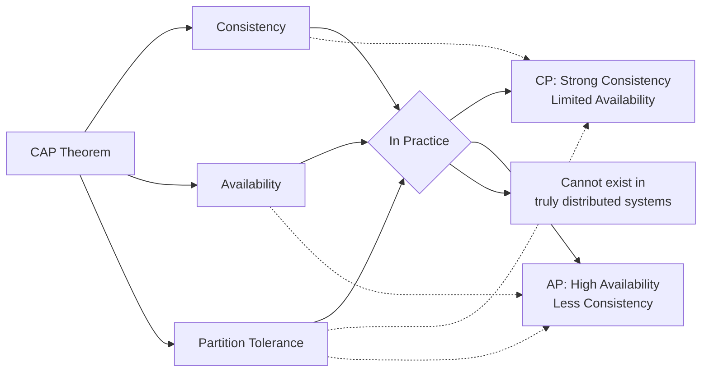
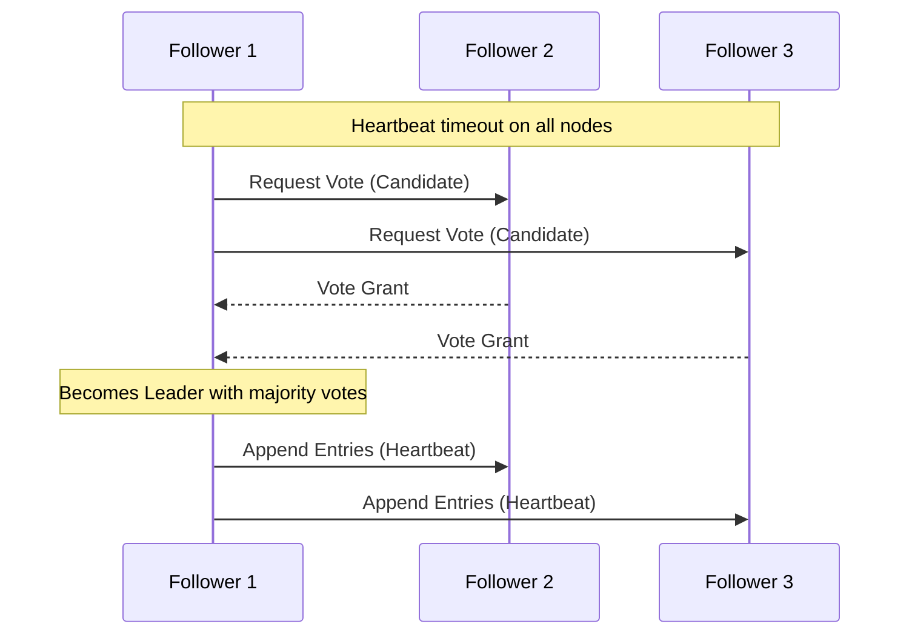

# Chapter 12: Consistency, Consensus & Distributed Algorithms

## Introduction

Distributed systems face unique challenges when maintaining data consistency across multiple nodes. Achieving consensus on shared state in the presence of failures and network partitions is one of the fundamental problems in distributed computing. Understanding these concepts is crucial for designing reliable distributed systems.

## CAP Theorem

### The Trade-Off Triangle

The CAP theorem states that in a distributed system, you can only guarantee two of the following three properties simultaneously:

**Consistency (C):** All nodes see the same data at the same time. Every read receives the most recent write or an error.

**Availability (A):** The system remains operational and responsive. Every request receives a response, without guarantee that it contains the most recent write.

**Partition Tolerance (P):** The system continues to operate despite network failures that prevent some nodes from communicating with others.

### CAP Theorem Implications

**CP Systems (Consistency + Partition Tolerance):**
- Ensure strong consistency during network partitions
- May become unavailable during partitions
- Examples: traditional RDBMS, some NoSQL databases

**AP Systems (Availability + Partition Tolerance):**
- Remain available during network partitions
- May have inconsistent data during partitions
- Examples: DNS, many web services

**CA Systems (Consistency + Availability):**
- Only possible when there are no network partitions
- Not truly distributed systems
- Examples: single-node databases

**Mermaid Diagram: CAP Theorem Trade-Offs**


### Real-World Application

**Banking Systems:** Prioritize consistency (CP) - better to be unavailable than show incorrect balances
**Social Media:** Prioritize availability (AP) - users can tolerate slightly outdated content for better availability

## Consensus Algorithms

### The Consensus Problem

In distributed systems, consensus is the process of achieving agreement among nodes on a single value or decision, even when some nodes may fail or behave incorrectly.

### Two-Phase Commit (2PC)

2PC is a blocking consensus algorithm used in distributed databases.

**Phases:**
1. **Prepare Phase:** Coordinator asks all participants if they can commit
2. **Commit Phase:** Coordinator tells participants to commit or abort based on responses

**Challenges:**
- Blocking problem: if coordinator fails, participants may block indefinitely
- Synchronous communication requirement
- Single point of failure

### Raft Consensus Algorithm

Raft is designed to be more understandable than Paxos while providing the same guarantees.

**Key Concepts:**
- **Leader Election:** One node acts as leader
- **Log Replication:** Leader manages log entries
- **Safety:** Ensures consistency properties

**Raft States:**
- **Follower:** Passively responds to requests
- **Candidate:** Initiates leader election
- **Leader:** Handles all client requests

**Raft Process:**
1. Leader election when heartbeat timeout occurs
2. Log replication from leader to followers
3. Commit when majority of nodes have entry

**Mermaid Diagram: Raft Leader Election**


### Paxos Consensus Algorithm

Paxos is one of the most important consensus algorithms, known for its correctness but complexity.

**Paxos Roles:**
- **Proposer:** Suggests values to be agreed upon
- **Acceptor:** Votes on proposals
- **Learner:** Learns the final agreed value

**Paxos Phases:**
1. **Prepare Phase:** Proposer asks acceptors to promise not to accept lower-numbered proposals
2. **Accept Phase:** Proposer sends value, acceptors accept if they haven't promised higher-numbered proposals

### Byzantine Fault Tolerance (BFT)

Unlike crash-fault tolerance (where nodes fail by stopping), Byzantine fault tolerance handles nodes that may fail arbitrarily, including malicious behavior.

**Use Cases:**
- Blockchain systems
- Financial systems
- Mission-critical applications

## Vector Clocks

### The Problem with Logical Clocks

Physical clocks across different nodes in a distributed system may not be perfectly synchronized, making it difficult to order events that occur on different nodes.

### Vector Clocks Solution

A vector clock is a data structure that provides a partial ordering of events in a distributed system.

**How Vector Clocks Work:**
- Each node maintains an array of counters (one for each node in the system)
- When a node performs an action, it increments its own counter
- When sending a message, it includes its vector clock
- When receiving a message, it updates its vector clock to the maximum of its values and the received values, then increments its own counter

**Example:**
```
Initial state: [0,0,0] for nodes A, B, C
A performs action: A=[1,0,0]
B performs action: B=[0,1,0] 
A sends message to C: A=[2,0,0], message carries [2,0,0]
C receives message: C=[2,0,1] (max of [0,0,0] and [2,0,0], then C's counter incremented)
```

**Event Relationships:**
- **Concurrent:** Events where neither vector clock is greater than the other
- **Happens-before:** If vector clock A is less than or equal to vector clock B in all positions and less in at least one position

## Anti-Entropy

### Dealing with Data Inconsistencies

In eventually consistent systems, data inconsistencies can persist for long periods. Anti-entropy mechanisms detect and repair these inconsistencies.

### Read Repair

When reading data, if multiple replicas return different values, the system can write back the most recent value to outdated replicas.

**Process:**
1. Client reads from multiple replicas
2. System detects inconsistencies
3. Latest value is written back to inconsistent replicas

### Hinted Handoff

When a replica is temporarily unavailable, another node stores a "hint" about the update and forwards it when the replica becomes available.

### Merkle Trees

Merkle trees help efficiently identify which parts of replicated data differ between nodes.

**Process:**
1. Each node builds a Merkle tree of its data
2. Nodes compare root hashes to detect differences
3. Only mismatched subtrees are synchronized

## Consistency Models

### Strong Consistency Models

**Linearizability:**
- Operations appear to occur atomically at some point between their invocation and response
- Provides the illusion of a single system
- Requires synchronization, impacting performance

**Sequential Consistency:**
- Operations appear in the same order to all nodes
- May not correspond to real-time order
- Weaker than linearizability

### Weak Consistency Models

**Eventual Consistency:**
- All replicas eventually converge to the same state
- No guarantees about when consistency will be achieved
- Higher availability and performance

**Causal Consistency:**
- Operations that are causally related are seen in the same order by all processes
- Concurrent operations may be seen in different orders

## Distributed Coordination

### Distributed Locks

Distributed locks coordinate access to shared resources across multiple nodes.

**Challenges:**
- Handling node failures
- Ensuring fairness
- Avoiding deadlocks

**Implementation Approaches:**
- Using consensus algorithms (Raft, Paxos)
- Lease-based systems
- Coordination services (Zookeeper, etcd)

### Distributed Transactions

Distributed transactions span multiple nodes and require coordination to ensure ACID properties.

**Two-Phase Commit (2PC):**
- Prepare phase: coordinator asks participants to prepare
- Commit phase: coordinator tells participants to commit or abort

**Three-Phase Commit (3PC):**
- Attempts to address 2PC's blocking problem
- Adds a "pre-commit" phase
- More complex but reduces blocking

## Real-World Examples

### Google's Spanner

Google's globally distributed database that provides strong consistency using TrueTime API.

**Features:**
- External consistency (linearizability with global clocks)
- TrueTime API for bounded clock uncertainty
- Combined consensus and distributed locks

### Apache Kafka

Uses consensus algorithms for partition leadership.

**Implementation:**
- Zookeeper for leader election
- Leader-follower replication
- Consistent partitioning across brokers

### DynamoDB

Amazon's NoSQL database that prioritizes availability with eventual consistency.

**Features:**
- Vector clocks for version tracking
- Quorum-based read/write (R + W > N)
- Conflict resolution through application-level handling

## Trade-offs and Decision Factors

### Consistency vs. Performance

**Strong Consistency:**
- Pros: Predictable behavior, easier reasoning
- Cons: Lower performance, reduced availability

**Weak Consistency:**
- Pros: Higher performance and availability
- Cons: More complex application logic needed

### Choosing the Right Approach

1. **Understand business requirements:** What's the impact of inconsistency?
2. **Consider performance needs:** How fast do operations need to be?
3. **Analyze failure scenarios:** What happens when partitions occur?
4. **Evaluate implementation complexity:** Can your team handle the complexity?

## Summary

Understanding consistency and consensus in distributed systems is essential for building reliable applications. The CAP theorem reminds us that trade-offs are inevitable, and the choice depends on your specific requirements. Consensus algorithms like Raft and Paxos provide frameworks for achieving agreement despite failures. Techniques like vector clocks and anti-entropy help manage consistency in the face of network challenges. Choose consistency models and algorithms based on your application's specific needs for data integrity, performance, and availability.