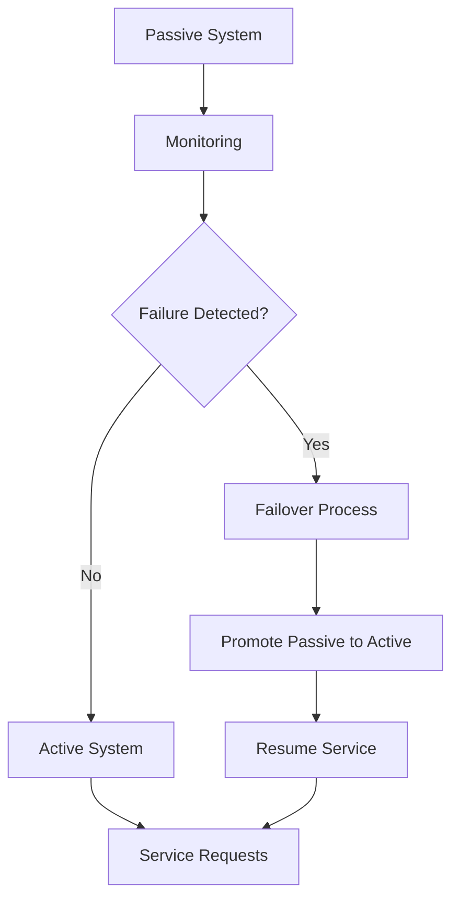
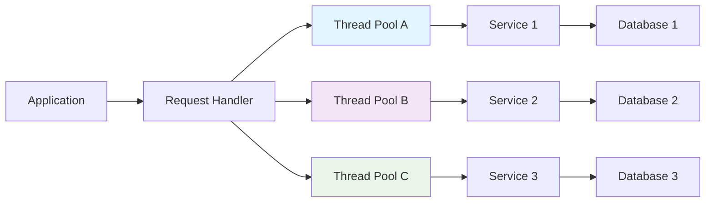

# Chapter 13: Reliability & Fault Tolerance

## Introduction

Reliability is the probability that a system will perform its intended function correctly over a specified period under stated conditions. Fault tolerance is the property that enables a system to continue operating properly in the event of the failure of some of its components. Building reliable, fault-tolerant systems is essential for maintaining service availability and user trust, especially as systems grow in complexity and scale.

## Redundancy Strategies

### Hardware Redundancy

Hardware redundancy involves duplicating critical components to prevent single points of failure.

**Power Supply Redundancy:**
- Multiple power supplies to servers
- Automatic failover when primary fails
- Uninterruptible Power Supplies (UPS) for short outages
- Generator backup for extended outages

**Network Redundancy:**
- Multiple network paths between components
- Load balancers with multiple network interfaces
- Multiple internet service providers (ISPs)

**Storage Redundancy:**
- RAID configurations for disk redundancy
- Multiple copies of data across different storage devices
- Geographic distribution of storage

### Software Redundancy

Software redundancy involves running multiple instances of applications or services to ensure continued operation during failures.

**Process Redundancy:**
- Multiple instances of the same application
- Load balancing across instances
- Automatic failover mechanisms

**Service Redundancy:**
- Multiple microservices performing the same function
- Redundant database clusters
- Multiple API gateways

### Geographic Redundancy

Geographic redundancy spreads system components across multiple physical locations to protect against disasters.

**Multi-Region Deployment:**
- Deploy applications in multiple geographic regions
- Automatic failover between regions
- Data replication across regions

**Disaster Recovery Sites:**
- Hot sites: fully operational, can be switched to immediately
- Warm sites: partially configured, can be activated quickly
- Cold sites: basic infrastructure, requires setup time

## Failover Mechanisms

### Active-Passive Failover

In active-passive configurations, one system is active while another is passive, ready to take over if the active system fails.

**Characteristics:**
- Passive system monitors active system
- Failover upon detection of failure
- May result in brief downtime during failover

**Real-World Example: Database High Availability**
```
Primary Database (Active): Accepts all reads/writes
Replica Database (Passive): Maintains synchronization
Monitoring System: Detects primary failure
Failover: Promotes replica to primary when failure detected
```

### Active-Active Failover

In active-active configurations, multiple systems are operational simultaneously, sharing the workload.

**Characteristics:**
- Both systems actively processing requests
- Higher resource utilization
- Faster failover times
- More complex to implement

**Example: Load Balancer Configuration**
```
Server 1: Processing 50% of requests
Server 2: Processing 50% of requests
Load Balancer: Distributes traffic between both servers
If Server 1 fails: All traffic routed to Server 2
```

### Automated vs Manual Failover

**Automated Failover:**
- Faster response to failures
- Reduced human error
- Potential for false positives (failover when not needed)

**Manual Failover:**
- Human decision-making in complex scenarios
- Prevents unnecessary failovers
- Slower response time

**Mermaid Diagram: Active-Passive Failover**


## Graceful Degradation

Graceful degradation is the ability of a system to maintain limited functionality when components fail, rather than completely stopping.

### Designing for Degradation

**Identify Critical vs. Non-Critical Features:**
- Core functionality that must remain operational
- Enhanced features that can be disabled during stress
- Fallback mechanisms for non-critical services

**Feature Flags:**
- Runtime configuration of feature availability
- Ability to disable components during stress
- A/B testing capabilities

**Real-World Example: Facebook's Degradation Strategy**
- Core feed functionality remains available
- High-resolution images replaced with lower resolution during high load
- Video auto-play disabled during network stress
- Advanced features like games temporarily disabled

### Circuit Breaking Pattern

The circuit breaker pattern prevents a component from repeatedly trying to execute an operation that is likely to fail.

**States:**
- **Closed:** Normal operation, requests pass through
- **Open:** Failure detected, requests fail immediately
- **Half-Open:** Test if service has recovered

**Implementation Example:**
```python
class CircuitBreaker:
    def __init__(self, failure_threshold=5, timeout=60):
        self.failure_threshold = failure_threshold
        self.timeout = timeout
        self.failure_count = 0
        self.last_failure_time = None
        self.state = "closed"  # closed, open, half_open
    
    def call(self, func, *args, **kwargs):
        if self.state == "open":
            if time.time() - self.last_failure_time > self.timeout:
                self.state = "half_open"
            else:
                raise Exception("Circuit breaker is OPEN")
        
        if self.state == "half_open":
            try:
                result = func(*args, **kwargs)
                self._reset()
                return result
            except:
                self._trip()
                raise
        
        try:
            result = func(*args, **kwargs)
            return result
        except:
            self._on_failure()
            raise
    
    def _on_failure(self):
        self.failure_count += 1
        self.last_failure_time = time.time()
        if self.failure_count >= self.failure_threshold:
            self.state = "open"
    
    def _trip(self):
        self.state = "open"
    
    def _reset(self):
        self.failure_count = 0
        self.state = "closed"
```

## Retry Mechanisms

### Exponential Backoff

Exponential backoff increases the delay between retries exponentially to avoid overwhelming the failing system.

**Algorithm:**
- Initial delay: T
- After each failure: delay = delay * backoff_factor
- Maximum delay to prevent indefinite retries

**Implementation:**
```python
import time
import random

def retry_with_backoff(func, max_retries=5, base_delay=1, max_delay=60, backoff_factor=2):
    delay = base_delay
    for attempt in range(max_retries):
        try:
            return func()
        except Exception as e:
            if attempt == max_retries - 1:
                raise e
            # Add jitter to prevent thundering herd
            jitter = random.uniform(0, delay * 0.1)
            time.sleep(delay + jitter)
            delay = min(delay * backoff_factor, max_delay)
```

### Circuit Breaker with Retry

Combining circuit breakers with retry patterns provides robust error handling.

**Benefits:**
- Prevents repeated attempts to failing services
- Allows for recovery with exponential backoff
- Provides better user experience

### Retry Budgets

Implement retry budgets to limit the percentage of requests that are retries.

**Example:**
- Maximum 20% of requests can be retries
- If exceeds threshold, reduce retry frequency
- Prevents cascading failures during high load

## Bulkhead Pattern

The bulkhead pattern isolates elements of a system into pools so that if one fails, the others continue to function.

### Resource Isolation

**Thread Pool Isolation:**
- Separate thread pools for different services
- Prevents one slow service from consuming all threads
- Limits the impact of failures

**Connection Pool Isolation:**
- Separate connection pools for different databases/external services
- Limits resource consumption per service
- Prevents cascading failures

**Database Shard Isolation:**
- Separate database shards for different user groups
- Failure in one shard doesn't affect others
- Enables targeted maintenance

### Real-World Example: Netflix Hystrix

Netflix's Hystrix library implements bulkhead pattern:

**Thread Isolation:**
- Each dependency call runs in its own thread pool
- Pool size limits concurrent calls to dependency
- Prevents one slow dependency from blocking all requests

**Semaphore Isolation:**
- Limits concurrent requests without thread pools
- Lower overhead than thread isolation
- Good for synchronous calls

**Mermaid Diagram: Bulkhead Pattern**


## Failure Detection and Monitoring

### Health Checks

**Active Health Checks:**
- Periodic requests to health endpoints
- Can check dependent services
- More resource-intensive

**Passive Health Checks:**
- Monitor actual traffic for failures
- Less overhead
- Slower failure detection

**Multi-Level Health Checks:**
- Basic: Service responds to requests
- Deep: Dependent services also checked
- Full: Complete functionality validation

### Chaos Engineering

Chaos engineering is the discipline of experimenting on a system to build confidence in its capability to withstand turbulent conditions.

**Principles:**
- Start with a steady state hypothesis
- Vary real-world events (failures, traffic spikes)
- Run in production (safely)
- Automate experiments
- Minimize blast radius

**Real-World Example: Netflix Chaos Monkey**
- Randomly terminates instances in production
- Tests system resilience automatically
- Identifies weaknesses before they cause outages

### Fault Injection

Intentionally introducing faults to test system behavior under failure conditions.

**Types of Fault Injection:**
- Network latency injection
- Service response errors
- Resource exhaustion
- Data corruption

## Design Patterns for Reliability

### Timeout Patterns

**Request Timeout:**
- Prevent infinite waiting for responses
- Should be set appropriately for service expectations
- May need different timeouts for different operations

**Connection Timeout:**
- Time to wait when establishing a connection
- Different from request timeout
- Important for preventing resource exhaustion

### Circuit Breaker Implementation

**State Management:**
- Track request success/failure rates
- Automatically transition between states
- Metrics for monitoring circuit health

**Metrics to Track:**
- Success rate percentage
- Request volume
- Error rate
- Latency distribution

### Idempotency

Ensuring that operations can be safely retried without side effects.

**Implementation:**
- Use unique request identifiers
- Track processed requests
- Design operations to be idempotent by nature

**Example: Payment Processing**
```python
def process_payment(payment_id, amount):
    # Check if already processed
    if payment_exists(payment_id):
        return get_payment_result(payment_id)
    
    # Process the payment
    result = execute_payment(amount)
    store_payment_result(payment_id, result)
    return result
```

## Real-World Reliability Examples

### Amazon S3

Amazon S3 achieves 99.999999999% durability through:

**Multiple Replicas:**
- Data replicated across multiple facilities
- Automatic recovery from failures
- Bit-level integrity checks

**Cross-Region Replication:**
- Optional replication to different geographic regions
- Protection against regional disasters
- Read-only copies for geographic distribution

### Google's Site Reliability Engineering (SRE)

Google's approach to reliability:

**Error Budgets:**
- Allowances for failures based on SLOs
- Balances reliability with feature development
- Clear guidelines on when to prioritize reliability work

**Toil Reduction:**
- Minimize manual operational work
- Automated incident response
- Self-service tools for developers

### Airbnb's Fault Tolerance

Airbnb implements fault tolerance through:

**Service Mesh:**
- Istio for traffic management
- Circuit breakers and retries
- Distributed tracing for debugging

**Feature Flags:**
- Runtime configuration changes
- Gradual rollouts
- Emergency feature disabling

## Reliability Metrics

### Key Reliability Indicators

**Mean Time Between Failures (MTBF):**
- Average time between system failures
- Higher values indicate better reliability

**Mean Time To Recovery (MTTR):**
- Average time to restore service after failure
- Lower values indicate better recovery capability

**Availability:**
- Percentage of time system is operational
- Formula: MTBF / (MTBF + MTTR)

### Service Level Objectives (SLOs)

Reliability-focused SLOs that guide system design:

**Availability SLOs:**
- 99.9% availability (43.8 minutes downtime per month)
- 99.99% availability (4.32 minutes downtime per month)

**Latency SLOs:**
- 95th percentile response time under 100ms
- 99th percentile response time under 200ms

## Summary

Reliability and fault tolerance require careful planning and implementation of multiple strategies. Redundancy at various levels ensures continued operation during component failures. Failover mechanisms provide automatic recovery from failures. Graceful degradation allows systems to continue operating with reduced functionality during stress. Retry mechanisms and circuit breakers prevent cascading failures. The bulkhead pattern isolates failures to prevent them from spreading. Regular testing through chaos engineering reveals weaknesses before they cause real outages. Remember that reliability is not a one-time implementation but an ongoing process that requires continuous monitoring, testing, and improvement.