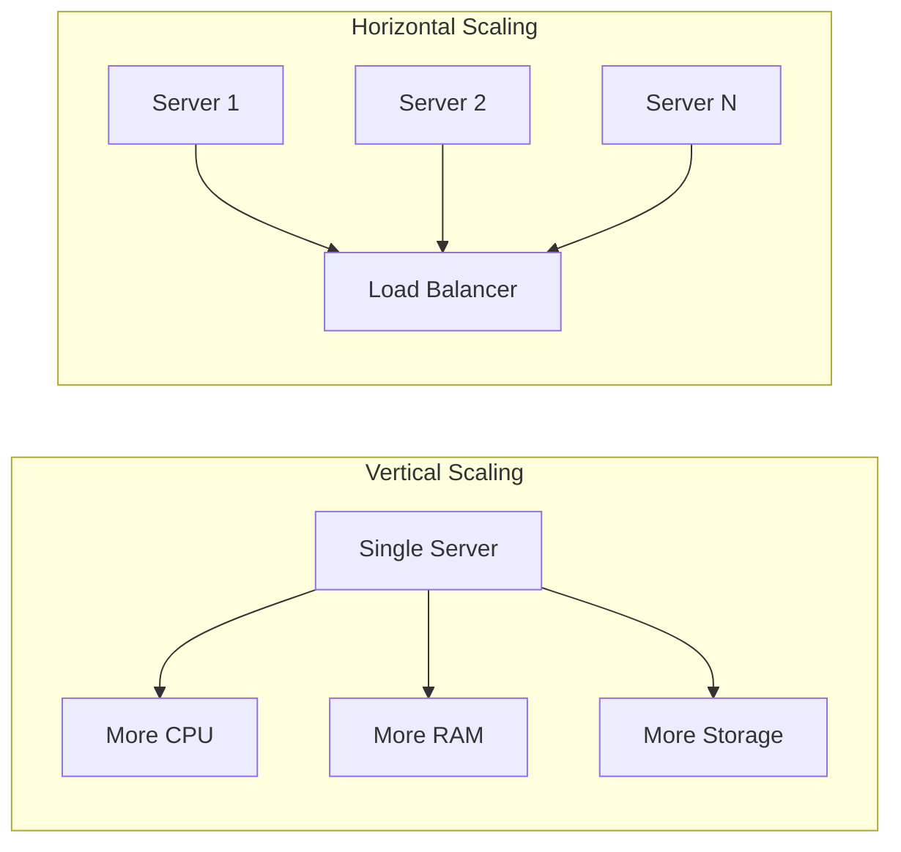
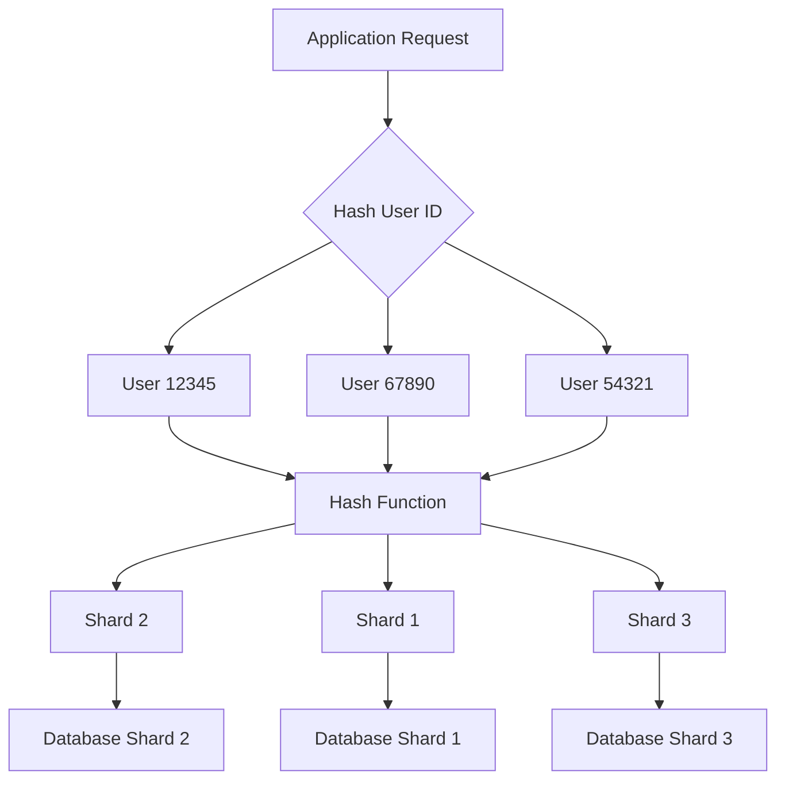
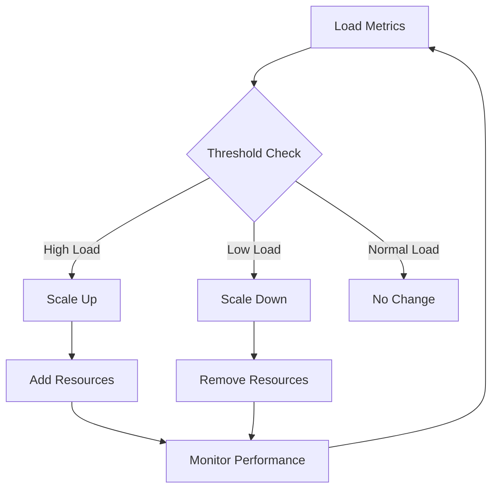

# Chapter 14: Scalability Techniques & Capacity Planning

## Introduction

Scalability is the capability of a system, network, or process to handle a growing amount of work, or its potential to be enlarged to accommodate that growth. It's a critical aspect of system design that determines how well a system can adapt to increased demand. Capacity planning is the process of determining the production capacity needed by an organization to meet changing demands for its products. Together, these concepts ensure that systems can grow efficiently while maintaining performance and cost-effectiveness.

## Vertical vs Horizontal Scaling

### Vertical Scaling (Scale-Up)

Vertical scaling involves increasing the capacity of existing resources by adding more power (CPU, RAM, storage) to a single server or node.

**Advantages:**
- Simpler to implement
- No changes needed to application logic
- Shared data between CPU cores
- No network overhead between components

**Disadvantages:**
- Limited by hardware constraints
- Single point of failure
- Expensive high-end hardware
- Downtime required for upgrades

**Real-World Example: Database Server Upgrade**
- Current server: 8 CPU cores, 32GB RAM
- Upgrade to: 16 CPU cores, 128GB RAM
- Same database instance, better performance
- Application code unchanged

### Horizontal Scaling (Scale-Out)

Horizontal scaling involves adding more servers or nodes to distribute the load across multiple machines.

**Advantages:**
- Near-unlimited scalability
- Better fault tolerance
- Cost-effective (commodity hardware)
- Can be done without downtime

**Disadvantages:**
- More complex application architecture
- Data consistency challenges
- Network overhead
- Distributed system complexity

**Real-World Example: Web Application Auto-Scaling**
- Start with 3 application servers
- Add 2 more servers during high traffic
- Remove extra servers during low traffic
- Load balancer distributes requests among all servers

**Mermaid Diagram: Vertical vs Horizontal Scaling**


### Choosing Between Vertical and Horizontal Scaling

**Choose Vertical Scaling When:**
- Application doesn't support distribution
- Workload is CPU-intensive but requires shared memory
- Limited budget for distributed system complexity
- Predictable, moderate growth

**Choose Horizontal Scaling When:**
- High availability is crucial
- Growth is unpredictable or very high
- Application is stateless
- Need geographic distribution

## Partitioning Strategies

### Vertical Partitioning

Vertical partitioning divides a database table by columns, storing different columns in different tables or databases.

**Approach:**
- Separate frequently accessed columns from rarely accessed ones
- Store different entity types in separate databases
- Often results in normalized schemas

**Example:**
```
Original User Table:
{id, name, email, password, profile_image, last_login, preferences}

Vertical Partitioning:
User Core: {id, name, email, password, last_login}
User Profile: {id, profile_image, preferences}
```

### Horizontal Partitioning (Sharding)

Horizontal partitioning splits a table by rows, distributing them across multiple databases or servers.

**Sharding Strategies:**

**Range-Based Sharding:**
- Partition based on ranges of values
- Example: Users with IDs 1-1000000 in Shard A, 1000001-2000000 in Shard B

**Hash-Based Sharding:**
- Use hash function on shard key to determine partition
- Provides better distribution
- Difficult to add/remove shards

**Directory-Based Sharding:**
- Use a lookup table to map keys to shards
- Most flexible but adds complexity

**Mermaid Diagram: Hash-Based Sharding**


### Partitioning Considerations

**Shard Key Selection:**
- Should distribute data evenly
- Should align with common query patterns
- Should minimize cross-shard operations

**Cross-Shard Operations:**
- Joins across shards are complex
- Transactions spanning shards require distributed handling
- May require application-level logic

## Autoscaling Policies

### CPU-Based Autoscaling

Scale based on CPU utilization metrics.

**Implementation:**
- Set target CPU utilization (e.g., 70%)
- Add servers when CPU exceeds threshold
- Remove servers when CPU falls below threshold

**Pros:**
- Simple to implement and understand
- Direct correlation with processing capacity

**Cons:**
- May not reflect actual user experience
- Doesn't account for I/O-bound workloads

### Request-Based Autoscaling

Scale based on request rate or queue length.

**Implementation:**
- Set target requests per second per server
- Add servers when request rate exceeds capacity
- Remove servers when demand decreases

**Pros:**
- More directly related to user demand
- Works well for web applications

**Cons:**
- May not account for request complexity
- Requires monitoring infrastructure

### Custom Metrics Autoscaling

Scale based on application-specific metrics.

**Examples:**
- Queue length for message processing systems
- Database connection pool usage
- Business metrics like active users

**Mermaid Diagram: Auto-scaling Architecture**


### Predictive Autoscaling

Use historical data and machine learning to predict traffic patterns.

**Approaches:**
- Time-based scaling (anticipate daily/weekly patterns)
- ML-based prediction (analyze multiple factors)
- Hybrid approaches combining prediction and real-time metrics

## Capacity Estimation

### Understanding Workload Patterns

**Traffic Patterns:**
- Peak hours vs. off-peak hours
- Weekly/monthly seasonal trends
- Special events or campaigns
- Organic growth trends

**Resource Utilization:**
- CPU usage patterns
- Memory consumption
- I/O patterns
- Network bandwidth

### Capacity Planning Process

**Step 1: Baseline Measurement**
- Measure current resource utilization
- Identify peak usage periods
- Record performance under normal load

**Step 2: Growth Forecasting**
- Analyze historical growth trends
- Factor in business growth projections
- Consider market expansion plans

**Step 3: Load Testing**
- Simulate expected future loads
- Identify bottlenecks
- Validate performance targets

**Step 4: Resource Planning**
- Calculate required resources for projected load
- Plan for peak usage scenarios
- Consider service level objectives (SLOs)

### Capacity Planning Tools and Techniques

**Benchmarking:**
- Measure system performance under controlled conditions
- Establish performance baselines
- Identify scalability limits

**Load Testing:**
- Simulate real-world traffic patterns
- Gradually increase load to identify breaking points
- Validate system behavior under stress

**A/B Testing:**
- Test different capacity configurations
- Measure impact on performance and cost
- Optimize resource allocation

### Real-World Example: E-commerce Seasonal Planning

**Black Friday Planning Process:**
1. Historical Analysis: Review past Black Friday traffic
2. Growth Projection: Account for year-over-year growth
3. Headroom Calculation: Plan for 2x-3x normal traffic
4. Resource Procurement: Reserve additional capacity
5. Testing: Simulate Black Friday traffic in advance
6. Monitoring: Real-time capacity and performance monitoring

## Headroom Planning

### What is Headroom?

Headroom is the extra capacity reserved beyond expected demand to handle unexpected spikes, traffic surges, or component failures.

### Types of Headroom

**Performance Headroom:**
- Extra capacity to maintain performance during unexpected load
- Typically 20-30% above expected peak usage
- Ensures consistent user experience

**Failure Headroom:**
- Capacity to maintain service during component failures
- Allows for graceful degradation
- Critical for high-availability systems

**Growth Headroom:**
- Capacity for unanticipated growth
- Buffer against inaccurate projections
- Flexibility for business opportunities

### Headroom Calculation

**Rule of Thumb Approach:**
- Normal: 20-30% headroom
- Critical systems: 40-50% headroom
- Seasonal businesses: Variable headroom based on patterns

**Mathematical Approach:**
```
Required Capacity = Expected Peak Load + (Expected Peak Load × Headroom Percentage)
Example: 10,000 requests/sec × (1 + 0.30) = 13,000 requests/sec
```

### Cost vs. Performance Trade-offs

**High Headroom:**
- Pros: Better performance during spikes, higher availability
- Cons: Higher infrastructure costs, lower resource utilization

**Low Headroom:**
- Pros: Lower costs, higher resource utilization
- Cons: Performance degradation during spikes, higher risk of outages

## Scaling Patterns

### Database Scaling Patterns

**Master-Slave Replication:**
- Read replicas for scaling read operations
- Single write master
- Eventual consistency between replicas

**Sharding:**
- Horizontal partitioning of data
- Distributes both read and write load
- Requires careful shard key selection

**Caching Layer:**
- Reduce database load with in-memory caches
- Implement cache-aside, write-through, or write-behind patterns
- Proper cache invalidation strategies

### Application Scaling Patterns

**Stateless Services:**
- No session state stored locally
- Easy to scale horizontally
- Load balancer distributes requests

**Microservices Architecture:**
- Independent scaling of different services
- Fault isolation
- Technology diversity

**Event-Driven Architecture:**
- Async processing with message queues
- Better resource utilization
- Improved fault tolerance

### CDN Scaling

Content Delivery Networks (CDNs) provide geographic distribution and caching.

**Benefits:**
- Reduced load on origin servers
- Improved user experience (lower latency)
- Better scalability for static content

**Implementation:**
- Cache static assets at edge locations
- Implement cache invalidation strategies
- Configure TTLs appropriately

## Performance Optimization

### Database Optimization

**Indexing Strategies:**
- Proper indexing for common query patterns
- Regular index maintenance
- Monitor query performance

**Query Optimization:**
- Analyze slow query logs
- Optimize complex joins
- Use appropriate isolation levels

**Connection Pooling:**
- Reuse database connections
- Limit concurrent connections
- Handle connection failures gracefully

### Application Optimization

**Code Optimization:**
- Profile application performance
- Identify and fix bottlenecks
- Optimize algorithms and data structures

**Caching Strategies:**
- Multi-layer caching (application, database, CDN)
- Proper cache invalidation
- Cache warming strategies

## Real-World Scaling Examples

### Netflix Scaling Architecture

Netflix handles massive scale with:

**Microservices:**
- Thousands of services
- Independent scaling per service
- Resilience through redundancy

**Chaos Engineering:**
- Regular failure testing
- Automatic failover capabilities
- Circuit breaker implementation

**Global Distribution:**
- Regional deployment
- CDN for content delivery
- Multi-region failover

### Twitter's Scaling Journey

Twitter's scaling evolution:

**Early Days:**
- Monolithic Ruby on Rails application
- Relational database
- Scaling challenges during growth

**Current Architecture:**
- Service-oriented architecture
- Distributed databases
- Caching at multiple layers
- Real-time processing with Apache Storm/Kafka

## Capacity Planning Tools

### Monitoring and Alerting

**Infrastructure Monitoring:**
- CPU, memory, disk, network utilization
- Application performance metrics
- Custom business metrics

**Alerting Systems:**
- Threshold-based alerts
- Anomaly detection
- Escalation procedures

### Forecasting Tools

**Time Series Analysis:**
- Predictive analytics for capacity needs
- Seasonal trend analysis
- Anomaly detection

**Cost Optimization:**
- Resource utilization analysis
- Right-sizing recommendations
- Reserved capacity planning

## Summary

Effective scalability and capacity planning require understanding your current system's limitations and projecting future needs. Choose the right scaling approach (vertical vs. horizontal) based on your specific requirements. Implement proper partitioning strategies to distribute load effectively. Set up intelligent autoscaling policies that respond to actual demand. Plan for capacity with appropriate headroom to handle unexpected spikes. Regularly monitor, test, and optimize your system to maintain performance as it scales. Remember that scalability is an ongoing process rather than a one-time implementation, requiring continuous attention and adjustment as your system and user base grow.