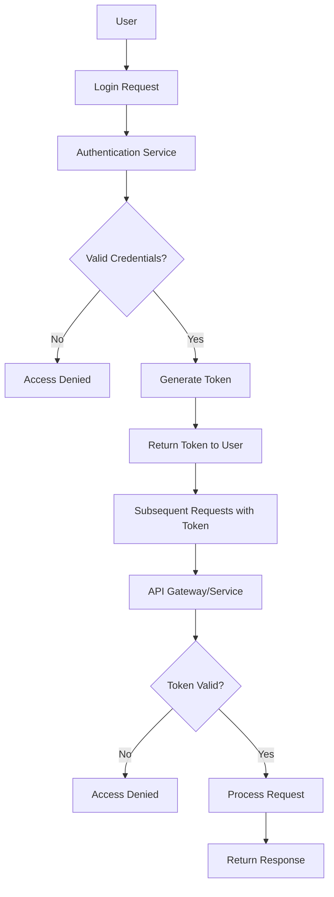
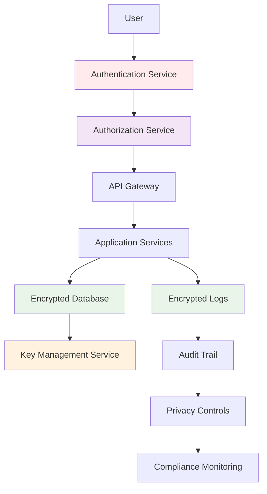

# Chapter 15: Security & Privacy

## Introduction

Security and privacy are fundamental aspects of any system design that handles user data or provides services over networks. As systems become more complex and interconnected, the attack surface increases and the potential impact of security breaches becomes more severe. Privacy concerns have also grown as users become more aware of how their personal information is collected, processed, and stored. Building security and privacy into the foundation of system design, rather than adding them as an afterthought, is critical for creating trustworthy systems.

## Authentication

### What is Authentication?

Authentication is the process of verifying the identity of a user, system, or entity. It answers the question: "Who are you?"

### Authentication Methods

**Password-Based Authentication:**
- Traditional username/password combination
- Second-factor authentication (2FA) for enhanced security
- Password managers to generate and store complex passwords
- Password policies to enforce security requirements

**Multi-Factor Authentication (MFA):**
- Combines multiple authentication factors
- Something you know (password), something you have (token), something you are (biometric)
- Significantly reduces risk of unauthorized access

**Certificate-Based Authentication:**
- Uses public key infrastructure (PKI)
- More secure than passwords
- Common in enterprise and IoT systems
- Requires certificate management infrastructure

**Token-Based Authentication:**
- JWT (JSON Web Tokens) for stateless authentication
- OAuth 2.0 for authorization frameworks
- API keys for service-to-service communication

**Example JWT Implementation:**
```python
import jwt
import datetime

# Generate token
def generate_token(user_id, secret_key):
    payload = {
        'user_id': user_id,
        'exp': datetime.datetime.utcnow() + datetime.timedelta(hours=1),
        'iat': datetime.datetime.utcnow()
    }
    token = jwt.encode(payload, secret_key, algorithm='HS256')
    return token

# Verify token
def verify_token(token, secret_key):
    try:
        payload = jwt.decode(token, secret_key, algorithms=['HS256'])
        return payload['user_id']
    except jwt.ExpiredSignatureError:
        return None  # Token expired
    except jwt.InvalidTokenError:
        return None  # Invalid token
```

### Authentication Architecture

**Centralized Authentication:**
- Single sign-on (SSO) systems
- Authentication as a service
- Consistent security policies across services

**Distributed Authentication:**
- Decentralized identity systems
- Blockchain-based identity
- Self-sovereign identity approaches

**Mermaid Diagram: Authentication Flow**


## Authorization

### What is Authorization?

Authorization is the process of determining what resources or actions an authenticated user is permitted to access. It answers the question: "What are you allowed to do?"

### Authorization Models

**Role-Based Access Control (RBAC):**
- Permissions assigned based on user roles
- Hierarchical roles (admin, user, guest)
- Easier to manage than individual permissions
- Common in enterprise systems

**Attribute-Based Access Control (ABAC):**
- Decisions based on user, resource, and environment attributes
- More flexible than RBAC
- Complex to implement but very granular
- Good for dynamic access requirements

**Access Control Lists (ACL):**
- Permissions associated with specific resources
- Fine-grained control
- Can be complex to manage at scale

**Policy-Based Access Control:**
- Uses policies written in policy languages (like Rego)
- Centralized policy enforcement
- Declarative approach to access control

### Authorization Implementation

**Token-Based Authorization:**
- Include permissions in JWT tokens
- Token validation in API gateways
- Short-lived tokens for security

**Centralized Authorization Service:**
- Dedicated service for policy decisions
- Consistent authorization across services
- Can become a bottleneck if not properly scaled

**Example RBAC Implementation:**
```python
class AuthorizationService:
    def __init__(self):
        # Role to permission mapping
        self.role_permissions = {
            'admin': {'read', 'write', 'delete', 'manage_users'},
            'editor': {'read', 'write'},
            'viewer': {'read'}
        }
    
    def check_permission(self, user, resource, action):
        user_role = user.get('role')
        if user_role in self.role_permissions:
            return action in self.role_permissions[user_role]
        return False
    
    def get_user_permissions(self, user):
        user_role = user.get('role')
        if user_role in self.role_permissions:
            return self.role_permissions[user_role]
        return set()
```

## Encryption

### Encryption in Transit

Encryption in transit protects data as it moves between systems, preventing interception and tampering.

**Transport Layer Security (TLS):**
- Standard protocol for securing communications
- Uses public key cryptography for key exchange
- Encrypts entire communication channel

**Implementation Best Practices:**
- Use TLS 1.2 or higher (TLS 1.3 preferred)
- Regularly update certificate authorities
- Implement certificate pinning for mobile apps
- Monitor for deprecated cipher suites

**Real-World Example: HTTPS**
- All modern web applications should use HTTPS
- Certificate management through services like Let's Encrypt
- HTTP to HTTPS redirects
- HSTS headers for security

### Encryption at Rest

Encryption at rest protects data stored in databases, file systems, and backup systems.

**Database Encryption:**
- Transparent database encryption (TDE)
- Column-level encryption for sensitive fields
- Key management for encryption keys

**File System Encryption:**
- Full disk encryption
- Selective file encryption
- Cloud-based encryption with customer-managed keys

**Key Management:**
- Hardware Security Modules (HSMs) for key storage
- Key rotation policies
- Separation of duties for key management
- Encryption key lifecycle management

**Implementation Example: Field-Level Encryption**
```python
from cryptography.fernet import Fernet
import base64

class FieldEncryption:
    def __init__(self, key):
        self.cipher = Fernet(key)
    
    def encrypt_field(self, plaintext):
        encrypted_bytes = self.cipher.encrypt(plaintext.encode())
        return base64.b64encode(encrypted_bytes).decode()
    
    def decrypt_field(self, encrypted_text):
        encrypted_bytes = base64.b64decode(encrypted_text.encode())
        return self.cipher.decrypt(encrypted_bytes).decode()

# Usage for sensitive data like SSN
key = Fernet.generate_key()
field_encryption = FieldEncryption(key)

# Encrypt sensitive data before storage
ssn = "123-45-6789"
encrypted_ssn = field_encryption.encrypt_field(ssn)
# Store encrypted_ssn in database

# Decrypt when needed
decrypted_ssn = field_encryption.decrypt_field(encrypted_ssn)
```

## Threat Modeling

### What is Threat Modeling?

Threat modeling is a systematic approach to identifying, understanding, and addressing potential security threats to a system.

### STRIDE Methodology

**Spoofing:** Someone might pose as another user or system
- Mitigation: Authentication, digital signatures

**Tampering:** Someone might modify data in transit or at rest
- Mitigation: Integrity checks, digital signatures, encryption

**Repudiation:** A user might deny performing an action
- Mitigation: Logging, audit trails, digital signatures

**Information Disclosure:** Sensitive information might be exposed
- Mitigation: Encryption, access controls, data minimization

**Denial of Service:** Services might be unavailable to legitimate users
- Mitigation: Rate limiting, resource quotas, DDoS protection

**Elevation of Privilege:** Someone might gain higher privileges than intended
- Mitigation: Principle of least privilege, access controls

### Threat Modeling Process

1. **Define Security Objectives:** What are you trying to protect?
2. **Create Architecture Overview:** How is the system structured?
3. **Decompose the Application:** Identify components and data flows
4. **Identify Threats:** Use frameworks like STRIDE
5. **Document Vulnerabilities:** Record findings
6. **Rank Threats:** Prioritize based on risk
7. **Define Countermeasures:** Plan how to address threats

## Privacy Considerations

### Data Minimization

Collect only the data that is necessary for the specific business purpose.

**Principles:**
- Collect minimum required data
- Retain data only as long as necessary
- Delete data when no longer needed
- Avoid storing unnecessary personal information

### User Consent and Control

**Consent Management:**
- Clear, specific consent for data processing
- Ability to withdraw consent
- Granular consent options
- Record and audit consent decisions

**User Rights:**
- Right to access their data
- Right to data portability
- Right to be forgotten
- Right to rectification

### PII (Personally Identifiable Information) Handling

**PII Identification:**
- Names, addresses, emails
- IP addresses, device IDs
- Financial information
- Health information

**PII Protection Strategies:**
- Data encryption and tokenization
- Access controls and audit logs
- Data loss prevention (DLP) tools
- Anonymization and pseudonymization techniques

**Real-World Example: GDPR Compliance**
- Data processing agreements
- Privacy by design
- Data breach notification procedures
- User data access requests

### Data Sovereignty and Jurisdiction

**Data Residency:**
- Store data in specific geographic locations
- Compliance with local data protection laws
- Cross-border data transfer restrictions

**Legal Compliance:**
- GDPR in Europe
- CCPA in California
- HIPAA for health data
- SOX for financial data

**Mermaid Diagram: Privacy and Security Architecture**


## Security Best Practices

### Principle of Least Privilege

Each component should have the minimum permissions necessary to perform its function.

**Implementation:**
- Role-based access controls
- Service accounts with minimal permissions
- Regular review of access rights
- Automated access provisioning and deprovisioning

### Defense in Depth

Multiple layers of security controls to protect the system.

**Layers:**
- Network security (firewalls, VPNs)
- Application security (input validation, authentication)
- Data security (encryption, access controls)
- Physical security (data center security)

### Regular Security Audits and Penetration Testing

**Internal Audits:**
- Code reviews for security vulnerabilities
- Configuration audits
- Access control reviews
- Security policy compliance checks

**External Testing:**
- Penetration testing by security firms
- Bug bounty programs
- Security assessments
- Compliance audits

## Security in Different Components

### API Security

**Rate Limiting:**
- Prevent abuse and DoS attacks
- Token bucket or leaky bucket algorithms
- Different limits for different user types

**API Gateway Security:**
- Authentication and authorization
- Request/response validation
- Logging and monitoring
- Threat detection

### Database Security

**Access Controls:**
- Role-based database permissions
- Network-based access controls
- Query monitoring and logging

**Data Protection:**
- Encryption at rest
- Column-level encryption
- Backup encryption
- Data masking for development

### Network Security

**Firewalls:**
- Network-based firewalls
- Application firewall (WAF)
- Host-based firewalls

**Network Segmentation:**
- Separate networks for different components
- DMZ for public-facing services
- VPNs for remote access

## Privacy by Design

### Privacy Principles

**Proactive, Not Reactive:**
- Build privacy from the ground up
- Anticipate privacy risks
- Implement privacy controls before problems occur

**Privacy as the Default:**
- Strong privacy settings by default
- User data not collected unless necessary
- Data automatically deleted after retention period

**End-to-End Security:**
- Protection throughout data lifecycle
- Secure data collection, processing, storage
- Secure deletion of data

### Data Protection Techniques

**Anonymization:**
- Remove or encrypt identifying information
- Prevent re-identification of individuals
- Use statistical methods to ensure anonymity

**Pseudonymization:**
- Replace identifiers with artificial identifiers
- Maintain possibility of re-identification with additional information
- More flexible than anonymization

**Data Tokenization:**
- Replace sensitive data with non-sensitive tokens
- Map tokens back to original data with secure mapping
- Protect data while maintaining utility

## Compliance and Regulations

### Major Compliance Frameworks

**GDPR (General Data Protection Regulation):**
- EU regulation for data protection
- Requires consent for data processing
- Right to be forgotten
- Data breach notification requirements

**HIPAA (Health Insurance Portability and Accountability Act):**
- US regulation for health data
- Strict privacy and security requirements
- Business associate agreements required

**SOX (Sarbanes-Oxley Act):**
- US regulation for financial records
- Internal controls and reporting requirements
- Data integrity for financial information

### Compliance Monitoring

**Automated Monitoring:**
- Real-time compliance checking
- Automated reporting
- Policy violation alerts

**Audit Trails:**
- Comprehensive logging
- Immutable audit logs
- Regular audit reviews

## Real-World Security Examples

### OAuth 2.0 Implementation

OAuth 2.0 is the industry standard for authorization.

**Authorization Code Flow:**
1. User initiates login at client application
2. Redirected to authorization server
3. User authenticates and grants permissions
4. Authorization server returns authorization code
5. Client exchanges code for access token
6. Client uses token to access protected resources

### Zero Trust Architecture

Zero trust assumes that networks are inherently untrusted and verifies everything.

**Principles:**
- Never trust, always verify
- Default deny, explicit allow
- Continuous verification
- Least privilege access

## Incident Response

### Security Incident Handling

**Detection and Analysis:**
- Security monitoring and alerting
- Incident classification and prioritization
- Forensic analysis of security events

**Containment, Eradication, and Recovery:**
- Isolate affected systems
- Remove threat from systems
- Restore systems from clean backups
- Verify system integrity

**Post-Incident Activities:**
- Root cause analysis
- Lessons learned documentation
- Process improvements
- Communication with stakeholders

## Summary

Security and privacy must be foundational elements of system design rather than afterthoughts. Implement strong authentication and authorization mechanisms to verify user identity and control access to resources. Protect data both in transit and at rest using appropriate encryption techniques. Conduct regular threat modeling to identify and address potential security weaknesses. Handle personal information responsibly by following privacy principles and regulatory requirements. Implement defense in depth strategies with multiple security layers. Regularly test and audit your security measures. Remember that security is an ongoing process that requires continuous attention, monitoring, and improvement as threats evolve and systems change.