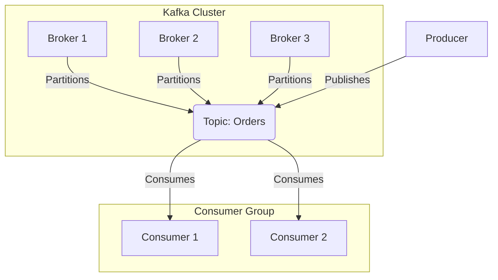

# Chapter 16: Data Pipelines & Stream Processing

## Introduction

In today's data-driven world, systems need to handle massive volumes of data in various ways. Data pipelines and stream processing are critical components that enable organizations to collect, process, and analyze data efficiently, whether in real-time or batch mode. Understanding these concepts is essential for designing scalable data systems.

## Batch vs Stream Processing

### Batch Processing
Batch processing involves collecting data over a period of time and processing it in large chunks. This approach is suitable for scenarios where near real-time processing is not required.

**Characteristics:**
- Processes data in scheduled intervals
- Handles large volumes of data efficiently
- Provides strong consistency and reliability
- Generally more cost-effective for large datasets

**Real-world example:** Daily financial reporting systems that process all transactions from the previous day overnight.

### Stream Processing
Stream processing handles data as it arrives, enabling real-time or near real-time analysis. This approach is crucial for applications requiring immediate responses to events.

**Characteristics:**
- Processes data immediately upon arrival
- Enables real-time analytics and decision-making
- Handles continuous data flow
- Requires sophisticated fault-tolerance mechanisms

**Real-world example:** Fraud detection systems that analyze transactions as they occur to detect suspicious patterns instantly.

## Event Sourcing

Event sourcing is a pattern where changes to application state are stored as a sequence of events. Rather than storing the current state, the system stores the history of events that led to the current state.

### Key Concepts
- **Event Store**: A database optimized for storing events
- **Event Replay**: The ability to reconstruct current state by replaying all events
- **Event Sourcing**: Persisting state changes as a log of events

### Benefits
- Complete audit trail of all changes
- Ability to reconstruct state at any point in time
- Time travel debugging capabilities
- Natural fit for event-driven architectures

### Real-world Example
An e-commerce order system where every change to an order (creation, payment, shipping, cancellation) is stored as an event. This allows reconstructing the complete history of an order and enables features like time-travel debugging.

## Stream Processors (Kafka, Apache Beam)

### Apache Kafka
Kafka is a distributed streaming platform that enables building real-time data pipelines and streaming applications. It serves as a publish-subscribe messaging system with high throughput and durability.

**Key Components:**
- **Topics**: Categories where records are stored
- **Partitions**: Topics are split into partitions for parallel processing
- **Brokers**: Kafka servers that store data
- **Producers**: Applications that publish data to Kafka
- **Consumers**: Applications that subscribe to topics

**Architecture Diagram:**

### Apache Beam
Apache Beam is an open-source unified programming model for defining both batch and streaming data processing pipelines. It abstracts the underlying execution engine.

**Key Concepts:**
- **Pipelines**: Directed acyclic graphs of processing steps
- **PCollections**: Distributed datasets
- **PTransforms**: Operations applied to PCollections
- **Runners**: Execution engines (Apache Spark, Apache Flink, Google Cloud Dataflow)

## Windowing in Stream Processing

Windowing is a technique that partitions streaming data based on time boundaries, enabling aggregation and analysis over specific time intervals.

### Types of Windows

1. **Tumbling Windows**: Fixed-size, non-overlapping windows
2. **Sliding Windows**: Fixed-size, overlapping windows
3. **Session Windows**: Dynamically sized windows based on activity gaps
4. **Global Windows**: Process all data as a single window

### Example Use Cases
- **Tumbling**: Average temperature every 5 minutes
- **Sliding**: Moving average of stock price every minute over last 10 minutes
- **Session**: Grouping user activities into sessions separated by 30-minute inactivity

## Exactly-Once Processing

Exactly-once processing guarantees that each message in a stream is processed only once, preventing duplicates and maintaining data integrity even in the presence of failures.

### Challenges
- Network failures
- Node failures
- Duplicate message delivery
- Partial processing results

### Solutions
- **Idempotent Operations**: Operations that can be safely applied multiple times
- **Transaction-Based Processing**: Ensuring atomicity of operations
- **Message Deduplication**: Tracking and eliminating duplicate messages

## Change Data Capture (CDC)

Change Data Capture is a pattern for automatically monitoring and capturing changes made to a database and streaming those changes to other systems in real-time.

### How CDC Works
1. Database logs transaction logs or write-ahead logs
2. CDC system monitors these logs for changes
3. Changes are captured and formatted as events
4. Events are published to downstream systems

### Benefits
- Real-time data synchronization
- Decoupling of data sources and consumers
- Reduced load on source databases
- Maintaining data consistency across systems

### Real-world Example
An online retail system where changes to inventory in the main database are immediately captured and synchronized to search indexes, recommendation engines, and analytics systems.

## Conclusion

Data pipelines and stream processing are essential for building modern data systems that can handle the volume, velocity, and variety of data in today's applications. Understanding these concepts enables architects to design systems that can process data efficiently, with the right balance of latency, throughput, and reliability for their specific use cases.