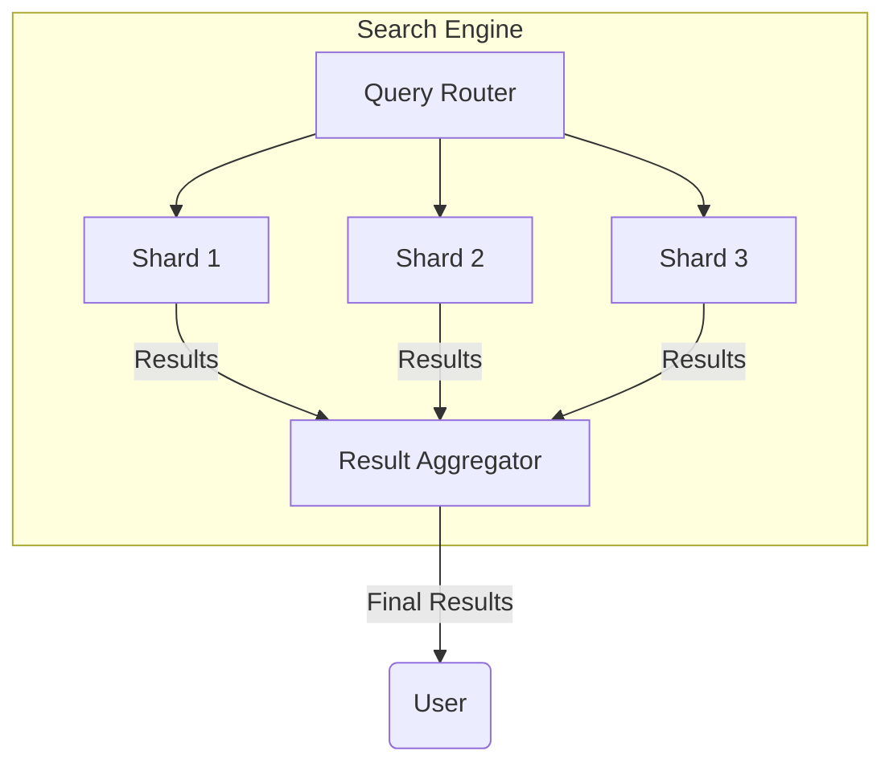

# Chapter 17: Search, Indexing & Full-Text Systems

## Introduction

Search systems are critical components in many applications, from e-commerce platforms to content management systems. Building efficient search systems requires understanding of indexing techniques, ranking algorithms, and optimization strategies to provide users with relevant results quickly.

## Inverted Indexes

An inverted index is a data structure that maps content (like words) to their location in a database or document set. It's the foundational technology behind most search engines.

### Structure
- **Terms Dictionary**: Contains all unique terms in the corpus
- **Postings List**: For each term, a list of documents containing that term
- **Metadata**: Additional information like term frequency, positions, etc.

### Example Structure
```
Term        → [Document IDs]
"apple"     → [doc1, doc3, doc7, doc12]
"banana"    → [doc2, doc5, doc8]
"cherry"    → [doc1, doc5, doc9, doc13, doc15]
```

### Advantages
- Fast query processing
- Efficient storage of document-term relationships
- Enables complex query operations

### Real-world Example
Google Search uses an enormous inverted index to map search terms to web pages. When you search for "system design," Google looks up this term in its inverted index to find all pages containing these words.

## Ranking and Scoring

Ranking determines the order in which search results are presented to users. Different algorithms exist to calculate relevance scores.

### TF-IDF (Term Frequency-Inverse Document Frequency)
- **Term Frequency (TF)**: How often a term appears in a document
- **Inverse Document Frequency (IDF)**: Rarity of the term across all documents
- **TF-IDF Score**: Product of TF and IDF, indicating term importance

### BM25 (Best Matching 25)
An improvement over TF-IDF that provides better ranking by considering document length normalization and term saturation.

### Machine Learning-Based Ranking
Modern search engines use complex machine learning models that consider:
- User behavior patterns
- Click-through rates
- Relevance feedback
- Personalization signals

### Real-world Example
E-commerce search engines like Amazon use sophisticated ranking algorithms that consider not just text relevance but also sales history, user preferences, ratings, and personalization signals to rank product results.

## Sharding Search Indices

As search systems grow, indices need to be distributed across multiple servers for scalability and performance.

### Horizontal Sharding
- Distribute index across multiple machines
- Each shard contains a subset of the data
- Query requests distributed across shards

### Sharding Strategies
1. **Term-based Sharding**: Distribute terms across nodes
2. **Document-based Sharding**: Distribute documents across nodes
3. **Hash-based Sharding**: Use hash of document ID or term ID

### Architecture Diagram:


### Challenges and Solutions
- **Query Fan-out**: Sending queries to all shards simultaneously
- **Result Aggregation**: Merging and ranking results from multiple shards
- **Load Balancing**: Ensuring even distribution of queries across shards

## Near-Real-Time Indexing

Near-real-time (NRT) indexing allows new or updated content to be searchable almost immediately, typically within seconds.

### Approach
- **Refresh Intervals**: Periodically refresh the search index
- **Buffering**: Temporarily store incoming documents
- **Segment Merging**: Merge small segments into larger ones over time

### Trade-offs
- **Performance vs. Freshness**: More frequent refreshes impact performance
- **Memory Usage**: Maintaining buffers and multiple index versions
- **Consistency**: Ensuring all replicas are updated

### Real-world Example
Social media platforms like Twitter need near-real-time indexing to ensure that when a user posts a tweet, it becomes searchable quickly. This requires balancing the need for immediate availability with system performance.

## Query Optimization

Optimizing search queries is crucial for system performance and user experience.

### Index Optimization
- **Field Selection**: Index only necessary fields
- **Analyzer Selection**: Use appropriate text analyzers for different languages
- **Index Types**: Choose between different index types (text, exact, range)

### Query Optimization Techniques
- **Query Caching**: Cache results for popular queries
- **Filtering**: Use filters before text scoring for better performance
- **Pagination**: Implement efficient result pagination
- **Auto-complete**: Provide suggestions during typing

### Performance Monitoring
- **Query Latency**: Track response times
- **Cache Hit Rates**: Monitor query cache effectiveness
- **Resource Utilization**: CPU, memory, and disk usage patterns

## Advanced Search Features

### Fuzzy Search
Handles typos and spelling variations by finding similar terms:
- **Edit Distance**: Number of operations to transform one string to another
- **Phonetic Matching**: Finds terms that sound similar
- **N-gram Search**: Breaks terms into smaller chunks

### Faceted Search
Allows users to refine results by applying filters:
- **Category Filters**: Filter by product category
- **Price Ranges**: Filter by price brackets
- **Availability**: Filter by stock status

### Personalization
- **User History**: Consider past searches and clicks
- **Location**: Adjust results based on user location
- **Preferences**: Adapt to user preferences and behavior

## Conclusion

Search, indexing, and full-text systems are complex but essential components of modern applications. Understanding inverted indexes, ranking algorithms, sharding strategies, and optimization techniques enables architects to design search systems that deliver relevant results with low latency while scaling to handle large volumes of data and queries.