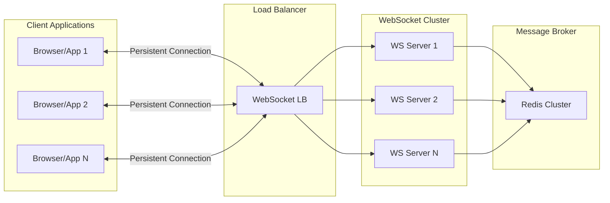
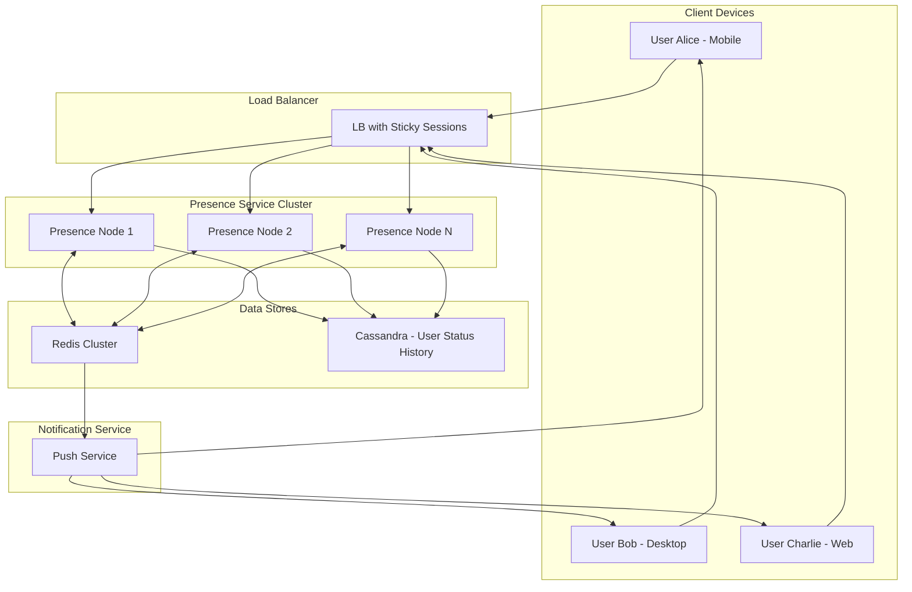

# Chapter 18: Real-Time Systems & Notifications

## Introduction

Real-time systems enable instant communication between applications and users, creating interactive experiences that respond immediately to events. These systems are fundamental to modern applications like chat, gaming, live dashboards, and collaborative tools. Building reliable real-time systems requires understanding of various protocols, delivery guarantees, and scaling strategies.

The key characteristics of real-time systems include:
- **Low Latency**: Sub-second response times for immediate user interaction
- **Bidirectional Communication**: Ability for both client and server to send messages
- **Connection Persistence**: Maintaining long-lived connections
- **Scalability**: Handling millions of concurrent connections efficiently

## WebSocket Protocol

WebSocket is a bidirectional communication protocol that maintains a persistent connection between client and server, enabling real-time data exchange.

### Key Characteristics

- **Persistent Connection**: Single TCP connection remains open for the session duration
- **Full Duplex**: Both client and server can send data simultaneously
- **Low Overhead**: Minimal framing overhead compared to HTTP
- **Cross-Domain**: Supports cross-origin communication with proper headers
- **Binary and Text Support**: Can transmit both text and binary data efficiently

### Connection Lifecycle

1. **Handshake**: HTTP Upgrade request to establish WebSocket connection
   ```
   GET /chat HTTP/1.1
   Host: server.example.com
   Upgrade: websocket
   Connection: Upgrade
   Sec-WebSocket-Key: x3JJHMbDL1EzLkh9GBhXDw==
   Sec-WebSocket-Protocol: chat, superchat
   Sec-WebSocket-Version: 13
   ```

2. **Data Transfer**: Bidirectional message exchange over the established connection

3. **Termination**: Graceful or abrupt connection closure with proper error handling

### Real-world Example

Stock trading platforms like Robinhood use WebSockets to provide real-time price updates to traders. When a trade executes, the price change is immediately pushed to all connected clients, ensuring traders have the most current market data for making decisions. Without WebSockets, clients would need to continuously poll the server, causing unnecessary load and potential delays.

### Architecture Diagram



### Implementation Considerations

- **Connection Management**: Tracking active connections using connection pools and session stores
- **Message Broadcasting**: Sending messages to multiple clients efficiently
- **Heartbeats**: Maintaining connection health with periodic ping/pong messages
- **Reconnection Logic**: Handling network failures with exponential backoff
- **Connection State**: Managing connection state across multiple server instances

## Server-Sent Events (SSE)

Server-Sent Events provide a way for servers to send real-time updates to clients over HTTP connections. Unlike WebSockets, SSE enables unidirectional communication from server to client.

### Key Features

- **Unidirectional**: Server pushes data to clients (one-way communication)
- **Automatic Reconnection**: Built-in reconnection mechanism on connection failure
- **Simple Format**: Text-based event format that's easy to parse
- **HTTP-Based**: Works well with existing HTTP infrastructure
- **Event Types**: Support for different event types and data formats

### Event Format

```
data: Hello World

data: Second line

```

For more complex events:
```
event: user-update
data: {"id": 123, "name": "John Doe", "status": "online"}

event: notification
data: {"message": "New message received", "timestamp": "2023-06-01T10:00:00Z"}
```

### Use Cases

- **Live blog updates**: Pushing new blog posts or comments to readers
- **Stock price feeds**: Providing real-time financial data updates
- **Progress indicators**: Showing upload/download progress to users
- **Real-time dashboards**: Updating metrics and KPIs without page refresh

### Advantages Over WebSockets

- **Simpler implementation**: No need for bidirectional communication handling
- **Better browser support**: Supported in most modern browsers
- **Automatic reconnection**: Built-in reconnection with configurable intervals
- **Works better with load balancers**: No sticky session requirements

### Disadvantages

- **Unidirectional**: Cannot send data from client to server
- **Limited binary support**: Text-based only (though binary can be Base64 encoded)
- **Single connection**: Only one connection per client compared to multiple WebSocket connections

## Real-Time Delivery Guarantees

Real-time systems must make trade-offs between delivery reliability and performance. Understanding different delivery guarantees helps design appropriate systems for specific use cases.

### At-Most-Once Delivery

- Message may be delivered once or not at all
- No duplicate delivery
- Potential message loss
- **Use case**: Live position updates in a game where old positions are irrelevant

```
Client sends: "Player moved to (x=10, y=5)"
Network drops: Message lost
Client sends: "Player moved to (x=12, y=6)"  // Only this is processed
```

### At-Least-Once Delivery

- Message guaranteed to be delivered one or more times
- Possible duplicate delivery
- No message loss
- **Use case**: Financial transactions where duplicates can be handled

```
Client sends: "Transfer $100 to account 123"
Server acknowledges but connection drops
Client resends: "Transfer $100 to account 123"  // Processed again, but deduplicated
```

### Exactly-Once Delivery

- Message delivered exactly one time
- Complex to implement correctly
- Requires sophisticated deduplication mechanisms
- **Use case**: Critical business transactions where accuracy is essential

### Delivery Order Guarantees

- **FIFO**: Messages delivered in order of arrival (strict ordering)
- **Priority-based**: High-priority messages delivered first (with optional ordering within priority levels)
- **Parallel**: Messages delivered in parallel when order doesn't matter (maximum throughput)

### Real-world Example

In a multiplayer gaming environment, different types of messages have different delivery requirements:
- Player position updates: At-most-once delivery (old positions become irrelevant)
- Score updates: At-least-once delivery to ensure accuracy
- Critical game events: Exactly-once delivery to prevent duplication
- Chat messages: In-order delivery to maintain conversation context

## Presence Systems

Presence systems track and broadcast the online status and activity of users in real-time. These systems are crucial for applications that need to show user availability and activity status.

### Core Components

1. **Status Tracking**: Monitor user states (online, away, busy, offline)
2. **Activity Monitoring**: Track what users are currently doing
3. **Subscription Management**: Determine who gets notified about status changes
4. **Heartbeat Management**: Regular ping-pong to detect connection failures

### Implementation Strategies

1. **Centralized**: Single service tracks all user states
   - Pros: Simpler consistency, easier management
   - Cons: Single point of failure, scalability challenges

2. **Distributed**: Multiple services coordinate to track states
   - Pros: Better scalability, fault tolerance
   - Cons: Complex consistency management

3. **Hybrid**: Local caching with distributed coordination
   - Pros: Balance of performance and reliability
   - Cons: More complex implementation

### Scalability Challenges

- **Millions of Connections**: Supporting high connection counts requires distributed systems
- **State Synchronization**: Keeping presence data consistent across nodes
- **Network Partitions**: Handling connection interruptions gracefully
- **Memory Management**: Each connection consumes memory resources

### Architecture Diagram



### Real-world Example

Instant messaging applications like WhatsApp or Discord use sophisticated presence systems. When a user's status changes (online to offline), the system must:
1. Detect the connection failure through heartbeat timeouts
2. Update the user's status in the distributed cache
3. Notify all subscribed contacts of the status change
4. Maintain status history for user availability patterns

## Scaling Pub/Sub for Real-Time Features

Publish/Subscribe (pub/sub) messaging patterns are essential for building scalable real-time systems. They decouple message producers from consumers, enabling flexible and resilient architectures.

### Message Brokers Comparison

- **Redis Pub/Sub**: 
  - Simple publish-subscribe model
  - In-memory storage (messages lost on disconnect)
  - Excellent for fan-out scenarios
  - Best for short-lived real-time messages

- **Apache Kafka**:
  - High-throughput, durable messaging
  - Message persistence and replay capabilities
  - Complex but scalable streaming platform
  - Best for event-driven architectures

- **RabbitMQ**:
  - Robust messaging with multiple protocols
  - Advanced routing capabilities
  - Enterprise features and management tools
  - Best for complex routing requirements

- **Amazon SNS**:
  - Cloud-native pub/sub service
  - Easy integration with AWS ecosystem
  - Automatic scaling and management
  - Best for cloud-native applications

### Fan-out Strategies

#### 1. Fan-out at Write

Pre-populate data for all recipients at write time:
```
When User A posts: "Hello everyone!"
→ Immediately write to feeds of all followers [B, C, D, E...]
→ Each follower's feed already has the post
→ Read is fast (just fetch user's feed)
```

- Pros: Fast read operations
- Cons: Heavy write operations, potential for write bottlenecks

#### 2. Fan-out at Read

Aggregate data from all followed users at read time:
```
When User B refreshes feed:
→ Read latest posts from followed users [A, F, G, H...]
→ Merge and sort posts by timestamp
→ Return to user
```

- Pros: No write amplification
- Cons: Slower read operations, complex aggregation

#### 3. Hybrid Approaches

Combine both strategies based on user activity:
- Popular users: Fan-out at write (since they have many followers)
- Regular users: Fan-out at read (since they have few followers)
- Dynamic switching: Adjust strategy based on follower count

### Connection Management

- **Connection Pooling**: Reuse connections efficiently to reduce overhead
- **Load Distribution**: Distribute connections across multiple servers
- **Graceful Degradation**: Maintain basic functionality during overloads
- **Connection Limits**: Implement proper limits to prevent resource exhaustion

### Performance Optimization

- **Message Batching**: Group messages to reduce network overhead
- **Compression**: Use compression algorithms to reduce payload sizes
- **Edge Caching**: Cache popular content closer to users
- **Protocol Optimization**: Use efficient serialization formats (Protobuf, MessagePack)

### Real-world Example

Twitter's notification system uses a hybrid approach:
- For direct mentions: Immediate push notifications using WebSocket connections
- For general feed updates: Fan-out at write for popular accounts, fan-out at read for regular accounts
- For trending topics: Redis Pub/Sub to broadcast updates to interested clients
- For mobile notifications: Separate push notification service with FCM/APNs

## Advanced Real-Time Patterns

### Event Sourcing

Store all state changes as a sequence of events rather than current state:
```
User balance changes:
Event 1: Deposit $100 → Balance $100
Event 2: Withdraw $30 → Balance $70
Event 3: Interest +$5 → Balance $75
```

Benefits for real-time systems:
- Complete audit trail
- Ability to reconstruct state at any point
- Time travel debugging capabilities

### Command Query Responsibility Segregation (CQRS)

Separate read and write operations:
- Write model: Optimized for data modification
- Read model: Optimized for real-time querying
- Eventual consistency between models

### Event Streaming

Process data as continuous streams:
- Real-time analytics and monitoring
- Live data transformation pipelines
- Complex event processing (CEP)

## Challenges in Real-Time Systems

### Connection Scalability

- **C10K/C1M Problem**: Handling thousands or millions of concurrent connections
  - Solution: Event-driven architecture with efficient I/O multiplexing (epoll, kqueue)
  - Tools: Node.js, Go, Java NIO, Netty framework

- **Memory Management**: Each connection consumes memory resources
  - Solution: Connection pooling, connection limits, and efficient data structures
  - Monitoring: Track memory usage per connection

- **CPU Utilization**: Managing event loops efficiently
  - Solution: Non-blocking I/O operations, worker thread pools
  - Threading: Separate threads for I/O and business logic

### Network Reliability

- **Connection Interruptions**: Handling mobile network switches and WiFi transitions
  - Solution: Smart reconnection with exponential backoff
  - Heartbeats: Regular ping/pong to detect failures quickly

- **Latency Variations**: Managing different network conditions
  - Solution: Adaptive message batching, connection quality monitoring
  - Routing: Geographic load balancing and CDN integration

- **Firewall Restrictions**: Navigating enterprise network policies
  - Solution: WebSocket fallbacks, HTTP tunneling, proxy support

### Data Consistency

- **Event Ordering**: Ensuring events are processed in the correct sequence
  - Solution: Sequence numbers, vector clocks, causal ordering
  - Partitioning: Order-sensitive operations in same partition

- **State Synchronization**: Keeping distributed state consistent
  - Solution: CRDTs (Conflict-free Replicated Data Types), consensus algorithms
  - Eventual consistency: Accept temporary inconsistencies with reconciliation

- **Conflict Resolution**: Handling simultaneous updates from multiple sources
  - Solution: Last-write-wins with timestamps, custom resolution logic
  - Business logic: Domain-specific conflict handling

### Resource Management

- **Memory Consumption**: Managing memory usage across connections
  - Solution: Memory limits per connection, garbage collection tuning
  - Monitoring: Track memory per connection and connection pool metrics

- **Bandwidth Utilization**: Optimizing data transmission
  - Solution: Data compression, delta encoding, message aggregation
  - Prioritization: Quality of Service (QoS) levels for different message types

- **Server Efficiency**: Balancing real-time requirements with resource use
  - Solution: Auto-scaling based on connection count and message volume
  - Optimization: Connection reuse, message batching, and connection pooling

## Security Considerations

### Authentication & Authorization

- **Connection Authentication**: Verify identity before accepting WebSocket/SSE connections
- **Message Authorization**: Ensure users can only subscribe to authorized channels
- **Token Refresh**: Handle authentication token expiration during long-lived connections

### Rate Limiting

- **Connection Limits**: Limit concurrent connections per user/IP
- **Message Rate**: Control message sending rate to prevent abuse
- **Subscription Limits**: Restrict number of subscriptions per connection

### Data Protection

- **Encryption**: Always use WSS (WebSocket Secure) and HTTPS for SSE
- **Message Validation**: Validate all incoming messages to prevent injection attacks
- **Privacy**: Ensure real-time data doesn't leak sensitive information

## Monitoring and Observability

### Key Metrics

- **Connection Metrics**: Active connections, connection rate, reconnection rate
- **Message Metrics**: Messages per second, latency, error rates
- **Resource Metrics**: Memory usage, CPU utilization, network bandwidth
- **Business Metrics**: User engagement, notification delivery rates, system uptime

### Distributed Tracing

- Trace messages across multiple services
- Identify bottlenecks in real-time pipelines
- Monitor end-to-end latency for user experiences

### Alerting

- Connection failure rates exceeding thresholds
- Message delivery delays
- Resource exhaustion (memory, CPU, connections)
- Security incidents (unauthorized access, message tampering)

## Best Practices

1. **Choose the Right Protocol**: Use WebSockets for bidirectional communication, SSE for server-to-client updates
2. **Implement Proper Error Handling**: Graceful degradation, retry mechanisms, fallback strategies
3. **Optimize Connection Management**: Connection pools, heartbeat monitoring, efficient cleanup
4. **Design for Scalability**: Horizontal scaling, stateless components, distributed architectures
5. **Consider Trade-offs**: Delivery guarantees vs. performance, consistency vs. availability
6. **Monitor Continuously**: Real-time metrics, alerting, and observability tools
7. **Plan for Failure**: Circuit breakers, fallback mechanisms, graceful degradation
8. **Secure Communications**: Always use encrypted connections and proper authentication

## Conclusion

Real-time systems and notifications are essential for creating engaging, interactive applications. Understanding the differences between WebSocket and SSE protocols, implementing appropriate delivery guarantees, managing presence systems, and scaling pub/sub mechanisms enables architects to build systems that provide seamless real-time experiences while maintaining reliability and performance at scale.

The key to success lies in choosing the right pattern for each use case, implementing proper error handling and monitoring, and continuously optimizing for resource usage while maintaining the low-latency requirements that users expect from real-time systems. As system demands grow, architects must carefully plan for horizontal scaling, efficient data management, and robust failure recovery mechanisms.