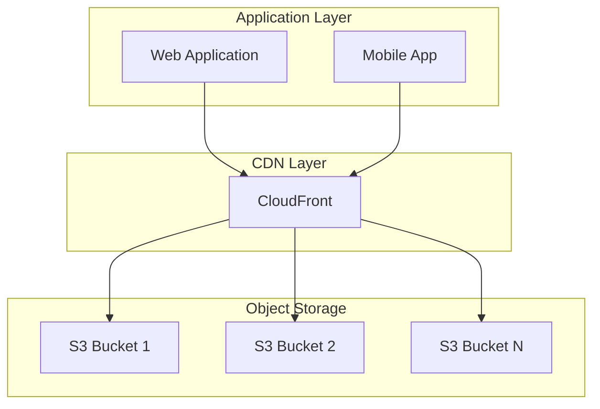
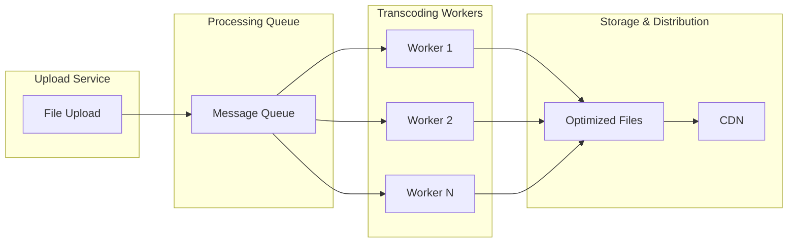

# Chapter 19: Media & File Storage at Scale

## Introduction

Modern applications require efficient handling of large volumes of media files including images, videos, audio, and documents. Scaling media storage involves addressing challenges in storage capacity, bandwidth, retrieval performance, and cost optimization. Understanding these concepts is crucial for architects designing systems that handle rich media content.

## Object Storage (S3)

Object storage is a storage architecture that manages data as objects rather than files or blocks. AWS S3 (Simple Storage Service) is a leading example of object storage.

### Key Characteristics
- **Flat Structure**: No hierarchy; objects identified by unique keys
- **Metadata-Rich**: Each object includes metadata (custom and system)
- **HTTP Access**: RESTful API using HTTP verbs (GET, PUT, DELETE, etc.)
- **Durability**: Multiple replicas across geographically distributed locations

### Object Structure
```
Bucket → Object Key → Object Data + Metadata
```

### Storage Classes
- **Standard**: High availability, immediate access
- **IA (Infrequent Access)**: Lower cost for infrequently accessed data
- **Glacier**: Archive storage for long-term retention
- **One Zone-IA**: Lower cost for non-critical data

### Real-world Example
Netflix uses S3 to store massive amounts of video content, with different storage classes for active content, backup, and archival materials.

### Consistency Model
- **Read-After-Write**: New objects are immediately readable
- **Eventual Consistency**: Updates and deletes may have propagation delays

### Architecture Diagram:


## Chunking & Multipart Upload

Large files are often divided into smaller chunks to improve upload reliability and performance.

### Chunking Benefits
- **Resume Capability**: Uploads can resume after interruption
- **Parallel Processing**: Multiple chunks uploaded simultaneously
- **Bandwidth Management**: Control upload speed and resource usage
- **Error Isolation**: Failure of one chunk doesn't affect others

### Multipart Upload Process
1. **Initiate**: Request to start multipart upload
2. **Upload Parts**: Upload chunks with unique part numbers
3. **Complete**: Assemble chunks into final object

### Implementation Considerations
- **Chunk Size**: Balance between overhead and reliability
- **Retry Logic**: Handle failed chunk uploads
- **Cleanup**: Remove incomplete uploads to save costs

### Real-world Example
Dropbox uses chunked uploads to handle large file transfers, allowing users to pause and resume uploads across sessions while maintaining connection stability.

## CDN Integration

Content Delivery Networks (CDNs) cache content closer to users, reducing latency and origin load.

### CDN Architecture
- **Edge Servers**: Distributed servers near users
- **Origin Server**: Central storage location
- **Cache Policies**: Rules for content caching and invalidation

### Integration Strategies
1. **Direct Upload to CDN**: Upload files directly to edge locations
2. **Origin Pull**: CDN fetches content on demand from origin
3. **Pre-population**: Push content to CDN in advance

### Cache Optimization
- **TTL (Time to Live)**: Set appropriate cache expiration
- **Cache Keys**: Differentiate cached content versions
- **Invalidation**: Evict outdated content efficiently

### Performance Metrics
- **Hit Ratio**: Percentage of requests served from cache
- **Time to First Byte**: Latency improvements
- **Origin Offload**: Reduction in origin server requests

### Real-world Example
YouTube integrates with multiple CDNs to serve video content globally, ensuring viewers get low-latency streaming with high quality regardless of their location.

## Transcoding Pipelines

Transcoding converts media files to different formats, resolutions, or quality levels to optimize for various devices and networks.

### Common Transcoding Tasks
- **Format Conversion**: MP4 to WebM, JPEG to WebP
- **Resolution Scaling**: 4K to 1080p to 720p
- **Quality Adjustment**: Different bitrates for various network conditions
- **Codec Optimization**: Optimize for specific playback devices

### Pipeline Architecture
```
Input → Validation → Transcoding → Optimization → Storage → Distribution
```

### Scalability Considerations
- **Parallel Processing**: Process multiple files simultaneously
- **Resource Management**: Balance CPU, GPU, and memory usage
- **Queue Management**: Handle burst loads efficiently
- **Cost Optimization**: Use spot instances for non-urgent processing

### Event-Driven Processing
- **Trigger-Based**: Transcoding starts on upload events
- **Workflow Management**: Coordinate multiple processing steps
- **Error Handling**: Retry failed transcoding jobs
- **Monitoring**: Track processing times and success rates

### Architecture Diagram:


### Real-world Example
Netflix has sophisticated transcoding pipelines that convert original video files into multiple formats and resolutions optimized for different devices and network conditions, ensuring optimal viewing experiences across platforms.

## Metadata Stores

Metadata stores maintain information about files including creation date, size, format, ownership, and application-specific attributes.

### Types of Metadata
- **System Metadata**: File size, creation date, checksum
- **Descriptive Metadata**: Title, description, author
- **Structural Metadata**: Relationships between objects
- **Administrative Metadata**: Permissions, access logs

### Storage Options
- **Object Storage Metadata**: Built-in key-value metadata
- **Relational Databases**: For complex querying needs
- **NoSQL Databases**: For flexible schema requirements
- **Search Indexes**: For advanced search capabilities

### Indexing Strategies
- **Primary Index**: Key-based lookups
- **Secondary Indexes**: Attribute-based queries
- **Composite Indexes**: Multi-attribute queries
- **Full-Text Indexes**: Content search capabilities

### Synchronization Challenges
- **Consistency**: Keeping metadata synchronized with objects
- **Atomic Operations**: Ensuring metadata and files update together
- **Backup and Recovery**: Maintaining metadata integrity

### Real-world Example
Flickr maintains rich metadata about each photo including EXIF data, user tags, location information, and social interactions, enabling powerful search and organization features.

## Performance Optimization Techniques

### Lazy Loading
- **Thumbnails**: Load low-resolution versions first
- **Progressive Enhancement**: Load higher quality as needed
- **Viewport Detection**: Load only visible content initially

### Adaptive Streaming
- **Multiple Quality Levels**: Provide different bitrates
- **Dynamic Switching**: Adjust quality based on network conditions
- **Buffer Management**: Optimize playback experience

### Format Optimization
- **Modern Codecs**: Use HEIF, AV1, or WebP for better compression
- **Responsive Images**: Different sizes for different devices
- **Format Conversion**: Optimize for specific browsers/clients

## Security Considerations

### Access Control
- **Presigned URLs**: Time-limited access to private content
- **IAM Policies**: Fine-grained permissions for storage access
- **Encryption**: Data encryption in transit and at rest

### Content Validation
- **File Type Verification**: Prevent malicious uploads
- **Virus Scanning**: Scan uploaded files for malware
- **Size Limits**: Prevent excessive resource consumption

### Audit and Compliance
- **Access Logging**: Track who accessed what content
- **Retention Policies**: Automatically delete content as needed
- **Privacy Controls**: Handle personal data appropriately

## Cost Management

### Storage Tiering
- **Hot vs Cold Access**: Store frequently accessed content on expensive tiers
- **Lifecycle Policies**: Automatically move data between tiers
- **Data Archival**: Move old data to cheaper storage

### Bandwidth Optimization
- **CDN Caching**: Reduce origin server requests
- **Compression**: Reduce data transfer costs
- **Smart Serving**: Adapt quality to device capabilities

### Resource Efficiency
- **Deduplication**: Avoid storing duplicate content
- **Format Optimization**: Use efficient codecs to reduce storage needs
- **Intelligent Caching**: Optimize cache hit ratios

## Conclusion

Media and file storage at scale requires careful consideration of storage technologies, delivery mechanisms, processing pipelines, and optimization strategies. By implementing object storage with CDN integration, efficient transcoding pipelines, and proper metadata management, architects can build systems that handle large volumes of media content while providing excellent user experiences and controlling costs.