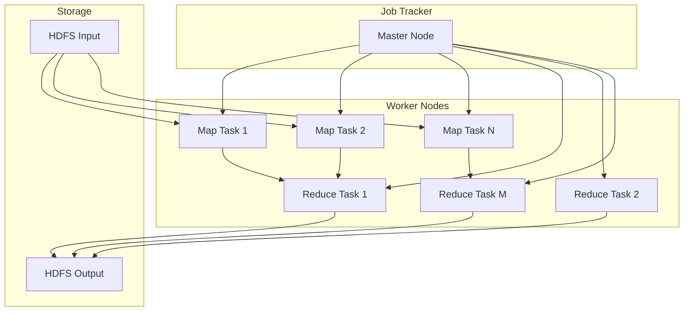
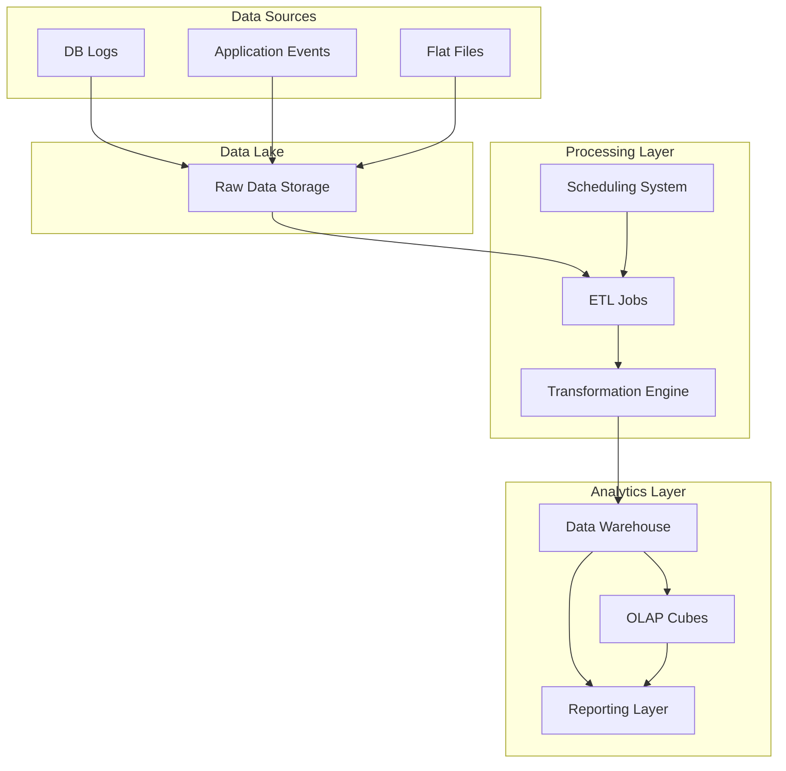

# Chapter 20: Batch Processing & Analytics

## Introduction

Batch processing involves collecting and processing large volumes of data in groups or batches, typically during scheduled intervals. This approach is fundamental for data analytics, reporting, and large-scale data transformations. Understanding batch processing concepts and architectures is essential for building systems that can handle complex analytical workloads efficiently.

## MapReduce Framework

MapReduce is a programming model for processing large datasets across distributed clusters. It simplifies parallel computing by abstracting the complexity of distributed processing.

### Core Concepts

#### Map Phase
- **Input**: Key-value pairs fed to map function
- **Processing**: Map function transforms input to intermediate key-value pairs
- **Output**: Intermediate key-value pairs grouped by key

#### Shuffle and Sort Phase
- **Partitioning**: Distribute data to reducers based on keys
- **Sorting**: Sort values by key before reducing
- **Grouping**: Group values with the same key

#### Reduce Phase
- **Input**: Key with associated list of values
- **Processing**: Reduce function aggregates values for each key
- **Output**: Final key-value pairs written to storage

### MapReduce Workflow
```
Input Data → Split → Map → Shuffle/Sort → Reduce → Output
```

### Example: Word Count
```python
# Map function
def map(doc_id, document):
    for word in document.split():
        emit(word, 1)

# Reduce function
def reduce(word, counts):
    emit(word, sum(counts))
```

### Real-world Example
Google uses MapReduce to process web crawl data, analyzing billions of web pages to build search indexes and compute page rankings.

### Advantages
- **Scalability**: Process petabytes of data across thousands of machines
- **Fault Tolerance**: Automatic handling of node failures
- **Abstraction**: Simplifies distributed programming
- **Cost Efficiency**: Runs on commodity hardware

### Limitations
- **Latency**: Higher latency compared to stream processing
- **Batch Nature**: Not suitable for real-time processing
- **Complexity**: Difficult to debug and monitor

### Architecture Diagram:


## Data Warehouses

Data warehouses are centralized repositories designed to store, manage, and analyze large volumes of structured data from various sources for business intelligence and analytics.

### Architecture Types

#### Traditional Data Warehouse
- **ETL Process**: Extract, Transform, Load from source systems
- **Centralized Model**: Single repository for enterprise data
- **Schema Design**: Star or snowflake schema for analytics

#### Modern Data Warehouse
- **Cloud-Native**: Built on cloud infrastructure
- **MPP Architecture**: Massively Parallel Processing
- **Columnar Storage**: Optimized for analytical queries

### Key Characteristics
- **Subject-Oriented**: Organized around business domains
- **Integrated**: Consolidated from multiple sources
- **Time-Variant**: Historical data tracking
- **Non-Volatile**: Data doesn't change once stored

### Popular Solutions
- **Amazon Redshift**: Cloud data warehouse by AWS
- **Google BigQuery**: Serverless, highly scalable analytics
- **Snowflake**: Cloud-native data platform
- **Azure Synapse**: Hybrid cloud data warehouse

### Performance Optimization
- **Partitioning**: Organize data by commonly queried dimensions
- **Clustering**: Sort data physically for query performance
- **Materialized Views**: Pre-computed aggregations
- **Compression**: Reduce storage and I/O requirements

### Real-world Example
Walmart uses a data warehouse to analyze sales patterns, inventory levels, and customer behavior across thousands of stores, enabling better inventory management and targeted marketing.

## OLAP vs OLTP

Understanding the differences between Online Analytical Processing (OLAP) and Online Transaction Processing (OLTP) is crucial for designing appropriate data systems.

### OLTP (Online Transaction Processing)
- **Purpose**: Support day-to-day operational needs
- **Operations**: Many short, fast transactions
- **Database Design**: Normalized schemas (3NF)
- **Read/Write Ratio**: Balanced or write-heavy
- **Response Time**: Milliseconds
- **Data Volume**: Small data sets per query
- **User Type**: End users and operational staff

### OLAP (Online Analytical Processing)
- **Purpose**: Support business intelligence and analytics
- **Operations**: Complex analytical queries
- **Database Design**: Denormalized schemas (star/snowflake)
- **Read/Write Ratio**: Read-heavy
- **Response Time**: Seconds to minutes
- **Data Volume**: Large data sets per query
- **User Type**: Analysts, executives, data scientists

### Comparison Table
| Aspect | OLTP | OLAP |
|--------|------|------|
| Primary Purpose | Operational Efficiency | Analytical Insight |
| Data Source | Current, real-time | Historical, aggregated |
| Data Operations | Insert, Update, Delete | Complex Queries |
| Database Schema | Normalized | Denormalized |
| Backup Strategy | Critical, frequent | Less critical |

### Real-world Example
An e-commerce platform uses OLTP for order processing (adding items to carts, processing payments) and OLAP for analyzing sales trends, customer behavior, and inventory optimization.

## Materialized Views

Materialized views are database objects that store the result of a query physically, significantly improving query performance for complex analytical operations.

### Benefits
- **Performance**: Pre-computed results eliminate expensive computations
- **Query Simplification**: Complex logic encapsulated in view
- **Consistency**: Same query logic across applications
- **Caching**: Frequent query results readily available

### Refresh Strategies
1. **Complete Refresh**: Recompute entire view
2. **Incremental Refresh**: Update only changed data
3. **Fast Refresh**: Optimize based on change tracking
4. **On-Demand**: Refresh when triggered

### Design Considerations
- **Storage Overhead**: Additional storage for view data
- **Maintenance Cost**: Resource requirements for refresh operations
- **Freshness Requirements**: Balance between performance and data currency
- **Update Patterns**: Align refresh schedule with data changes

### Use Cases
- **Aggregations**: Pre-computed summaries and statistics
- **Joins**: Complex multi-table joins
- **Calculations**: Expensive mathematical operations
- **Reporting**: Standardized business metrics

### Real-world Example
A financial services company maintains materialized views of daily trading summaries to enable fast reporting dashboards that would otherwise require expensive real-time aggregations across multiple tables.

## Design of Analytics-Friendly Schemas

Creating schemas optimized for analytical queries is crucial for performance in data warehousing and analytics systems.

### Dimensional Modeling
- **Facts**: Numeric, measurable data (sales amounts, quantities)
- **Dimensions**: Contextual data (time, product, geography)
- **Star Schema**: Fact table connected to dimension tables
- **Snowflake Schema**: Normalized dimension tables

### Star Schema Example
```
Fact_Sales
├── sale_id
├── product_id → Dim_Product
├── customer_id → Dim_Customer
├── date_id → Dim_Date
├── store_id → Dim_Store
└── sales_amount
```

### Schema Design Principles
1. **Denormalization**: Reduce join complexity
2. **Surrogate Keys**: Use artificial keys for dimensions
3. **Slowly Changing Dimensions**: Handle dimension changes over time
4. **Hierarchy Flattening**: Pre-compute hierarchies in dimensions

### Data Lakehouse Architecture

Modern analytics systems often use a data lakehouse architecture combining the best of data lakes and warehouses:

### Components
- **Data Lake**: Raw storage for all data types
- **Lakehouse**: Structured analytics layer over data lake
- **Processing Engine**: Spark, Databricks, or other analytics engines
- **Governance Layer**: ACID transactions, schema enforcement

### Benefits
- **Cost Efficiency**: Cheaper storage than traditional warehouses
- **Flexibility**: Handle structured and unstructured data
- **Performance**: Optimized for analytical workloads
- **Scalability**: Horizontally scalable storage and compute

### Real-world Example
Uber's data platform uses a lakehouse approach to store raw event data in object storage while providing structured analytics capabilities, enabling both ad-hoc analytics and ML workloads.

## Batch Processing Patterns

### Pipeline Processing
- **Sequential Steps**: Data flows through processing stages
- **Error Handling**: Isolate failures to prevent cascading issues
- **Checkpointing**: Save progress to enable recovery

### Parallel Processing
- **Data Partitioning**: Split data across processing nodes
- **Task Distribution**: Balance workload across resources
- **Result Aggregation**: Combine results from parallel tasks

### Incremental Processing
- **Change Detection**: Process only new or modified data
- **Watermarking**: Track processing progress and completeness
- **Delta Processing**: Minimize data movement and processing

### Batch Scheduling and Orchestration
- **Dependency Management**: Coordinate jobs with dependencies
- **Resource Allocation**: Optimize cluster resource usage
- **Monitoring and Alerting**: Track job status and performance
- **Retry Logic**: Handle transient failures automatically

### Architecture Diagram:


## Performance Optimization

### Partitioning Strategies
- **Horizontal**: Split data by rows (time, geography, etc.)
- **Vertical**: Split data by columns
- **Hash-Based**: Distribute data based on key hash
- **Range-Based**: Partition by value ranges

### Query Optimization
- **Predicate Pushdown**: Push filters to storage layer
- **Column Pruning**: Read only required columns
- **Join Optimization**: Choose optimal join algorithms
- **Statistics**: Use column statistics for optimization

### Resource Management
- **Cluster Allocation**: Right-size cluster for workload
- **Memory Management**: Optimize memory usage for processing
- **Parallelism**: Balance task parallelism with resource availability
- **Cost Control**: Use spot instances where appropriate

## Conclusion

Batch processing and analytics form the backbone of data-driven decision making in modern organizations. Understanding MapReduce, data warehousing concepts, OLAP vs OLTP differences, materialized views, and analytics-friendly schema design enables architects to build systems that efficiently process and analyze large volumes of data while meeting performance and cost requirements. The choice between traditional batch processing and newer data lakehouse architectures depends on specific use cases, scalability requirements, and organizational needs.