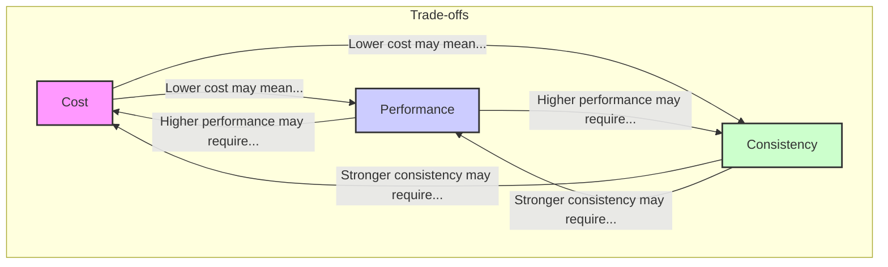

# Chapter 21: Cost, Performance Trade-offs & Optimization

In system design, every decision is a trade-off. This chapter explores one of the most critical balancing acts: managing cost, performance, and consistency. We will cover how to model costs, analyze trade-offs, and apply optimization strategies to build efficient and sustainable systems.

## 1. Key Concepts

### a. Cost Modeling
Cost modeling is the process of estimating the expenses associated with building and running a system. It involves identifying all cost drivers, such as:
- **Infrastructure**: Servers, storage, networking, and data centers.
- **Software**: Licensing fees for databases, operating systems, or third-party services.
- **Operational Costs**: Salaries for engineers, monitoring tools, and on-call rotations.
- **Development Costs**: Time and resources spent on designing, building, and testing the system.

A good cost model helps you forecast expenses, justify budget requests, and make informed decisions about resource allocation.

**Real-world Example:**
When choosing between a managed database service (like Amazon RDS) and a self-hosted database on EC2, a cost model would compare the monthly service fees against the cost of virtual machines, storage, and the engineering hours required for maintenance, backups, and scaling.

### b. The Trade-off Triangle: Cost, Performance, Consistency
System design often involves balancing three competing goals:
- **Cost**: The total expenditure of the system.
- **Performance**: How quickly the system responds to requests (latency) and how much it can handle (throughput).
- **Consistency**: The guarantee that all clients see the same data at the same time.

It's often said you can pick two out of the three. For example, achieving high performance and strong consistency usually requires more expensive hardware and complex engineering, thus increasing cost.

### c. Benchmarking and Profiling
- **Benchmarking**: The practice of testing a system's performance against a known standard or baseline. It helps you understand how your system behaves under different loads and identify performance targets.
- **Profiling**: The process of analyzing a system's resource consumption (CPU, memory, I/O) to identify bottlenecks. Profiling tools can pinpoint specific functions or queries that are slow or inefficient.

**Real-world Example:**
A team might use a tool like `wrk` or `JMeter` to benchmark an API's response time under 100, 500, and 1000 concurrent users. If latency spikes, they would use a profiler like `pprof` (for Go) or `JProfiler` (for Java) to find the exact lines of code causing the slowdown.

## 2. Optimization Strategies

Once you have identified bottlenecks through profiling and benchmarking, you can apply various optimization strategies:

| Strategy | Description | Example |
| --- | --- | --- |
| **Resource Scaling** | Adding more or more powerful resources. **Vertical scaling** means increasing the capacity of a single server (e.g., more CPU/RAM). **Horizontal scaling** means adding more servers. | If a database is CPU-bound, you might upgrade to a larger instance (vertical) or add more read replicas (horizontal). |
| **Caching** | Storing frequently accessed data in a faster, in-memory layer to reduce latency and load on backend systems. | Caching the results of expensive database queries in Redis or Memcached. |
| **Algorithmic Efficiency** | Improving the underlying algorithms to perform tasks with less computational work (e.g., reducing time complexity from O(n²) to O(n log n)). | Replacing a nested loop with a hash map lookup to find related items. |
| **Data Schema Optimization** | Designing database schemas to support efficient queries. This includes proper indexing, denormalization where appropriate, and choosing the right data types. | Adding a database index to a frequently queried column to avoid full table scans. |
| **Asynchronous Processing** | Moving non-critical, long-running tasks to a background worker to avoid blocking the main request thread. | Sending emails or processing images asynchronously using a message queue. |

By systematically applying these principles, you can design systems that meet performance goals while staying within budget constraints.
