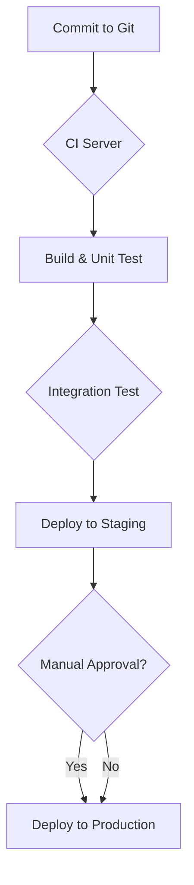

# Chapter 22: Deployment, CI/CD & Infra Automation

## 1. Introduction

This chapter explores how modern software is deployed and managed. We'll cover Continuous Integration/Continuous Deployment (CI/CD), Infrastructure as Code (IaC), and key deployment strategies that ensure software is delivered reliably and efficiently.

## 2. Continuous Integration/Continuous Deployment (CI/CD)

**CI/CD** is a set of practices that automate the software delivery process.

- **Continuous Integration (CI):** A practice where developers frequently merge their code changes into a central repository, after which automated builds and tests are run. The goal is to detect integration issues early.

- **Continuous Deployment (CD):** An extension of CI where code changes that pass all automated tests are automatically deployed to a production environment.

### Build Pipelines

A **build pipeline** (or CI/CD pipeline) is the heart of this process. It's a series of automated steps to build, test, and deploy code.

**Example Pipeline Stages:**
1.  **Source:** Triggered by a code commit.
2.  **Build:** The code is compiled or packaged.
3.  **Test:** Unit tests, integration tests, and other automated tests are run.
4.  **Deploy to Staging:** The application is deployed to a staging environment for further testing.
5.  **Deploy to Production:** The application is deployed to the production environment.



## 3. Deployment Strategies

### Blue/Green Deployment

This strategy involves running two identical production environments, "Blue" and "Green."

- **Blue:** The current live environment.
- **Green:** The new version of the application.

Traffic is switched from Blue to Green. If anything goes wrong, you can quickly switch back to Blue.

```mermaid
graph TD
    subgraph "Before Deployment"
        Router1 --> Blue[Blue Environment (v1)];
    end
    subgraph "During Deployment"
        Router2 --> Blue2[Blue Environment (v1)];
        Green[Green Environment (v2)];
    end
    subgraph "After Deployment"
        Router3 --> Green2[Green Environment (v2)];
    end
```

### Canary Deployment

A small percentage of users are routed to the new version of the application (the "canary"). If the new version performs well, the rollout continues to a larger audience.

**Real-world example:** Facebook often rolls out new features to a small subset of users in a specific region before a global rollout.

## 4. Infrastructure as Code (IaC)

**Infrastructure as Code (IaC)** is the practice of managing and provisioning infrastructure (networks, virtual machines, load balancers) through code and automation, rather than through manual processes.

**Benefits:**
- **Reproducibility:** Easily create identical environments.
- **Version Control:** Track changes to your infrastructure over time.
- **Automation:** Reduce manual effort and errors.

**Popular IaC Tools:**
- **Terraform:** A declarative tool for building, changing, and versioning infrastructure.
- **AWS CloudFormation:** A service that helps you model and set up your Amazon Web Services resources.
- **Ansible:** A configuration management tool that can also be used for provisioning.

## 5. Configuration Management

**Configuration Management** is the process of maintaining computer systems, servers, and software in a desired, consistent state.

**Tools like Ansible, Puppet, and Chef** are used to automate the configuration of servers, ensuring that they all have the same software and settings.

## 6. Rollbacks

A **rollback** is the process of reverting to a previous version of an application if a deployment fails.

- **Blue/Green:** Rollback is as simple as switching traffic back to the Blue environment.
- **Canary:** Rollback involves routing all traffic back to the old version.
- **With IaC:** You can often roll back infrastructure changes by applying a previous version of your infrastructure code.
