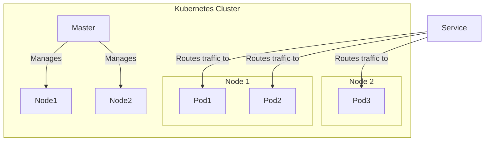

# Chapter 23: Containers, Orchestration & Serverless

## 1. Introduction

This chapter covers the modern paradigms for deploying and managing applications: containers, orchestration, and serverless computing. These technologies offer different levels of abstraction and control over your infrastructure.

## 2. Containers vs. Virtual Machines (VMs)

- **Virtual Machines (VMs):** A VM is an emulation of a complete computer system. It runs on top of a hypervisor and includes a full copy of an operating system. This provides strong isolation but is resource-heavy.

- **Containers:** A container is a lightweight, standalone, executable package of software that includes everything needed to run it: code, runtime, system tools, system libraries, and settings. Containers share the host system's kernel, making them much more lightweight than VMs.

```mermaid
graph TD
    subgraph "Virtual Machines"
        A[Host OS] --> B[Hypervisor];
        B --> C[VM 1 (Guest OS + App)];
        B --> D[VM 2 (Guest OS + App)];
    end
    subgraph "Containers"
        E[Host OS] --> F[Container Engine];
        F --> G[Container 1 (App)];
        F --> H[Container 2 (App)];
    end
```

**Real-world example:** Docker is the most popular containerization platform.

## 3. Container Orchestration: Kubernetes

When you have many containers, you need a tool to manage them. This is where **container orchestration** comes in.

**Kubernetes (K8s)** is an open-source container orchestration platform that automates the deployment, scaling, and management of containerized applications.

### Kubernetes Fundamentals

- **Pod:** The smallest deployable unit in Kubernetes. A Pod can contain one or more containers.
- **Node:** A worker machine in a Kubernetes cluster.
- **Cluster:** A set of Nodes that run containerized applications.
- **Service:** An abstraction that defines a logical set of Pods and a policy by which to access them.
- **Deployment:** A resource object in Kubernetes that provides declarative updates for Pods.



## 4. Service Meshes

A **service mesh** is a dedicated infrastructure layer for handling service-to-service communication. It provides features like:

- **Traffic Management:** Advanced routing, load balancing, and traffic splitting.
- **Security:** Mutual TLS (mTLS) for secure communication.
- **Observability:** Metrics, logs, and traces for all traffic.

**Popular Service Meshes:** Istio, Linkerd.

## 5. Serverless Computing

**Serverless computing** is a cloud computing execution model in which the cloud provider runs the server, and dynamically manages the allocation of machine resources. Pricing is based on the actual amount of resources consumed by an application, rather than on pre-purchased units of capacity.

### Serverless Models

- **Function as a Service (FaaS):** Run code in response to events without managing any servers. Examples: AWS Lambda, Google Cloud Functions.
- **Backend as a Service (BaaS):** Use third-party services for backend functionality like authentication, databases, and storage. Example: Firebase.

### Cold Starts

A **cold start** is the latency that occurs the first time a serverless function is invoked after a period of inactivity. The cloud provider needs to provision a container and load your code, which takes time. Subsequent invocations are "warm" and much faster.

## 6. When to Pick Each

- **Containers:** Great for packaging applications and their dependencies. Good for microservices.
- **Kubernetes:** Ideal for managing complex, containerized applications at scale.
- **Serverless:** Best for event-driven applications, background jobs, and APIs with unpredictable traffic. It simplifies development but offers less control over the environment.
