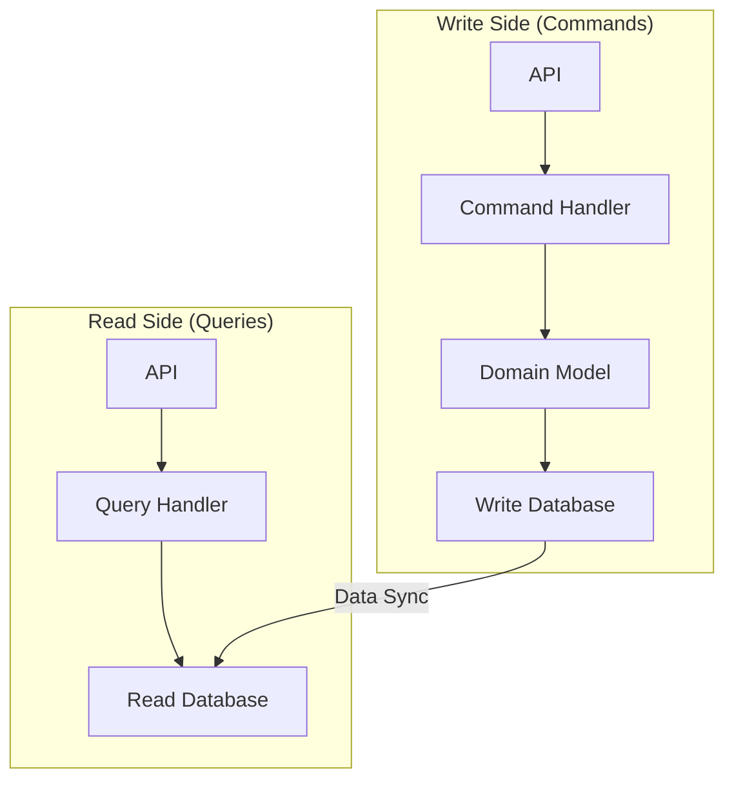

# Chapter 25: Design Patterns & Anti-patterns

## 1. Introduction

This chapter covers common reusable design patterns that provide proven solutions to recurring problems in system design. We will also explore anti-patterns—common mistakes to avoid.

## 2. Design Patterns

### Command Query Responsibility Segregation (CQRS)

**CQRS** is a pattern that separates the models for reading (Query) and writing (Command) data.

- **Commands:** Change the state of an object but do not return data.
- **Queries:** Return data but do not change the state.

This allows for separate optimization of the read and write paths. For example, you can have a denormalized read database for fast queries.

### Event Sourcing

**Event Sourcing** is a pattern where all changes to application state are stored as a sequence of events. The current state of the application is derived by replaying the events.

**Benefits:**
- **Audit Trail:** You have a complete log of all changes.
- **Temporal Queries:** You can determine the state of the application at any point in time.
- **Debugging:** You can replay events to reproduce bugs.

**Real-world example:** A bank account can be modeled using event sourcing. The balance is not stored directly; instead, a series of deposit and withdrawal events are stored. The current balance is calculated by replaying these events.

## 3. Anti-patterns

### The Monolithic Hell

A **monolith** is an application where all the functionality is in a single, tightly coupled codebase. While simple to start with, monoliths can become difficult to maintain, scale, and deploy as they grow.

**Symptoms:**
- Small changes require a full redeployment of the entire application.
- A bug in one module can bring down the entire system.
- Difficult to adopt new technologies.

**Solution:** Break the monolith into smaller, independent microservices.

### The Distributed Monolith

A **distributed monolith** is an anti-pattern where you have a system of microservices, but they are so tightly coupled that they behave like a monolith.

**Symptoms:**
- A change in one service requires changes in many other services.
- Services cannot be deployed independently.
- A failure in one service cascades to many other services.

**Solution:** Ensure that services are loosely coupled and have well-defined APIs.

### N+1 Query Problem

The **N+1 query problem** is a common performance anti-pattern where an application makes N+1 database queries to retrieve data that could have been retrieved in a single query.

**Example:**
You want to retrieve a list of authors and their books.
1.  Query for all authors (`SELECT * FROM authors`).
2.  For each author, query for their books (`SELECT * FROM books WHERE author_id = ?`).

If there are N authors, this results in N+1 queries.

**Solution:** Use a `JOIN` to retrieve all the data in a single query: `SELECT * FROM authors JOIN books ON authors.id = books.author_id`.
