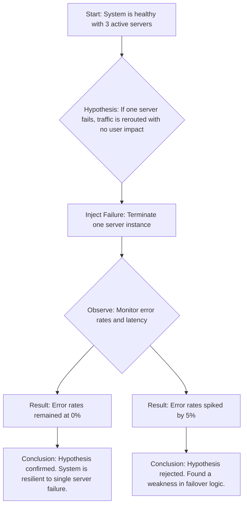

# Chapter 26: Testing, Load Testing & Chaos Engineering

This chapter covers the principles and practices of ensuring a system is robust, reliable, and performs as expected under stress. We will explore testing methodologies at scale, techniques for load testing, and the discipline of Chaos Engineering to build resilient systems.

<guideline>
A chapter should ideally include:
- Clear definitions and explanations of key concepts. Explained in simple terms. And in a way that help the reader build intuition, and build a strong foundation/fundamentals.
- Real-world examples to illustrate ideas.
- Mermaid Diagrams where applicable to visualize architectures or processes.
</guideline>

---

### 1. Testing at Scale

In distributed systems, testing goes beyond simple unit tests. It requires a strategy that can validate behavior across multiple services.

-   **Unit Testing:** Still the foundation, but focused on the logic within a single service or component.
-   **Integration Testing:** Verifies the interactions between services. In a microservices architecture, this often involves testing API contracts between a service and its dependencies. Real-world example: Testing that an `OrderService` can correctly call the `PaymentService` and handle its responses.
-   **End-to-End (E2E) Testing:** Simulates a full user journey across the entire system. These tests are powerful but can be slow and brittle. They are best used for critical paths, like a user signup and login flow.

### 2. Load Testing

Load testing is the practice of simulating user traffic to understand how the system behaves under load. The goal is to identify performance bottlenecks, determine capacity, and ensure the system meets its performance requirements.

**Methodologies:**

-   **Capacity Test:** Gradually increase the load to find the maximum capacity the system can handle before performance degrades.
-   **Stress Test:** Overwhelm the system with extreme load to see how it fails and, more importantly, how it recovers.
-   **Spike Test:** Simulate a sudden, massive increase in traffic to test the system's autoscaling and elastic capabilities. Real-world example: A flash sale on an e-commerce site.

### 3. Chaos Engineering

Chaos Engineering is the discipline of experimenting on a system to build confidence in its ability to withstand turbulent conditions in production. It is a proactive approach to finding weaknesses before they cause outages.

**Key Concepts:**

-   **Hypothesis:** You start with a belief about how the system will behave. For example, "If we shut down one of our three web server instances, users will not experience any errors."
-   **Failure Injection:** You deliberately inject failures into the system. This could be:
    -   Terminating virtual machines.
    -   Injecting latency into network calls.
    -   Causing CPU or memory pressure on a service.
-   **Verification:** You measure the impact of the failure and compare it to your hypothesis. If the system did not behave as expected, you have found a weakness to fix.

**Example Chaos Experiment:**

