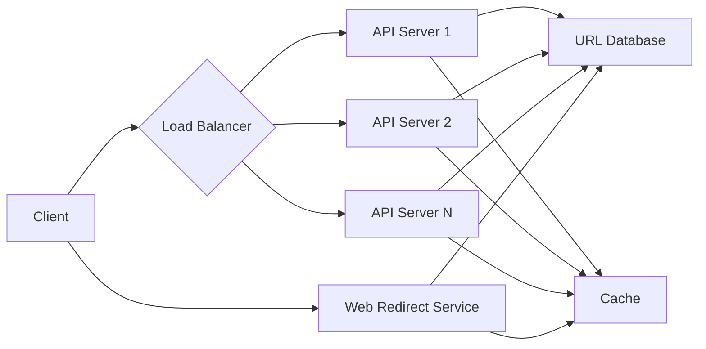

# Chapter 27: System Design Interview Framework

## What is the System Design Interview?

The system design interview is a technical interview that evaluates your ability to design scalable, reliable systems. Unlike coding interviews that focus on algorithms and data structures, system design interviews test your understanding of architecture, trade-offs, and problem-solving skills for complex, real-world scenarios.

## The Standard Framework for System Design Interviews

A successful approach to system design interviews follows a clear 6-step framework:

### 1. Clarify Requirements (5-10 minutes)
- Ask clarifying questions to understand the scope
- Define functional and non-functional requirements
- Determine scale requirements (QPS, data volume, etc.)

### 2. Back-of-the-Envelope Estimation (5 minutes)
- Estimate traffic, storage, and bandwidth requirements
- Consider peak loads and growth projections
- This helps determine the scale of your design

### 3. Design High-Level Architecture (15-20 minutes)
- Start with simple architecture
- Add components step by step
- Draw block diagrams showing major components

### 4. Deep Dive & Trade-offs (10-15 minutes)
- Discuss detailed design of critical components
- Address scalability, reliability, and performance
- Consider different approaches and their trade-offs

### 5. Handle Edge Cases & Scale (5-10 minutes)
- Consider error handling and failure scenarios
- Discuss how the system handles growth
- Address security and data consistency

### 6. Summary (2-3 minutes)
- Recap the key design decisions
- Mention alternative approaches
- Highlight the most important trade-offs

## Real-World Example: Designing a URL Shortener

Let's apply the framework to a real interview question:

### Step 1: Clarify Requirements
Functional requirements:
- Given a URL, return a shortened version
- Redirect from short URL to original URL
- Support custom short URLs
- Track click analytics

Non-functional requirements:
- Low latency for redirects (under 100ms)
- High availability (99.9% uptime)
- Scalability to handle millions of URLs

### Step 2: Back-of-the-Envelope Estimation
Assumptions: 100M URLs per day, 10:1 read-to-write ratio
- 100M shortens per day → ~1,150 URLs per second
- 1B redirects per day → ~11,500 per second
- Each URL: 500 bytes of metadata
- Storage: ~50GB per year

### Step 3: High-Level Architecture
**Mermaid Diagram: URL Shortener High-Level Architecture**

### Step 4: Deep Dive & Trade-offs
**URL Generation Strategy:**
- Hash-based: MD5/SHA2 of long URL + encode first 6 chars
- Counter-based: Use incrementing counter in base62
- Benefits of counter: No collisions, shorter URLs
- Drawback: Predictable URLs

**Database Choice:**
- PostgreSQL: ACID compliance, strong consistency
- Cassandra: High write throughput, availability
- Decision: PostgreSQL for consistency requirements

### Step 5: Handle Edge Cases
- Duplicate URL handling
- Custom URL validation and conflict resolution
- Handling high-traffic URLs (caching strategy)

### Step 6: Summary
- Used counter-based generation for URL shortening
- Caching layer for performance
- Trade-off: Consistency over availability for data integrity

## Common Design Patterns in System Design Interviews

### 1. Cache-Aside Pattern
Load data into cache only when requested, improving read performance.

### 2. Write-Through Pattern
Write data to cache and storage simultaneously for consistency.

### 3. Event-Driven Architecture
Decouple services using message queues for asynchronous processing.

## Key Trade-offs to Discuss

1. **Consistency vs. Availability**: CAP theorem implications
2. **Latency vs. Throughput**: Optimizing for speed vs. volume
3. **Cost vs. Performance**: Balancing budget with requirements
4. **Complexity vs. Simplicity**: When to add complexity for scale

## Common Mistakes to Avoid

- Starting with implementation details instead of high-level design
- Ignoring failure scenarios and error handling
- Not discussing scalability from the beginning
- Not asking clarifying questions
- Focusing only on one solution without discussing alternatives

## Practice Prompts

1. Design a news feed system (Facebook, Twitter)
2. Design a ride-sharing service (Uber, Lyft)
3. Design a payment system (Stripe, Square)
4. Design a file storage system (Google Drive, Dropbox)
5. Design a messaging system (WhatsApp, Slack)

## Interview Tips

- Communicate your thought process clearly
- Make reasonable assumptions and state them
- Start simple and add complexity gradually
- Ask questions to better understand requirements
- Be ready to justify your design decisions with trade-offs