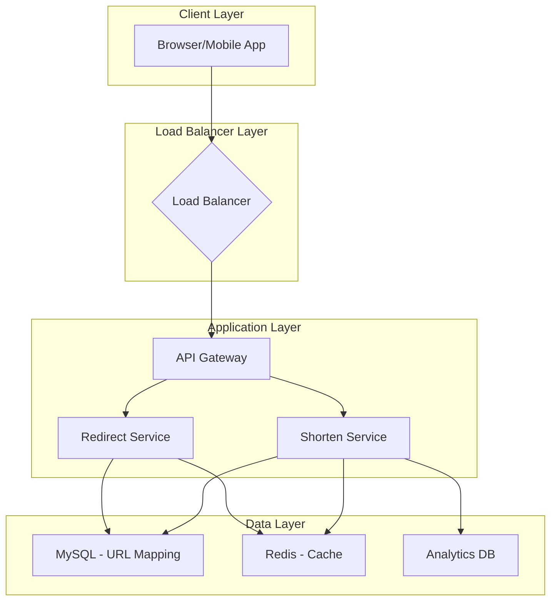
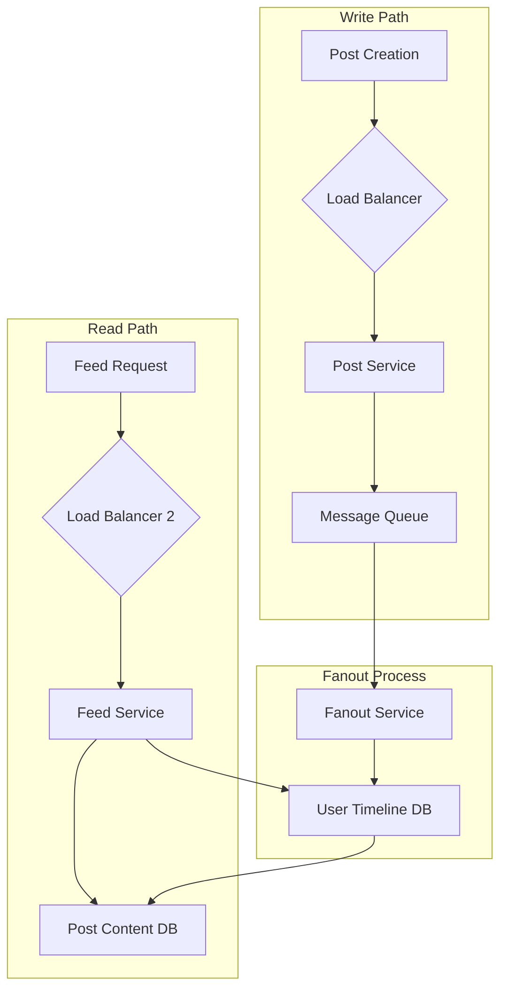
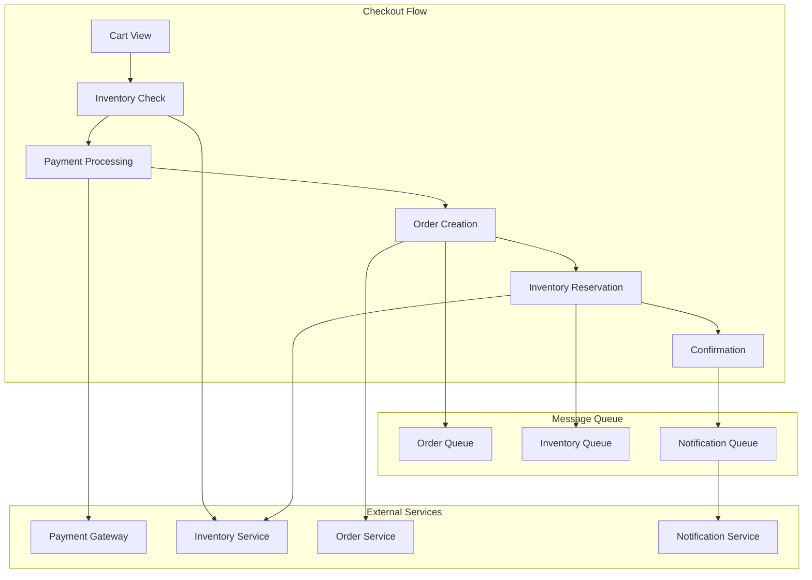
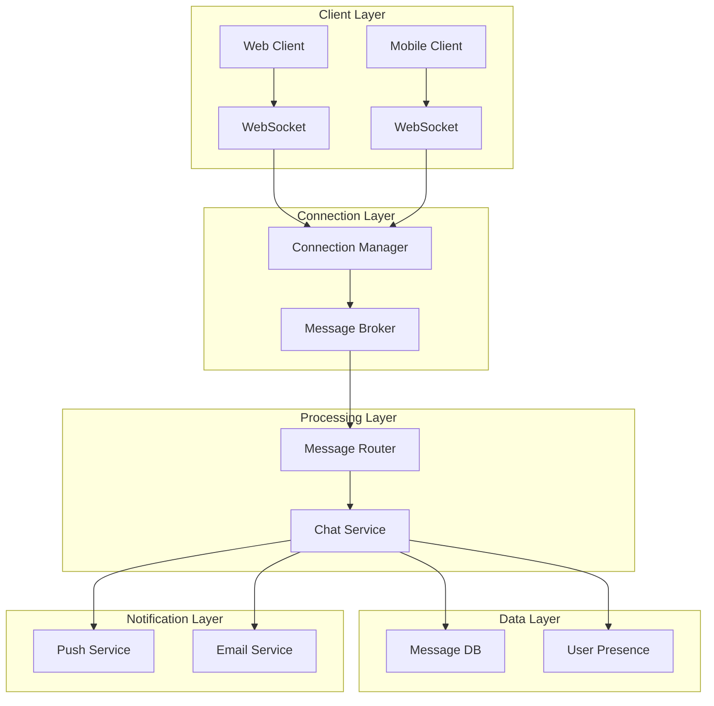
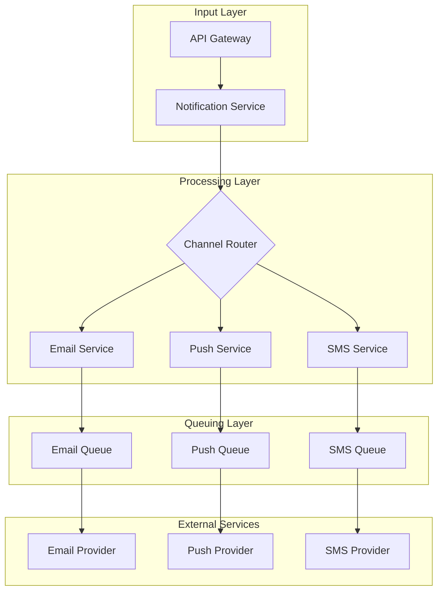

# Chapter 28: Case Studies & Worked Examples

## Introduction

This chapter presents end-to-end system design examples across various domains. Each case study follows a structured approach to demonstrate how to apply system design principles to real-world problems.

## Case Study 1: URL Shortener Service

### Requirements
- Generate short URLs from long URLs (e.g., https://example.com/very/long/path → https://short.ly/abc123)
- Redirect short URLs to original URLs
- Custom short URLs support
- Analytics: Track click counts, referrer, geographic location
- High availability and low latency

### Estimation
- 100M new URLs per day → ~1,150 URLs/second
- 1B redirects per day → ~11,500 requests/second
- Peak traffic: 3x average → 35,000 requests/second
- Storage: 100 bytes per URL entry → ~10GB/year

### Architecture
**Mermaid Diagram: URL Shortener Architecture**

### Implementation Details
- **URL Generation**: Using base62 encoding of incrementing counter to generate short codes
- **Caching**: Redis cache for frequently accessed URLs (90% hit rate)
- **Database**: MySQL for persistent storage with sharding by URL ID
- **Analytics**: Asynchronous analytics processing using message queues

### Trade-offs
- **Consistency vs. Performance**: Strong consistency for URL creation, eventual consistency for analytics
- **Predictability vs. Uniqueness**: Counter-based prevents collisions but may create predictable URLs

## Case Study 2: News Feed System (Social Media)

### Requirements
- Display personalized feed of posts from followed users
- Support for different post types: text, images, videos
- High read-to-write ratio (100:1)
- Real-time updates for new posts

### Estimation
- 100M DAU (Daily Active Users)
- 1M posts per day → ~12 posts/second
- 100M feed requests per day → ~1,150 requests/second
- Average 500 followers per user

### Architecture
**Mermaid Diagram: News Feed Architecture**

### Implementation Details
- **Fan-out Strategy**: Hybrid approach of fan-out on write (for users with few followers) and fan-out on read (for users with many followers)
- **Timeline Storage**: Sharded Redis for recent posts, database for older posts
- **Ranking Algorithm**: Combine recency, engagement, and user preferences

### Trade-offs
- **Fan-out on Write vs. Read**: Write-time fan-out for small followings, read-time fan-out for celebrities
- **Personalization vs. Latency**: Pre-computed feeds with re-ranking at read time

## Case Study 3: E-commerce Checkout System

### Requirements
- Cart management
- Inventory checking
- Payment processing
- Order creation
- Inventory reservation
- High availability during peak times

### Estimation
- 1M orders per day during peak season → ~12 orders/second average, 50+ during peaks
- 99.99% uptime requirement during checkout
- Payment processing within 3 seconds

### Architecture
**Mermaid Diagram: E-commerce Checkout Architecture**

### Implementation Details
- **Inventory Management**: Distributed locks to prevent overselling
- **Payment Processing**: Asynchronous payment confirmation with retries
- **Order Processing**: Event-driven architecture with compensating transactions
- **Timeout Handling**: Circuit breaker pattern for external dependencies

### Trade-offs
- **Consistency vs. Availability**: Strong consistency for inventory, eventual consistency for recommendations
- **Performance vs. Reliability**: Synchronous payment processing for security vs. user experience

## Case Study 4: Real-time Chat System

### Requirements
- Real-time message delivery
- Support for 1:1, group chats
- Message persistence and history
- Presence indicators (online/offline)
- Support for file sharing

### Estimation
- 50M daily active users
- 100M messages per day → ~1,150 messages/second
- 10:1 read-to-write ratio for message history
- Peak: 3x average load

### Architecture
**Mermaid Diagram: Real-time Chat Architecture**

### Implementation Details
- **Connection Management**: WebSocket connections with connection pooling
- **Message Delivery**: Fan-out to all connected users in chat room
- **Persistence**: Cassandra for message history with time-based partitioning
- **Presence**: Redis for real-time user status with heartbeat monitoring

### Trade-offs
- **Delivery Guarantees**: At-least-once delivery with deduplication vs. exactly-once complexity
- **Real-time vs. Persistence**: In-memory for real-time delivery, database for history

## Case Study 5: Notification Service

### Requirements
- Support for multiple channels: push, email, SMS, in-app
- Personalization and templating
- Delivery scheduling and rate limiting
- High delivery rates and low latency

### Estimation
- 1B notifications per day
- 90% email, 8% push, 2% SMS
- Peak: 3x average during morning hours
- 99.9% delivery success rate

### Architecture
**Mermaid Diagram: Notification Service Architecture**

### Implementation Details
- **Channel Routing**: Rule-based routing based on user preferences and content type
- **Template Engine**: Dynamic templates with personalization variables
- **Rate Limiting**: Per-user and per-channel rate limiting to avoid spam
- **Retry Logic**: Exponential backoff with dead-letter queues for failed deliveries

### Trade-offs
- **Immediacy vs. Efficiency**: Batch processing vs. immediate delivery
- **Customization vs. Complexity**: Template flexibility vs. system complexity

## Key Lessons from Case Studies

1. **Start with Requirements**: Always define functional and non-functional requirements first
2. **Estimate Early**: Back-of-envelope calculations guide architectural decisions
3. **Consider Failure**: Design for failure scenarios and recovery mechanisms
4. **Balance Trade-offs**: Every decision has implications; consider all aspects
5. **Iterate and Scale**: Begin with simple solutions that can scale

## Common Patterns Across Case Studies

1. **Caching**: Almost every system benefits from strategic caching
2. **Asynchronous Processing**: Message queues for decoupling and reliability
3. **Load Balancing**: Essential for distributing traffic and handling scale
4. **Monitoring**: Critical for understanding system health and performance
5. **Security**: Authentication, authorization, and data protection throughout