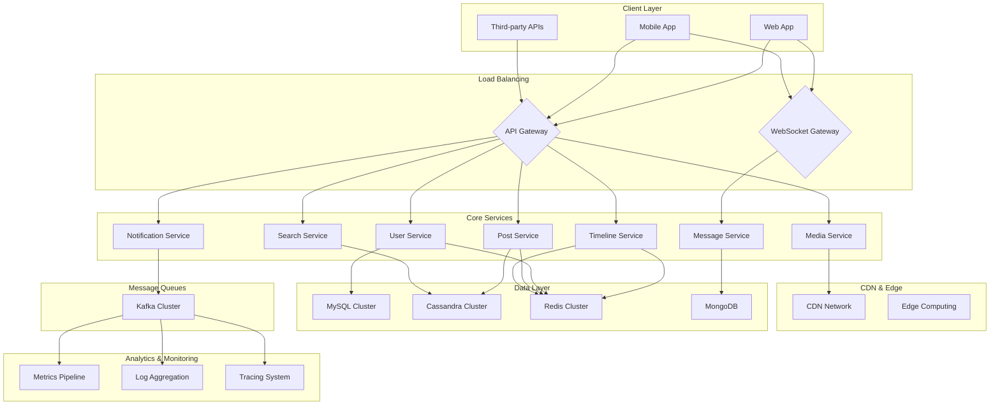
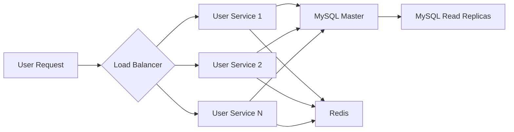

# Chapter 29: Capstone Project: End-to-End System Design

## Introduction

The capstone project brings together all the concepts covered in previous chapters into a comprehensive system design exercise. This chapter provides guidance on how to approach building a complete end-to-end system that demonstrates proficiency in system design principles.

## Capstone Project: Social Media Platform with Real-time Features

### Project Overview

Design and architect a social media platform similar to Twitter that supports posting text updates, following other users, real-time news feeds, direct messaging, and content discovery.

### Requirements Analysis

#### Functional Requirements
- **User Management**: User registration, authentication, profile management
- **Content Creation**: Post text updates, images, and videos up to 2MB
- **Social Features**: Follow/unfollow users, like posts, comment, share
- **News Feed**: Personalized timeline of posts from followed users
- **Direct Messaging**: Real-time private conversations
- **Content Discovery**: Trending posts, hashtag search, suggested users
- **Notifications**: Real-time alerts for likes, comments, follows, and messages
- **Search**: Search posts and users by keywords

#### Non-Functional Requirements
- **Scalability**: Support 10M users, 100M daily active users, 1B posts per day
- **Performance**: Feed load <500ms, post creation <200ms, message delivery <100ms
- **Availability**: 99.99% uptime (52.56 minutes of downtime per year)
- **Reliability**: Handle failures gracefully with automatic recovery
- **Security**: End-to-end encryption for messages, OAuth authentication
- **Consistency**: Strong consistency for user account data, eventual consistency for social interactions

### Architecture Overview

**Mermaid Diagram: High-Level Architecture**


### Detailed Component Design

#### 1. User Service
**Responsibilities**: User authentication, profile management, follow relationships
- **Technology**: Java/Spring Boot microservice
- **Database**: MySQL for user accounts (strong consistency needed)
- **Cache**: Redis for frequently accessed user profiles
- **Authentication**: JWT tokens with refresh token rotation
- **Scaling**: Horizontal sharding by user ID range

**Mermaid Diagram: User Service Architecture**


#### 2. Post Service
**Responsibilities**: Create, read, update, delete posts; handle media uploads
- **Technology**: Node.js microservice for high I/O operations
- **Database**: Cassandra for high-write throughput
- **Media Storage**: S3-compatible object storage with CDN
- **Indexing**: Elasticsearch for text search capabilities
- **Scaling**: Horizontal sharding by post ID

#### 3. Timeline Service
**Responsibilities**: Generate personalized news feeds for users
- **Technology**: Golang for performance-critical operations
- **Architecture**: Hybrid fan-out approach (fan-out on write for users with <1K followers, fan-out on read for larger accounts)
- **Cache**: Redis Sorted Sets for timeline curation
- **Algorithm**: Combine recency, engagement, and personalization signals

#### 4. Message Service
**Responsibilities**: Real-time chat between users, group conversations
- **Technology**: Erlang/Elixir for message passing capabilities
- **Protocol**: WebSocket connections with connection pooling
- **Storage**: MongoDB for message history (flexible schema for different message types)
- **Delivery**: At-least-once delivery with client-side deduplication

#### 5. Media Service
**Responsibilities**: Handle image/video uploads, transcoding, CDN distribution
- **Technology**: Python/FFmpeg for media processing
- **Storage**: S3 for original files, CDN for distribution
- **Processing**: Asynchronous transcoding with multiple quality formats
- **Optimization**: Image optimization, video compression algorithms

### Data Flow & APIs

#### API Design Principles
- RESTful endpoints with proper HTTP methods
- Consistent response formats with metadata
- Versioned APIs (v1, v2) for backward compatibility
- Rate limiting per user/IP
- Pagination for resource collections

#### Example API Endpoints
```
POST /v1/users/register
GET /v1/users/{id}/profile
POST /v1/posts
GET /v1/posts/{id}
GET /v1/users/{id}/timeline
POST /v1/messages
GET /v1/notifications
GET /v1/search/posts?q={query}
```

### Security Considerations

#### Authentication & Authorization
- OAuth 2.0 with PKCE for mobile apps
- JWT tokens with short expiration (15 minutes) and refresh tokens
- Role-based access control for admin functions
- Rate limiting to prevent abuse

#### Data Protection
- Encryption at rest for sensitive data
- HTTPS for all communications
- End-to-end encryption for direct messages
- Regular security audits and pen-testing

#### Privacy
- GDPR compliance for EU users
- Right to deletion requests
- Data retention policies
- Consent management for data usage

### Monitoring & Observability

#### Metrics Collection
- **Business Metrics**: DAU, MAU, post creation rate, engagement rate
- **System Metrics**: Request rate, error rate, latency percentiles
- **Infrastructure Metrics**: CPU, memory, disk, network utilization
- **SLI/SLO Tracking**: Availability, latency, and correctness metrics

#### Logging Strategy
- Structured logging with consistent format (JSON)
- Log levels: DEBUG, INFO, WARN, ERROR
- Distributed tracing IDs in logs for request correlation
- Centralized log aggregation with retention policies

#### Alerting System
- **Critical**: Service down, high error rate (>5%), high latency (>95th percentile)
- **Warning**: Resource utilization >80%, error rate >1%
- **Informational**: New feature usage, traffic patterns

### Deployment Strategy

#### Infrastructure
- Container orchestration with Kubernetes
- Multi-region deployment for availability
- Infrastructure as Code with Terraform
- Blue-green deployments for zero-downtime releases

#### CI/CD Pipeline
- Automated testing (unit, integration, load)
- Security scanning for vulnerabilities
- Automated deployment with rollback capability
- Feature flag management for gradual rollouts

### Performance Optimization

#### Caching Strategy
- **Application Cache**: Redis for frequently accessed data
- **CDN**: CloudFront for media and static assets
- **Database Cache**: MySQL query cache and connection pooling
- **Client Cache**: Browser caching headers for static resources

#### Database Optimization
- **Read Replicas**: For read-heavy operations (timeline, profile)
- **Sharding**: Horizontal partitioning by user ID or post ID
- **Indexing**: Optimized queries with proper indexing strategy
- **Connection Pooling**: Efficient database connection management

#### Asynchronous Processing
- **Message Queues**: Kafka for decoupling services
- **Background Jobs**: Handle heavy processing without blocking UI
- **Event Sourcing**: For audit trails and data consistency
- **Batch Processing**: For analytics and reporting

### Scalability Planning

#### Horizontal Scaling
- **Auto-scaling Groups**: Scale services based on CPU/memory metrics
- **Load Distribution**: Even distribution of traffic across instances
- **Stateless Services**: Enable easy horizontal scaling
- **Database Scaling**: Read replicas, sharding, and partitioning

#### Vertical Scaling Considerations
- Monitor resource usage patterns
- Plan for capacity ahead of traffic growth
- Database vertical scaling for IOPS and memory
- Network bandwidth for high-throughput services

### Trade-offs & Decision Summary

#### Consistency vs. Availability
- **Strong Consistency**: User accounts, authentication
- **Eventual Consistency**: Social interactions (likes, follows)
- **AP Systems**: News feed, search results
- **CP Systems**: Payment processing, inventory

#### Cost vs. Performance
- **Hot Data**: Keep frequently accessed content in memory
- **Cold Data**: Archive older content to cheaper storage
- **Caching**: Balance cache hit rate with memory costs
- **CDN**: Geographic distribution vs. bandwidth costs

#### Complexity vs. Maintainability
- **Microservices**: Independent scaling and deployment
- **Monolith Components**: Simpler for tightly coupled features
- **Event-Driven**: Loose coupling but more complex debugging
- **Sync vs Async**: Performance vs. complexity trade-offs

### Testing Strategy

#### Unit Testing
- Test individual components in isolation
- Mock external dependencies
- Achieve >80% code coverage
- Automated in CI/CD pipeline

#### Integration Testing
- Test service-to-service communication
- Database integration tests
- External API integration
- Message queue processing

#### Load Testing
- Performance under expected load
- Stress testing to failure points
- Bottleneck identification
- Auto-scaling verification

#### Chaos Engineering
- Random service failures
- Network partitions
- Resource exhaustion
- Recovery process validation

### Future Enhancements

#### Planned Features
- Video streaming capabilities
- Advanced analytics and insights
- Machine learning recommendations
- Advanced privacy controls

#### Technical Improvements
- GraphQL API for flexible data fetching
- Edge computing for lower latency
- Advanced caching strategies
- Improved real-time synchronization

## Conclusion

This capstone project demonstrates the practical application of system design principles across multiple domains. It incorporates:
- Scalable architecture patterns
- Security and privacy considerations
- Performance optimization techniques
- Reliability and monitoring strategies
- Cost-effective infrastructure choices

The key to successful system design is balancing multiple competing requirements while making thoughtful trade-offs. Each component of the system was designed with specific requirements in mind, while maintaining overall system coherence and performance.

This comprehensive design serves as a foundation for a production-ready social media platform that can scale to millions of users while maintaining reliability and performance.