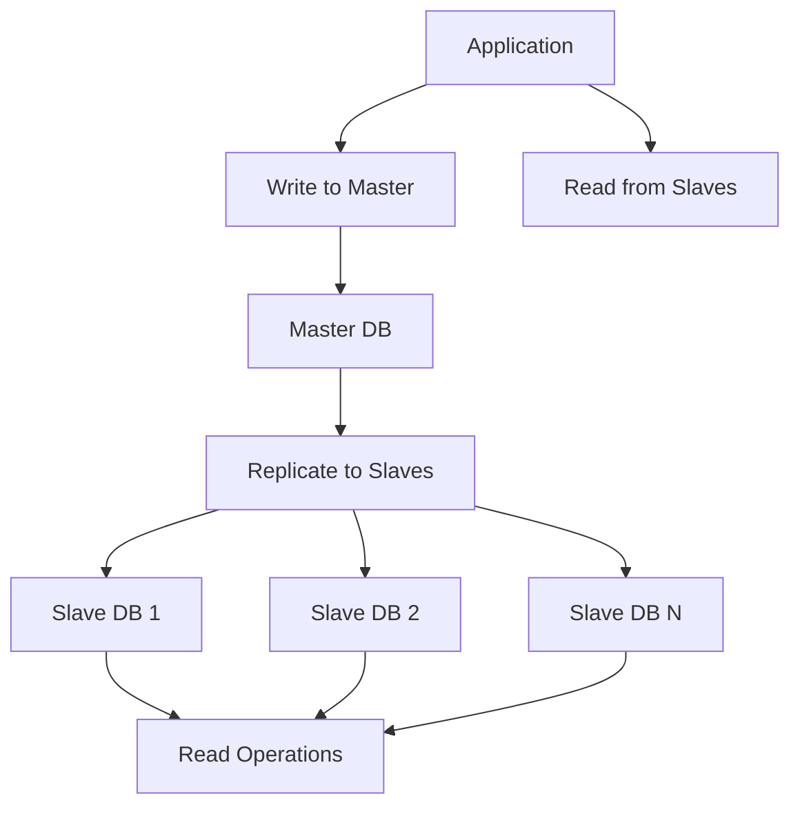
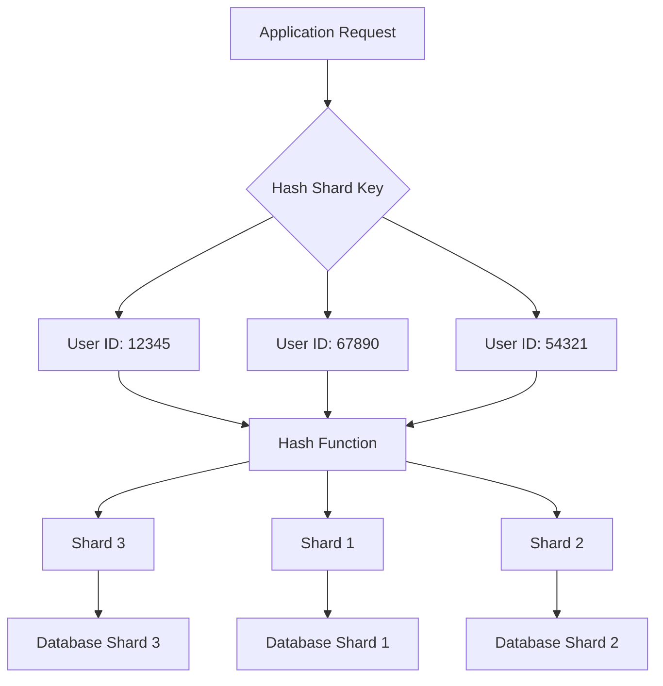
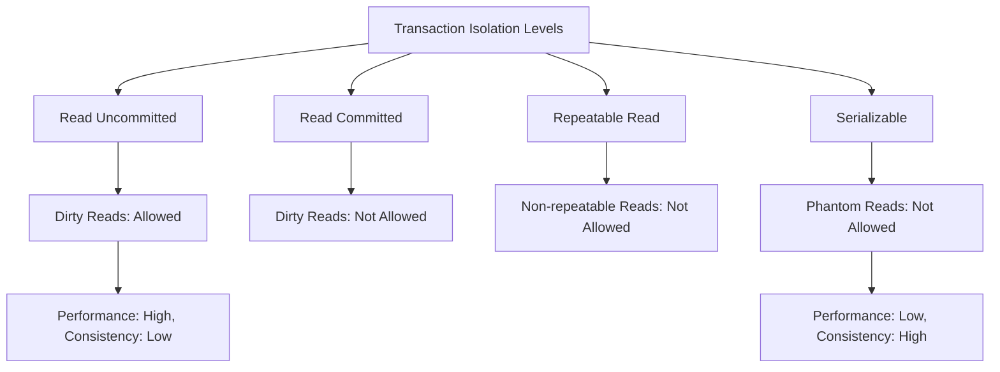

# Chapter 7: Database Internals & Scaling

## Introduction

Understanding database internals is crucial for making informed decisions about scaling. As your application grows, the database often becomes the primary bottleneck. This chapter explores the internal workings of databases and various strategies to scale them effectively.

## Database Replication

Database replication involves maintaining multiple copies of the same data across different servers. This technique serves multiple purposes: improving availability, distributing read load, and providing disaster recovery.

### Types of Replication

**Master-Slave (Primary-Replica) Replication:**
- One master database handles writes
- Multiple slave databases handle reads
- Changes from master are replicated to slaves asynchronously
- If master fails, one slave can be promoted to master

**Mermaid Diagram: Master-Slave Replication**

**Master-Master (Multi-Master) Replication:**
- Multiple nodes can accept writes
- Changes are propagated between all masters
- Provides higher availability and write scaling
- Can lead to conflicts that need resolution

### Replication Strategies

**Asynchronous Replication:**
- Master does not wait for slaves to acknowledge
- Fastest write performance
- Risk of data loss if master fails before replication

**Synchronous Replication:**
- Master waits for at least one slave to acknowledge
- Higher consistency but slower writes
- More resilient to master failures

**Semi-Synchronous Replication:**
- Compromise between async and sync
- Master waits for at least one slave to confirm receipt
- Better consistency with acceptable performance impact

### Real-World Example: E-commerce Platform

An e-commerce platform might use master-slave replication where:
- The master database handles order creation, inventory updates, and payment processing
- Slave databases handle product catalog browsing and user account views
- Geographic distribution of slaves for faster regional access

## Sharding and Partitioning

Sharding (horizontal partitioning) divides data across multiple databases based on a sharding key, allowing for better scalability.

### Types of Sharding

**Range-Based Sharding:**
- Data is partitioned based on ranges of values
- Example: User IDs 1-1000000 → Shard A, 1000001-2000000 → Shard B
- Simple but can lead to uneven distribution

**Hash-Based Sharding:**
- Uses a hash function on the sharding key
- Provides more even distribution
- Difficult to add new shards without rehashing

**Directory-Based Sharding:**
- Uses a lookup service to map keys to shards
- Most flexible approach
- Adds a layer of complexity

**Mermaid Diagram: Hash-Based Sharding**

### Sharding Considerations

**Sharding Key Selection:**
- Should distribute data evenly
- Should align with common query patterns
- Should minimize cross-shard operations

**Cross-Shard Operations:**
- Joins across shards are complex
- Transactions spanning shards require distributed transaction handling
- May require application-level logic

**Rebalancing:**
- Adding/removing shards requires data migration
- Should be done without downtime
- May require dual-writes during transition

### Partitioning Strategies

**Vertical Partitioning:**
- Split tables by columns
- Example: User profiles vs. user activity logs
- Each partition contains the same rows but different columns

**Horizontal Partitioning:**
- Split tables by rows
- Each partition contains the same columns but different rows
- Sharding is a form of horizontal partitioning

## Consistency Models

Different consistency models offer trade-offs between performance and data accuracy.

### Strong Consistency

- Reads always return the most recent write
- Provides a single-system view
- Higher latency due to synchronization requirements
- Suitable for financial applications

### Eventual Consistency

- Changes propagate over time
- High availability and performance
- Temporary inconsistencies allowed
- Suitable for social networks and content management

### Causal Consistency

- Related operations maintain order
- Independent operations may be inconsistent
- Balances consistency and performance

### Real-World Example: Social Media Platform

A social media platform might use different consistency models for different features:
- Strong consistency for user authentication and financial transactions
- Eventual consistency for timeline updates and friend lists
- Causal consistency for comment threads where replies must follow the original post

## Transactions and Isolation Levels

### ACID Properties

**Atomicity:** All operations in a transaction succeed or all fail
**Consistency:** Database remains in valid state after transaction
**Isolation:** Concurrent transactions don't interfere with each other
**Durability:** Completed transactions persist even after system failures

### Isolation Levels

**Read Uncommitted:**
- Lowest isolation level
- Allows dirty reads (reading uncommitted changes)
- Fastest but least consistent

**Read Committed:**
- Prevents dirty reads
- Allows non-repeatable reads and phantom reads
- Used in many applications for good balance

**Repeatable Read:**
- Prevents dirty and non-repeatable reads
- Allows phantom reads
- MySQL default InnoDB isolation level

**Serializable:**
- Highest isolation level
- Prevents all anomalies
- Slowest due to locking

**Mermaid Diagram: Transaction Isolation Levels**

### Distributed Transactions

**Two-Phase Commit (2PC):**
- Coordinator manages distributed transaction
- Prepare phase: ask all participants if ready
- Commit phase: commit or abort based on responses
- Complex but ensures consistency

**Saga Pattern:**
- Series of local transactions
- Each transaction has a compensating transaction
- More flexible than 2PC but more complex to implement

## Scaling Strategies

### Vertical Scaling (Scale-Up)

- Increase resources on existing database servers
- Add more CPU, RAM, or faster storage
- Easier to implement but limited by hardware
- Single point of failure

### Horizontal Scaling (Scale-Out)

- Add more database servers
- Distribute load across multiple nodes
- Higher availability and capacity
- More complex to manage

### Read Replicas

- Scale read operations by adding more replica nodes
- Master handles writes, replicas handle reads
- Common strategy for read-heavy applications
- Can be combined with other techniques

### Database Sharding

- Distribute data across multiple database instances
- Each shard contains a subset of data
- Enables scaling both reads and writes
- Complexity lies in managing multiple shards

### Caching Layer

- Store frequently accessed data in memory
- Reduce database load for common queries
- Can be implemented at application or database level
- Invalidation strategies are crucial

## Database Internal Components

### Storage Engine

The storage engine manages how data is stored and retrieved on disk.

**InnoDB (MySQL):**
- Supports transactions and row-level locking
- Implements MVCC for concurrency control
- Clustered index for primary keys

**MyISAM (MySQL):**
- Faster for read-heavy workloads
- Table-level locking
- No transaction support

**WAL (Write-Ahead Logging):**
- Ensures durability by logging changes before applying
- Critical for crash recovery
- Affects write performance

### Query Execution

**Query Parser:** Validates and parses SQL queries
**Query Optimizer:** Determines the most efficient execution plan
**Query Executor:** Executes the plan against the data

### Buffer Pool and Caching

- In-memory cache for frequently accessed data
- Reduces disk I/O
- Size should be tuned based on available memory
- Replacement algorithms (LRU, LRU-K) manage cache content

## Summary

Scaling databases requires understanding the trade-offs between consistency, availability, and performance. Consider your application's specific requirements when choosing replication strategies, sharding approaches, and consistency models. Monitor your database performance continuously and plan for scaling before hitting bottlenecks. Success often comes from combining multiple techniques rather than relying on a single approach.