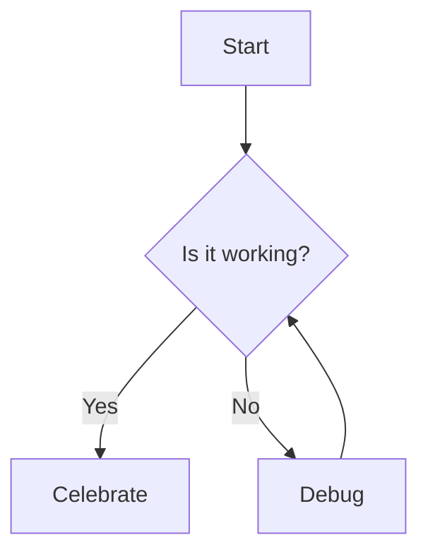

# Sample Document

This is a sample markdown document to test the Markdown → PDF exporter.

## Table

| Name | Age | Role |
|------|-----:|------|
| Alice | 30 | Engineer |
| Bob | 25 | Designer |

## Mermaid diagram



## Code block

```js
function greet(name) {
  return `Hello, ${name}!`;
}
console.log(greet('World'));
```

## Footnote

Here's a sentence with a footnote.[^1]

[^1]: This is the footnote text.
